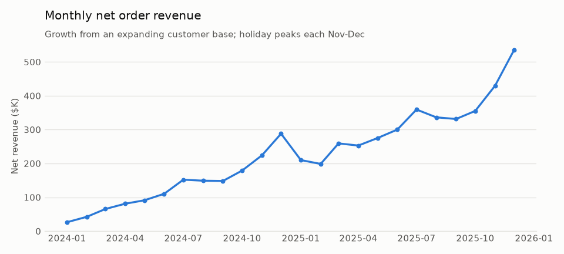
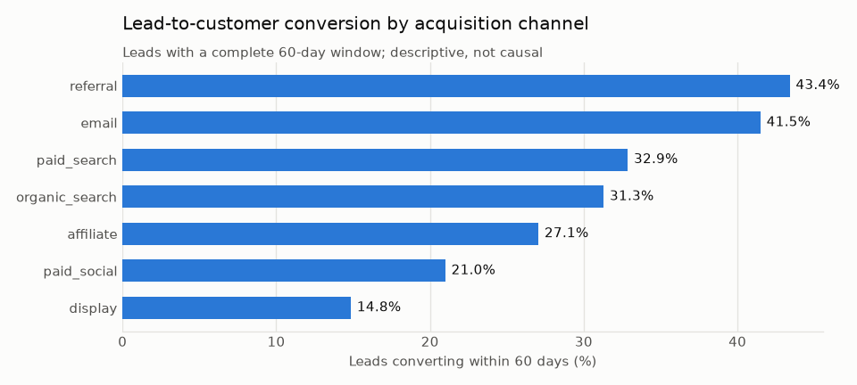

# 00 · Foundation and Synthetic Consumer Data

## Business problem

Every later analysis (acquisition, churn, conversion, customer value, forecasting, lifecycle and
the executive dashboard) needs one trustworthy, shared view of the customer journey. In a real
company that is the warehouse layer; here it is a reproducible simulation of **Northstar
Consumer**, a fictional omnichannel retailer that sells apparel, footwear, home, beauty, outdoor
and accessories through its website, app and physical stores, and runs a paid membership
program, **Northstar Plus**.

## Decision supported

This section does not make a business decision itself. It supports every later decision by
guaranteeing that:

- all sections read the **same** tables with the **same** definitions and keys;
- analyses can be run **as of any cutoff date** without leaking future information;
- results are **reproducible** from a clean checkout with one command.

## Data used

Thirteen synthetic tables generated by `northstar.synthetic.generate` (full schema, keys and
column definitions in [`docs/data_dictionary.md`](../../docs/data_dictionary.md)):

| Entity required by the spec | Tables |
|---|---|
| Prospects / leads | `prospects` |
| Customers | `customers` |
| Marketing touches / campaigns | `marketing_touches`, `campaigns` |
| Web/app sessions and funnel events | `sessions`, `funnel_events` |
| Orders / order lines | `orders`, `order_lines`, `products` |
| Subscription / membership events | `subscription_events` |
| Support / contact events | `support_contacts` |
| Embedded A/B test | `experiments`, `experiment_assignments` |

History runs from **2024-01-01 to 2025-12-31** (24 months). No real people are represented:
identifiers are sequential codes (`P000001`, `C000001`, ...), there are no names, emails, phone
numbers or addresses, and every value is drawn from the simulation.

## Method

The generator is an agent-level, discrete-event simulation
([`src/northstar/synthetic/`](../../src/northstar/synthetic)). All generative assumptions live in
one auditable file, [`params.py`](../../src/northstar/synthetic/params.py).

1. **Lead arrival.** 40,000 leads arrive with ~50% volume growth over two years, an annual
   holiday peak, weekday and hour-of-day patterns, and a drifting channel mix (paid social grows,
   display shrinks). Each lead gets a *latent purchase intent* driven by channel, age, income,
   region, email consent and noise. The latent value is never written to disk.
2. **Prospect journey.** Leads with higher intent visit more often and progress further through
   the ordered funnel `session_start -> product_view -> add_to_cart -> checkout_start -> purchase`.
   Opted-in leads receive weekly nurture emails; cart abandoners can be retargeted; a cart saved
   in an earlier session makes later checkout more likely; mobile sessions lose more people at
   checkout. The first purchase converts the lead into a customer.
3. **Embedded experiment.** From 2025-03-03 to 2025-05-25 unconverted leads are assigned to a
   one-page-checkout test by a deterministic SHA-256 hash of `experiment_id:prospect_id`
   (stable, reproducible, independent of the random seed). Treatment raises the
   checkout-to-purchase step and slightly shrinks first-order baskets, giving section 03 a
   primary metric and a genuine guardrail trade-off.
4. **Customer lifecycle.** Repeat purchases follow a Poisson process thinned by an hourly demand
   calendar (seasonality, weekdays, promotions). A latent churn hazard competes with the next
   purchase: it is higher for one-and-done buyers, discount-acquired customers and low-intent
   channels, lower for members, and rises after a poorly resolved support contact. Churned
   customers can be reactivated, usually by a win-back email that goes to customers idle for 90+
   days. Churn itself is **never recorded**; later sections must define it from observed
   inactivity.
5. **Channels and economics.** Orders are split across web, app and store (store orders have no
   session). Promotions and welcome/win-back offers apply real discounts at line level;
   membership fees, media costs and support contacts (with resolution time and optional CSAT) are
   logged as events.
6. **Assembly.** Rows get chronological identifiers, one-second timestamps and canonical dtypes,
   then are written as Parquet with a manifest of row counts and content hashes.

### Time and cutoff concept

[`northstar.timeline`](../../src/northstar/timeline.py) defines the convention every later section
uses:

- A **cutoff** is the moment an analysis is run. Features use rows with `time < cutoff`; outcome
  labels use `cutoff <= time < cutoff + horizon` (`PredictionWindow`).
- The default cutoff is **2025-07-01**: 18 months of history before it and 6 months after it for
  90/180-day outcomes and later out-of-time evaluation.
- `snapshot(tables, cutoff)` returns the point-in-time view of every table. It filters every
  time column, keeps only order lines of surviving orders, and masks support resolution time and
  CSAT that were not yet known at the cutoff.
- Entity tables store only attributes known at creation. `prospects` has no conversion flag and
  `customers` has no lifetime value or churn status. `customer_id` appears on sessions and
  touches only after the person converted, so a time filter can never reveal a future
  conversion.

## Validation design

`northstar generate-data` refuses to write data that fails
[`northstar.validation`](../../src/northstar/validation.py), and the test suite re-checks
everything:

- **Schema:** exact column order, dtypes, nullability, allowed category values, time range.
- **Keys:** primary-key uniqueness for all 13 tables; every foreign key resolves.
- **Business rules:** order totals equal the sum of their lines and `gross - discount`;
  `customer_since` equals the first order; each digital order matches exactly one purchase event
  at the same timestamp; funnel stages are contiguous and time-ordered; membership events follow
  a valid subscribe/renew/cancel state machine; support contacts follow their orders; promotion
  discounts match campaign terms and dates; experiment arms match the hash rule and are logged at
  the first eligible session.
- **Negative tests:** 15 kinds of deliberate corruption (duplicate keys, orphan FKs, skipped
  funnel stages, leaked `customer_id`, flipped variants, broken membership sequences, and more)
  must each be detected.
- **Determinism:** the same seed produces identical DataFrames and byte-identical Parquet files;
  a different seed changes behavior.
- **Signal sanity:** using only `snapshot(tables, cutoff)` features, 90-day inactivity is
  predictable from recency (AUC between 0.6 and 0.95), lead conversion is predictable from lead
  age and channel, and past spend rank-correlates with future spend. These checks bound the
  signal from both sides so it is learnable but not trivial.
- **Traceability:** the results block below must equal a rendering of
  `outputs/data_profile.json`, and a slow test regenerates the full default dataset and checks
  it reproduces that JSON exactly.

## Results generated from the current run

Figures: [`outputs/figures/monthly_net_revenue.png`](outputs/figures/monthly_net_revenue.png),
[`outputs/figures/conversion_by_channel.png`](outputs/figures/conversion_by_channel.png).
Tables: [`outputs/monthly_kpis.csv`](outputs/monthly_kpis.csv),
[`outputs/channel_summary.csv`](outputs/channel_summary.csv).

<!-- BEGIN GENERATED: data-profile -->
_Seed `20240101`, 40,000 prospects, history 2024-01-01 to 2026-01-01 (exclusive), default cutoff 2025-07-01. Rendered from `outputs/data_profile.json`._

| KPI | Value |
|---|---:|
| Leads | 40,000 |
| Customers | 12,359 |
| Lead conversion within 60 days | 30.0% |
| Orders | 64,215 |
| Net order revenue | $5,402,376 |
| Average order value | $84.13 |
| Revenue from repeat (non-first) orders | 81.2% |
| Orders with a discount campaign | 19.2% |
| Store share of orders | 18.8% |
| Repeat purchase within 180 days | 63.3% |
| Customers who ever joined Northstar Plus | 2,318 |
| Membership fee revenue | $170,252 |
| Support contacts per 100 orders | 10.4 |
| Mean CSAT (answered surveys) | 3.59 |
| Variable marketing cost | $441,033 |
| Experiment assignments (control / treatment) | 2,888 / 2,886 |
| Orders before / on-or-after default cutoff | 36,378 / 27,837 |

| Table | Rows |
|---|---:|
| `products` | 130 |
| `campaigns` | 55 |
| `experiments` | 1 |
| `prospects` | 40,000 |
| `customers` | 12,359 |
| `marketing_touches` | 426,612 |
| `sessions` | 220,091 |
| `funnel_events` | 606,786 |
| `orders` | 64,215 |
| `order_lines` | 108,829 |
| `subscription_events` | 11,477 |
| `support_contacts` | 6,713 |
| `experiment_assignments` | 5,774 |

| Acquisition channel | Leads | Customers | 60-day conversion | Cost per lead | Cost per customer |
|---|---:|---:|---:|---:|---:|
| paid_search | 9,238 | 3,167 | 32.9% | $19.23 | $56.11 |
| paid_social | 8,810 | 1,878 | 21.0% | $12.74 | $59.76 |
| display | 3,048 | 464 | 14.8% | $7.48 | $49.11 |
| affiliate | 3,060 | 859 | 27.1% | $23.33 | $83.11 |
| email | 4,588 | 1,931 | 41.5% | $1.58 | $3.76 |
| referral | 3,484 | 1,554 | 43.4% | $10.66 | $23.91 |
| organic_search | 7,772 | 2,506 | 31.3% | - | - |
<!-- END GENERATED: data-profile -->





## Business interpretation

These are descriptive facts about the simulated business. They set context for later sections
and do not claim causal effects.

- **Channel quality differs from channel cost.** Referral and email leads convert two to three
  times as often as paid social and display leads. Affiliate is the most expensive channel per
  acquired customer. Paid social's cheap leads convert poorly, so its cost per customer ends up
  above paid search. Section 01 tests whether lead-level targeting beats channel-level rules.
- **Revenue growth is compounding and seasonal.** Monthly revenue rises as the customer base
  accumulates, with a pronounced November-December peak each year. Section 05 has to beat a
  seasonal naive forecast on this series.
- **Retention is where value accrues.** The large majority of revenue comes from repeat
  (non-first) orders, and member,
  support and email-engagement histories are all observable before any cutoff. Sections 02, 04
  and 06 build on them.
- **An experiment is ready to analyze.** Both arms have thousands of randomized prospects, which
  gives section 03 a properly powered primary-metric test with a guardrail.

## Limitations and next steps

- **Synthetic by design.** Relationships reflect the documented assumptions in `params.py`, not
  real consumer behavior. Their value is known ground truth, so they can check whether methods
  recover it. They are not evidence about real markets.
- **Identified traffic only.** Anonymous visits, cross-device identity resolution and
  multi-touch attribution ambiguity are out of scope.
- **Right-censoring.** Leads and customers near the end of the history have had less time to
  convert or repeat. Rates above use fixed, fully observed windows, and later sections must do
  the same.
- **No returns or refunds.** Return requests are logged as support contacts; they do not reduce
  revenue.
- **Store behavior is simplified:** store orders have no browsing trail, and store visits without
  a purchase are not observed.
- **Next:** sections 01-06 consume these tables through `load_tables()` and
  `timeline.snapshot()`; section 08 adds drift monitoring against a reference/current split of
  the same data.

## Reproduction commands

From the repository root, with the virtual environment activated (see the root README):

```bash
northstar generate-data          # generate + validate data/raw/*.parquet, refresh outputs/ and this README
northstar validate-data          # re-validate existing files
northstar profile-data           # rebuild outputs/ and the results block from existing files
northstar data-dictionary        # re-render docs/data_dictionary.md from the schema
python -m pytest tests/test_generation.py tests/test_validation.py tests/test_timeline.py \
  tests/test_business_sanity.py tests/test_cli.py tests/test_documented_results.py
```

Options: `--seed` and `--n-prospects` change the simulation (for example
`northstar generate-data --n-prospects 5000` for a quick run), and `--out` writes elsewhere.
Running with non-default options also rewrites `outputs/` and this README's results block. Use
`--skip-profile` to leave the committed results untouched.
