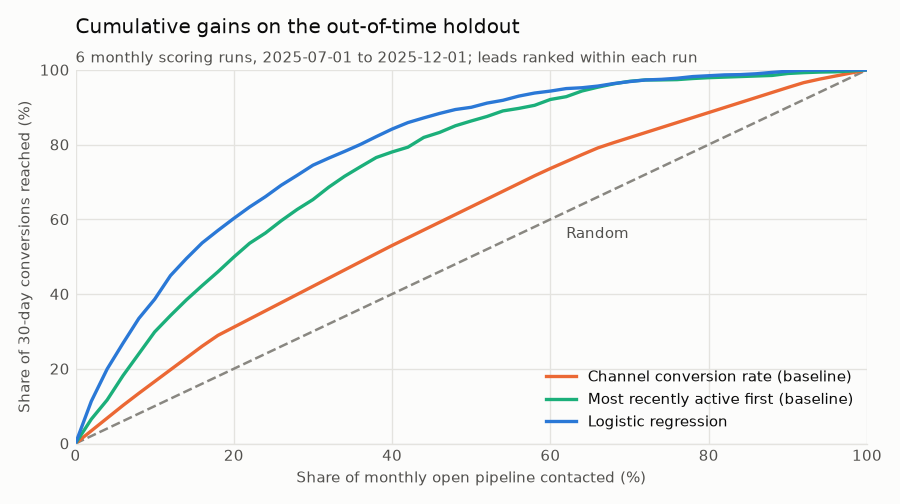
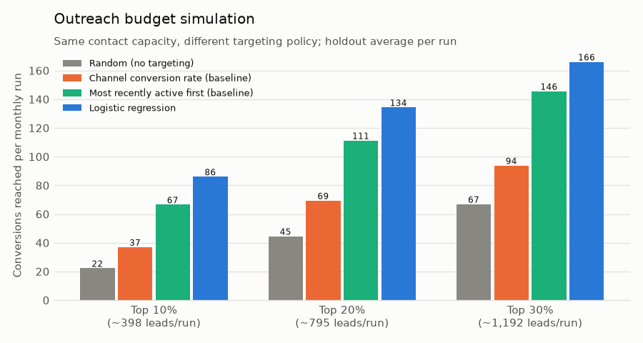
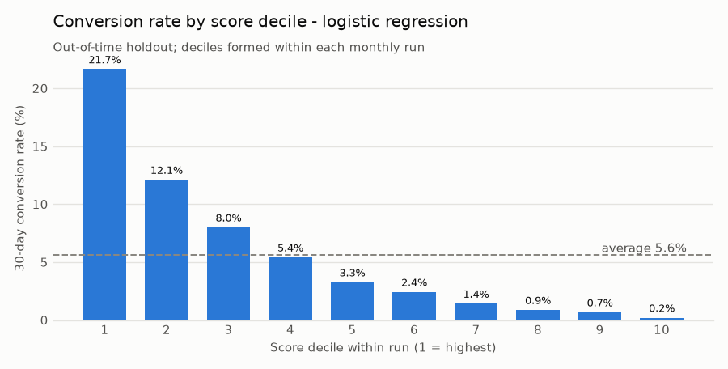
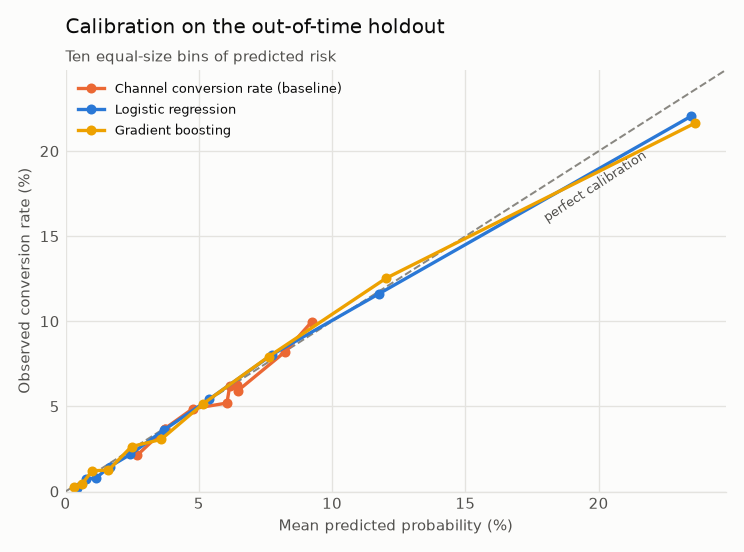
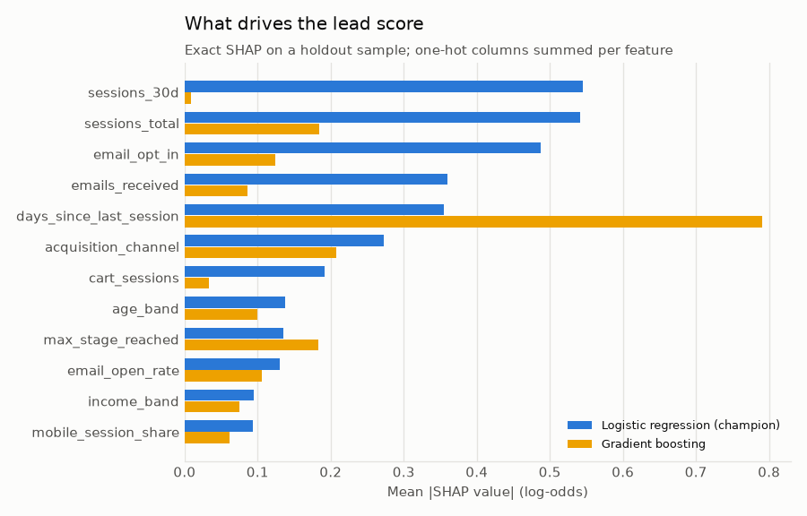

# 01 · Customer Acquisition Optimization

## Business problem

Northstar generates about 1,700 identified leads a month on average (sign-ups, account creations,
captured emails; between roughly 1,200 and 2,700 depending on season and growth, see section 00's
`monthly_kpis.csv`), but only about one in twenty open leads places a first order in any given
month. Sales and lifecycle marketing can only give personal follow-up (outbound calls, a
tailored first-order offer, a concierge chat) to a fraction of them. Today that capacity goes to
leads from the "best" channels, such as referral and email, based on historical channel
conversion rates.

**Business question:** which prospects should sales and marketing prioritize to maximize
customer acquisition efficiency?

## Decision supported

Once a month, the lead scoring run ranks every **open lead** (created in the last 90 days, no
first order yet) by its probability of placing a first order in the **next 30 days**. The team
contacts the top of the list up to its capacity. The analysis answers three questions:

1. Does a lead-level model rank leads better than today's channel rule and a simple "most
   recently active first" heuristic?
2. How many more converting leads does a fixed outreach budget reach under each targeting
   policy?
3. Are the predicted probabilities trustworthy enough to use for capacity planning (calibration)?

## Data used

Shared synthetic tables from [section 00](../00_foundation/README.md), read through
`northstar.timeline.snapshot` so only information available at each run's cutoff is used:

| Table | Used for |
|---|---|
| `prospects` | pipeline membership, lead attributes (channel, region, age/income band, device, email consent), lead age |
| `sessions`, `funnel_events` | visit counts and recency, deepest funnel stage reached, cart/checkout sessions, pages, app/mobile share |
| `marketing_touches` | nurture emails received/opened/clicked, retargeting ad clicks (the sourcing touch itself is excluded) |
| `customers` | **label only**: `customer_since` inside the outcome window |

No `orders`, `customer_id`-linked rows or other post-conversion tables feed the features.

## Method

Code: [`src/northstar/acquisition/`](../../src/northstar/acquisition)
([`dataset.py`](../../src/northstar/acquisition/dataset.py),
[`models.py`](../../src/northstar/acquisition/models.py),
[`evaluation.py`](../../src/northstar/acquisition/evaluation.py),
[`report.py`](../../src/northstar/acquisition/report.py)).

1. **Scoring runs and target.** A run is the first day of a month (the cutoff). The population
   is open leads at the cutoff. The label is 1 if the lead's first order falls in
   `[cutoff, cutoff + 30 days)`. The target is therefore defined purely by future behavior
   relative to the feature cutoff.
2. **Point-in-time features (23).** Five lead attributes and 18 behavioral features, all computed
   from `snapshot(tables, cutoff)`. Funnel stages reached after the cutoff, even inside a session
   that started before it, are invisible.
3. **Models, all with the same `fit` / `predict_proba` interface:**
   - *Channel conversion rate (baseline):* today's practice. Each lead gets its channel's smoothed
     training conversion rate.
   - *Most recently active first (baseline):* a sales heuristic that ranks by days since the last
     visit. It ranks only, so calibration does not apply.
   - *Logistic regression:* L2-regularized. Counts are log1p-transformed and standardized;
     attributes are one-hot encoded.
   - *Gradient boosting:* `HistGradientBoostingClassifier` with fixed, conservative
     hyperparameters, no early stopping and a fixed seed.
4. **Targeting evaluation.** Capacity is allocated **within each monthly run**, as the team would
   do it. Precision/recall/lift at the top 10% and 20%, decile lift and cumulative gains all
   rank within runs and then pool. Ties, such as all leads from one channel under the channel
   rule, are resolved by their expected value under random tie-breaking, so results never
   depend on row order.
5. **Budget simulation.** Contact 10%, 20% or 30% of each month's open pipeline under four
   policies: random (no targeting), the two rules and the champion model. Report conversions
   reached, precision, share of all conversions reached and contacts needed per conversion.
6. **Explainability.** Centered logistic coefficients (odds ratio per standard deviation or vs.
   the average level), exact SHAP values for both learned models (`LinearExplainer` and
   `TreeExplainer`, one-hot columns summed back to their raw feature), and permutation importance
   for the champion on the holdout.

## Validation design

- **Time-aware split with no label overlap.** Twelve *fit* runs (Apr 2024 - Mar 2025) train the
  candidates and three later *validation* runs (Apr - Jun 2025) select the champion by average
  precision. Every model is then refit on all 15 training runs and scored **once** on six
  **out-of-time holdout** runs (Jul - Dec 2025). `SplitPlan` refuses any design in which an
  earlier run's outcome window reaches past the start of a later split, so the last training
  label window ends exactly at the first holdout cutoff (2025-07-01). The same holdout rows are
  used for every model.
- **Leakage audit, run on every execution.** `leakage_audit` recomputes the first holdout run
  from data truncated at its cutoff and requires identical features. It also checks that no
  pipeline lead converted before its cutoff, that no customer-linked rows reach the features,
  that no outcome column is a feature, and that train labels end before the holdout starts. As a
  proxy-leak alarm, it flags any single feature with holdout AUC ≥ 0.9. If any check fails,
  `northstar acquisition` stops without writing results.
- **Uncertainty.** A lead can appear in several monthly runs, so 95% intervals come from a
  **lead-clustered** bootstrap (200 resamples). The champion-minus-baseline differences are
  paired on the same resamples.
- **Metrics for an imbalanced target (~6% positive):** ROC AUC for ranking, average precision,
  precision/recall/lift at fixed capacity for targeting value, and Brier score, expected
  calibration error, calibration slope and mean predicted vs. observed for calibration.
- **Tests** ([`tests/test_acquisition_*.py`](../../tests)): hand-built leads with known pipeline
  membership, half-open label boundaries and features, including a session that straddles the
  cutoff. Features must be invariant to deleting or scrambling post-cutoff rows. The audit must
  flag an injected label proxy and an already-converted lead. Tie-aware top-k is checked against
  brute force, along with ECE and calibration-slope sanity, oracle/random bounds for the budget
  simulation, exact SHAP additivity, deterministic training, and an end-to-end CLI run. The
  README block must equal a rendering of `metrics.json`, the prose claims below are asserted
  against it, and a slow test regenerates the default data and reproduces the committed
  metrics.

## Results generated from the current run

Figures: [`gains_curve.png`](outputs/figures/gains_curve.png),
[`decile_lift.png`](outputs/figures/decile_lift.png),
[`calibration.png`](outputs/figures/calibration.png),
[`budget_policies.png`](outputs/figures/budget_policies.png),
[`shap_importance.png`](outputs/figures/shap_importance.png).
Tables: [`model_comparison.csv`](outputs/model_comparison.csv),
[`decile_lift.csv`](outputs/decile_lift.csv),
[`budget_simulation.csv`](outputs/budget_simulation.csv),
[`calibration.csv`](outputs/calibration.csv), [`gains_curve.csv`](outputs/gains_curve.csv),
[`feature_importance.csv`](outputs/feature_importance.csv),
[`logistic_coefficients.csv`](outputs/logistic_coefficients.csv), and everything in
[`metrics.json`](outputs/metrics.json).

<!-- BEGIN GENERATED: acquisition-results -->
_Data seed `20240101`, 40,000 prospects. Rendered from `outputs/metrics.json`. Monthly scoring runs; open pipeline = leads created in the previous 90 days without a first order; label = first order within 30 days of the run; 200 lead-clustered bootstrap resamples for 95% intervals._

**Time-aware split**

| Split | Runs | First run | Last run | Lead-runs | Unique leads | Conversions | Conversion rate |
|---|---:|---|---|---:|---:|---:|---:|
| fit | 12 | 2024-04-01 | 2025-03-01 | 40,280 | 16,725 | 2,290 | 5.7% |
| validation | 3 | 2025-04-01 | 2025-06-01 | 10,518 | 6,052 | 632 | 6.0% |
| holdout | 6 | 2025-07-01 | 2025-12-01 | 23,850 | 11,468 | 1,338 | 5.6% |

Of 3,640 first orders placed in the holdout outcome windows, 36.8% came from scorable open-pipeline leads, 61.2% from leads created during the window and 2.0% from leads older than 90 days.

**Leakage audit** (the pipeline refuses to write results if any check fails)

| Check | Result |
|---|---|
| features only from pre cutoff rows | pass |
| features unchanged when future rows removed | pass |
| no pipeline lead converted before cutoff | pass |
| no customer linked rows in feature inputs | pass |
| no outcome columns used as features | pass |
| train labels end before holdout starts | pass |
| no single feature suspiciously predictive | pass |

Most predictive single feature on the holdout: `days_since_last_session` (AUC 0.762, limit 0.9). Last training label window ends 2025-07-01; first holdout run 2025-07-01.

**Model comparison** (champion selected on validation average precision: **Logistic regression**; all models refit on fit + validation runs and scored on the same holdout)

| Model | Validation AP | Holdout ROC AUC [95% CI] | Holdout AP [95% CI] | Precision @10% | Lift @10% | Recall @20% | Brier | ECE | Calibration slope | Mean predicted / observed |
|---|---:|---:|---:|---:|---:|---:|---:|---:|---:|---:|
| Channel conversion rate (baseline) | 0.076 | 0.602 [0.588, 0.619] | 0.075 [0.069, 0.081] | 9.3% | 1.66x | 31.1% | 0.0526 | 0.0031 | 1.00 | 5.8% / 5.6% |
| Most recently active first (baseline) | 0.150 | 0.762 [0.751, 0.775] | 0.138 [0.127, 0.152] | 16.8% | 2.99x | 49.9% | - | - | - | - |
| Logistic regression **(champion)** | 0.230 | 0.810 [0.801, 0.820] | 0.205 [0.190, 0.226] | 21.7% | 3.86x | 60.2% | 0.0484 | 0.0030 | 1.00 | 5.9% / 5.6% |
| Gradient boosting | 0.215 | 0.810 [0.799, 0.822] | 0.204 [0.189, 0.226] | 21.8% | 3.88x | 60.6% | 0.0484 | 0.0043 | 0.98 | 5.8% / 5.6% |

- Logistic regression minus channel conversion rate (baseline): ROC AUC +0.207 [0.190, 0.224], average precision +0.131 [0.117, 0.150].
- Logistic regression minus most recently active first (baseline): ROC AUC +0.048 [0.039, 0.055], average precision +0.067 [0.054, 0.082].
- Champion ROC AUC by holdout run ranges from 0.796 to 0.823 across 6 monthly runs.

**Decile lift - logistic regression** (deciles within each holdout run)

| Decile | Lead-runs | Conversions | Conversion rate | Lift | Cumulative share of conversions |
|---:|---:|---:|---:|---:|---:|
| 1 | 2,387 | 517 | 21.7% | 3.86x | 38.6% |
| 2 | 2,384 | 289 | 12.1% | 2.16x | 60.2% |
| 3 | 2,386 | 191 | 8.0% | 1.43x | 74.5% |
| 4 | 2,383 | 129 | 5.4% | 0.96x | 84.2% |
| 5 | 2,386 | 78 | 3.3% | 0.58x | 90.0% |
| 6 | 2,384 | 58 | 2.4% | 0.43x | 94.3% |
| 7 | 2,383 | 34 | 1.4% | 0.25x | 96.9% |
| 8 | 2,386 | 21 | 0.9% | 0.16x | 98.4% |
| 9 | 2,384 | 16 | 0.7% | 0.12x | 99.6% |
| 10 | 2,387 | 5 | 0.2% | 0.04x | 100.0% |

**Outreach budget simulation** (contact a fixed share of each monthly open pipeline; holdout averages per run)

| Capacity | Policy | Contacts / run | Conversions reached / run | Precision | Share of conversions reached | Lift vs random | Contacts per conversion |
|---:|---|---:|---:|---:|---:|---:|---:|
| 10% | Random (no targeting) | 398 | 22.3 | 5.6% | 10.0% | 1.00x | 17.8 |
| 10% | Channel conversion rate (baseline) | 398 | 37.0 | 9.3% | 16.6% | 1.66x | 10.7 |
| 10% | Most recently active first (baseline) | 398 | 66.6 | 16.8% | 29.9% | 2.99x | 6.0 |
| 10% | Logistic regression | 398 | 86.1 | 21.7% | 38.6% | 3.86x | 4.6 |
| 20% | Random (no targeting) | 795 | 44.6 | 5.6% | 20.0% | 1.00x | 17.8 |
| 20% | Channel conversion rate (baseline) | 795 | 69.4 | 8.7% | 31.1% | 1.56x | 11.5 |
| 20% | Most recently active first (baseline) | 795 | 111.3 | 14.0% | 49.9% | 2.49x | 7.1 |
| 20% | Logistic regression | 795 | 134.3 | 16.9% | 60.2% | 3.01x | 5.9 |
| 30% | Random (no targeting) | 1,192 | 66.9 | 5.6% | 30.0% | 1.00x | 17.8 |
| 30% | Channel conversion rate (baseline) | 1,192 | 93.8 | 7.9% | 42.1% | 1.40x | 12.7 |
| 30% | Most recently active first (baseline) | 1,192 | 145.6 | 12.2% | 65.3% | 2.18x | 8.2 |
| 30% | Logistic regression | 1,192 | 166.1 | 13.9% | 74.5% | 2.48x | 7.2 |

- At 10% capacity the champion reaches +49.1 conversions per run (+133%) versus the channel rule, with 6.1 fewer contacts per conversion.
- At 20% capacity the champion reaches +64.9 conversions per run (+93%) versus the channel rule, with 5.5 fewer contacts per conversion.
- At 30% capacity the champion reaches +72.3 conversions per run (+77%) versus the channel rule, with 5.5 fewer contacts per conversion.

**Drivers** (mean |SHAP value| in log-odds on a holdout sample for both learned models; permutation importance = drop in the champion's holdout AP when the feature is shuffled)

| Feature | SHAP: logistic regression | SHAP: gradient boosting | Direction (champion) | Permutation AP drop |
|---|---:|---:|---|---:|
| `sessions_30d` | 0.545 | 0.009 | higher -> more likely | 0.057 |
| `sessions_total` | 0.542 | 0.184 | higher -> less likely | 0.058 |
| `email_opt_in` | 0.488 | 0.124 | higher -> more likely | 0.043 |
| `emails_received` | 0.360 | 0.086 | higher -> less likely | 0.023 |
| `days_since_last_session` | 0.354 | 0.790 | higher -> less likely | 0.046 |
| `acquisition_channel` | 0.272 | 0.207 | categorical | 0.020 |
| `cart_sessions` | 0.192 | 0.033 | higher -> more likely | 0.018 |
| `age_band` | 0.138 | 0.100 | categorical | 0.002 |
| `max_stage_reached` | 0.135 | 0.183 | higher -> more likely | 0.012 |
| `email_open_rate` | 0.130 | 0.105 | higher -> more likely | 0.007 |
| `income_band` | 0.095 | 0.076 | categorical | 0.001 |
| `mobile_session_share` | 0.094 | 0.061 | higher -> less likely | 0.002 |

Largest logistic-regression coefficients (numeric features are log1p-scaled and standardized, so odds ratios are per standard deviation):

| Term | Coefficient | Odds ratio |
|---|---:|---:|
| `acquisition_channel_display` | -0.734 | 0.48 |
| `sessions_total` | -0.655 | 0.52 |
| `sessions_30d` | +0.619 | 1.86 |
| `acquisition_channel_referral` | +0.532 | 1.70 |
| `email_opt_in` | +0.490 | 1.63 |
| `days_since_last_session` | -0.430 | 0.65 |
| `emails_received` | -0.382 | 0.68 |
| `acquisition_channel_paid_social` | -0.340 | 0.71 |
<!-- END GENERATED: acquisition-results -->











## Business interpretation

- **Lead-level scoring beats channel-level rules by a wide margin.** On the same out-of-time
  holdout, the champion outranks both the channel rule and the recency heuristic. The
  lead-clustered bootstrap intervals for the AUC and average-precision differences exclude zero.
  Channel still matters (it is one of the drivers), but most of the signal lives in behavior
  *within* a channel.
- **The same outreach budget reaches far more buyers.** At every simulated capacity the champion
  reaches more converting leads than random, the channel rule and the recency heuristic. Its top
  decile converts at more than three times the pipeline average. Equivalently, the team needs
  materially fewer contacts per converting lead (see the budget table).
- **Simple and interpretable is enough here.** Logistic regression and gradient boosting are
  statistically tied on the holdout (overlapping intervals). Validation average precision picked
  the logistic model, which is also the easier one to explain, monitor and hand to section 08.
  Both models rank recency of the last visit among their top drivers. Recent sessions, email
  consent and engagement, and reaching the cart raise the score. A long trail of sessions
  without buying lowers it once recent activity is accounted for.
- **Probabilities are usable for planning.** Both learned models are well calibrated out of time
  (low ECE, calibration slope close to 1, mean predicted close to observed), so the expected
  number of conversions from a contact list can be read off the scores directly.
- **Scope matters: most first orders come from brand-new leads.** Most first orders placed in a
  month come from leads created *during* that month, often within days, and a monthly batch
  cannot score them. Monthly prioritization is the right tool for the open backlog. Speed-to-lead
  handling of new sign-ups (near-real-time scoring or an immediate welcome journey) is a
  separate, larger lever.

**Recommendation.** Replace the channel-based call list with the monthly model-ranked list at
current capacity. Keep the channel rule as the fallback if scoring fails. Before scaling spend
on outreach, run a randomized holdout on the top-ranked leads (see below) to measure how many of
the reached conversions the outreach actually *causes*.

## Limitations and next steps

- **Reached ≠ caused.** The simulation counts conversions among contacted leads. High-propensity
  leads may convert without outreach, so the *incremental* value of outreach is not identified
  here. Next step: an outreach experiment, with random holdouts within score bands, analyzed with
  the tooling from section 03, followed by uplift modelling if effects vary by segment.
- **Monthly cadence.** Leads created between runs are not scored until the next run, and most
  conversions happen in that gap. Daily scoring with the same feature code is straightforward;
  section 08 will serve the model.
- **Correlated behavioral features.** Session counts, recency and lead age are correlated, so
  single-feature attributions (SHAP, coefficients, permutation) split credit among them
  differently across models. Read drivers as groups, not as causal effects.
- **Fixed hyperparameters, one champion refit.** The design favors a clean out-of-time estimate
  over tuning. A rolling-origin backtest with monthly retraining would give the stability
  estimate a production process needs.
- **Synthetic data.** Relationships come from the documented generative assumptions in
  `params.py`. The value here is a leak-free, reproducible method, not evidence about real
  consumers. There is no dollar value per contact or per customer, so efficiency is reported as
  contacts per conversion.

## Reproduction commands

From the repository root, with the virtual environment activated (see the root README):

```bash
northstar generate-data                 # shared data (section 00), if not already present
northstar acquisition                   # rebuild outputs/ and the results block above (~40 s)
python -m pytest tests/test_acquisition_dataset.py tests/test_acquisition_metrics.py \
  tests/test_acquisition_models.py tests/test_acquisition_pipeline.py
```

`northstar acquisition` generates the default data first if `data/raw` is empty (pass
`--no-generate` to fail instead). Use `--data-dir`, `--out-dir` and `--readme` to run against
other data or write elsewhere. The slow reproduction test
(`test_committed_metrics_are_reproduced_from_default_generation`) regenerates the default data
from scratch and re-runs the analysis. It is included in the default `python -m pytest` and
skipped by `-m "not slow"`.
