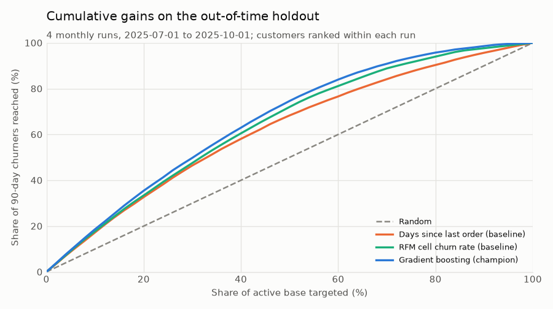
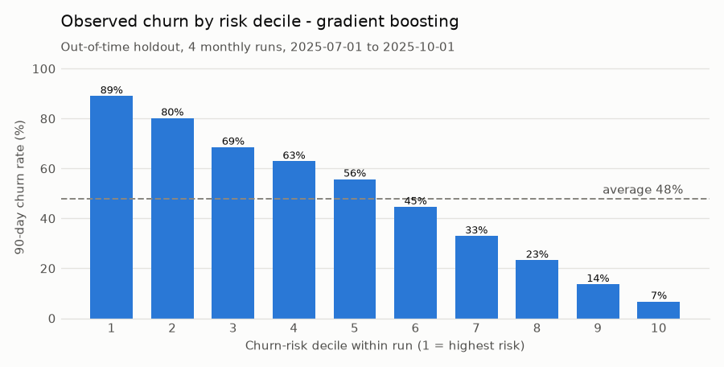
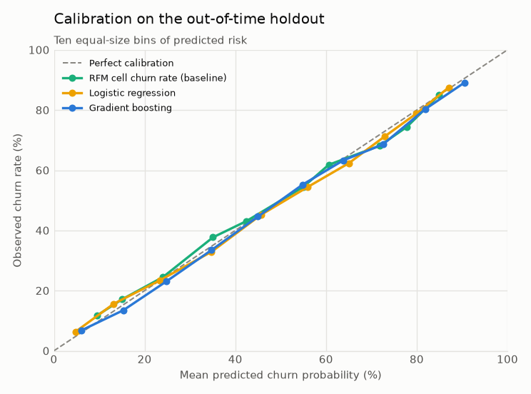
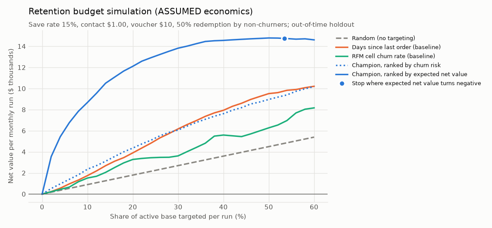
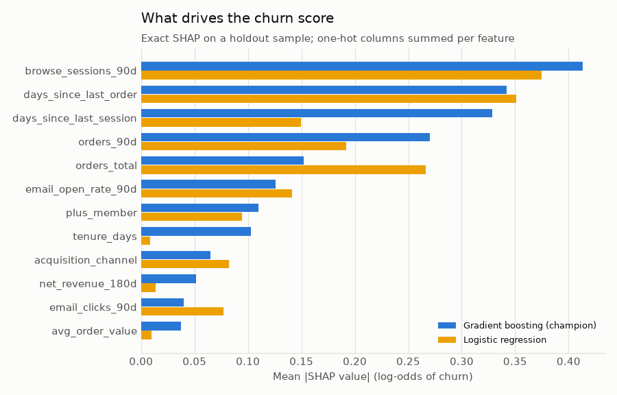

# 02 · Retention and Churn Prediction

## Business problem

Northstar's repeat business is where its margin lives, yet in any given month roughly half of the
customers who bought in the last six months will not buy again in the next three. CRM can fund a
retention offer (a personal message plus a voucher) for only part of the active base. Today the
list is built with a recency rule: whoever has gone longest without an order gets the offer.

**Business question:** which active customers are most at risk of churning, and how should a
limited retention budget be prioritized?

## Decision supported

Once a month, the retention run scores every **active customer** and CRM contacts the top of the
list up to its budget. The analysis answers four questions:

1. Does a customer-level churn model rank risk better than the recency rule and an RFM
   segmentation?
2. How many would-be churners does each targeting depth reach (precision and recall)?
3. Are the predicted probabilities reliable enough to plan with (calibration, including by run and
   by segment)?
4. Given explicit, adjustable assumptions about offer economics, who should receive the offer:
   the highest-*risk* customers or the highest-*value-at-risk* ones, and how deep should the list
   go?

## Churn definition and time windows

Northstar is a non-contractual retailer: customers never "cancel", they just stop buying. Churn is
therefore defined on purchase inactivity, relative to a scoring cutoff `c` (the first day of each
month):

| Window | Interval | Used for |
|---|---|---|
| Observation (feature) window | all history `< c`; activity windows of 30/90/180 days end at `c` | features |
| Active-base window | `[c - 180 days, c)` | population: customers with at least one order here |
| Prediction (outcome) window | `[c, c + 90 days)` | label: **churned = 1 if no order in this window** |

- The 90-day horizon matches the business's own lapse rule: win-back emails start after 90 idle
  days. Customers idle for more than 180 days are already lapsed and belong to the win-back
  program, not churn prevention.
- Windows are half-open. An order exactly at `c` belongs to the outcome window (the customer did
  not churn) and is invisible to the features. An order exactly at `c + 90 days` is outside it.
- A run needs 180 days of history (the first run is 2024-07-01) and a complete outcome window
  (the last labelled run is 2025-10-01; the data end on 2025-12-31).
- These rules are constants in [`dataset.py`](../../src/northstar/retention/dataset.py)
  (`ACTIVE_DAYS`, `HORIZON_DAYS`) and are pinned by boundary tests in
  [`tests/test_retention_dataset.py`](../../tests/test_retention_dataset.py).

## Data used

Shared synthetic tables from [section 00](../00_foundation/README.md), read through
`northstar.timeline.snapshot`, so every feature uses only rows timestamped before the cutoff:

| Table | Used for |
|---|---|
| `customers` | tenure; acquisition channel, region, age/income band, device, email consent |
| `orders`, `order_lines`, `products` | recency, frequency (lifetime, last 90 days, prior 90 days), 180-day revenue, order value, discount share, category breadth, store/app mix; trailing 180-day gross margin (value, not a feature) |
| `sessions` | browsing sessions that did not end in an order (30/90 days), days since last visit |
| `marketing_touches` | lifecycle emails received, open rate and clicks in the last 90 days |
| `subscription_events` | Northstar Plus membership at the cutoff; cancellation requests in the last 180 days |
| `support_contacts` | contacts, low-CSAT (≤ 2) and slow (> 24 h) resolutions in 180 days, contacts still open at the cutoff (resolutions and CSAT after the cutoff are masked) |
| `orders` in `[c, c + 90d)` | **label only** |

## Method

Code: [`src/northstar/retention/`](../../src/northstar/retention)
([`dataset.py`](../../src/northstar/retention/dataset.py),
[`models.py`](../../src/northstar/retention/models.py),
[`evaluation.py`](../../src/northstar/retention/evaluation.py),
[`simulation.py`](../../src/northstar/retention/simulation.py),
[`report.py`](../../src/northstar/retention/report.py)). Tie-aware ranking metrics, the clustered
bootstrap and the SHAP helpers are shared with [section 01](../01_acquisition/README.md).

1. **Scoring runs.** One run per month. Population = active base at the cutoff; label = churned
   in the next 90 days.
2. **Point-in-time features (30).** Six customer attributes and 24 behavioral features built
   from `snapshot(tables, cutoff)`. The trailing 180-day gross margin is kept alongside as the
   customer's *value*, used only by the budget simulation.
3. **Models, all with the same `fit` / `predict_proba` interface:**
   - *Days since last order (baseline):* today's recency rule. It ranks only, so calibration
     does not apply.
   - *RFM cell churn rate (baseline):* each customer gets the smoothed training churn rate of
     their recency (0-29, 30-59, 60-89, 90-119, 120+ days) × frequency (1, 2-3, 4-7, 8+ orders)
     cell. It is calibrated and explainable, and a stronger benchmark than recency alone.
   - *Logistic regression:* L2-regularized; features log1p-transformed and standardized,
     attributes one-hot encoded.
   - *Gradient boosting:* `HistGradientBoostingClassifier` with fixed, conservative
     hyperparameters and a fixed seed.
4. **Champion selection by validation log loss.** Log loss is a proper scoring rule that rewards
   both ranking and calibration. The budget simulation multiplies probabilities by dollar values,
   so calibration matters as much as ranking here.
5. **Targeting evaluation.** The budget is allocated **within each monthly run**. Precision,
   recall and lift at 5/10/20/30% of the active base, risk deciles and gains curves all rank
   within runs and then pool, with ties resolved by expectation.
6. **Explainability and drivers.** Exact SHAP values for both learned models (agreement between
   a linear and a tree model is a robustness check), centered logistic coefficients, permutation
   importance for the champion, per-customer *reason codes* (the top features pushing a
   customer's risk up; [`reason_codes_sample.csv`](outputs/reason_codes_sample.csv)), and
   observed churn by business segment next to mean predicted risk.
7. **Retention budget simulation** ([`simulation.py`](../../src/northstar/retention/simulation.py)).
   On the holdout, each policy targets the same share of each run. *Observed* inputs are who
   actually churned and each customer's trailing margin. *Assumed* inputs are the save rate,
   contact cost, voucher cost, voucher redemption by customers who would have bought anyway, and
   the value of a save. They live in one dataclass (`RetentionAssumptions`), are printed in the
   results, and are stress-tested:
   - five policies: random, the two baselines, the champion ranked by **churn risk**, and the
     champion ranked by **expected net value** `save_rate · p · (value − voucher) − contact −
     voucher · redemption · (1 − p)`;
   - an unconstrained rule, "target while expected net value > 0", which sets the depth *ex ante*
     from the model, not from hindsight;
   - the **break-even save rate** for every policy and depth;
   - a sensitivity grid over save rate × voucher value, with the value-ranked list re-planned
     under each scenario.

## Validation design

- **Out-of-time, purged split.** Six *fit* runs (Jul - Dec 2024) train the candidates and two
  later *validation* runs (Mar - Apr 2025) select the champion. Every model is then refit on all
  eight training runs and scored **once** on four **holdout** runs (Jul - Oct 2025), which start
  at the portfolio's default cutoff (2025-07-01). Runs in Jan - Feb and May - Jun 2025 are
  deliberately left out: their 90-day label windows would reach into the next split. `SplitPlan`
  rejects any design where that happens. The last training label window ends 2025-06-30.
- **Leakage audit, run on every execution.** `leakage_audit` rebuilds the first holdout run from
  data truncated at its cutoff and requires identical features. It also recomputes every label
  from the order log, checks that every scored customer was active at the cutoff, that the latest
  event feeding any feature is strictly before the cutoff, that no outcome column is a feature,
  and that training labels end before the holdout starts. As a proxy-leak alarm, it flags any
  single feature with holdout AUC ≥ 0.9. If any check fails, `northstar retention` stops without
  writing results.
- **Uncertainty.** Customers appear in several monthly runs, so 95% intervals come from a
  **customer-clustered** bootstrap (200 resamples). Champion-minus-baseline differences are
  paired on the same resamples.
- **Metrics.** Churn is common (~50%), so ROC AUC and average precision measure discrimination;
  precision/recall/lift at fixed depths measure targeting value; log loss, Brier score, ECE,
  calibration slope, and mean predicted vs. observed (overall, per run and per segment) measure
  calibration.
- **Tests** ([`tests/test_retention_*.py`](../../tests)): hand-built customers pin every window
  boundary: the active-window start, orders exactly at the cutoff and at cutoff + 90 days,
  support resolutions after the cutoff, and pending membership cancellations. Deleting the
  entire future must change labels but no feature. The audit must catch an injected label
  proxy, corrupted labels and an inactive customer. Other tests hand-check the RFM baseline,
  depth metrics against a manual ranking, and the simulation accounting and break-even formula.
  They also check the vectorized top-k against the reference implementation, oracle/random
  bounds, the direction of sensitivity effects, and SHAP additivity, and run an end-to-end CLI.
  The README block must equal a rendering of `metrics.json`, the prose claims below are asserted
  against it, and a slow test regenerates the default data and reproduces the committed metrics.

## Results generated from the current run

Figures: [`gains_curve.png`](outputs/figures/gains_curve.png),
[`decile_churn.png`](outputs/figures/decile_churn.png),
[`calibration.png`](outputs/figures/calibration.png),
[`retention_value_curve.png`](outputs/figures/retention_value_curve.png),
[`shap_importance.png`](outputs/figures/shap_importance.png).
Tables: [`model_comparison.csv`](outputs/model_comparison.csv),
[`targeting_depths.csv`](outputs/targeting_depths.csv),
[`decile_table.csv`](outputs/decile_table.csv), [`calibration.csv`](outputs/calibration.csv),
[`gains_curve.csv`](outputs/gains_curve.csv),
[`segment_drivers.csv`](outputs/segment_drivers.csv),
[`feature_importance.csv`](outputs/feature_importance.csv),
[`logistic_coefficients.csv`](outputs/logistic_coefficients.csv),
[`retention_simulation.csv`](outputs/retention_simulation.csv),
[`retention_value_curve.csv`](outputs/retention_value_curve.csv),
[`roi_sensitivity.csv`](outputs/roi_sensitivity.csv),
[`reason_codes_sample.csv`](outputs/reason_codes_sample.csv), and everything in
[`metrics.json`](outputs/metrics.json).

<!-- BEGIN GENERATED: retention-results -->
_Data seed `20240101`, 40,000 prospects. Rendered from `outputs/metrics.json`. Monthly scoring runs; active base = customers with an order in the 180 days before the run; churned = no order in the 90 days from the run; 200 customer-clustered bootstrap resamples for 95% intervals._

**Time-aware split**

| Split | Runs | First run | Last run | Customer-runs | Unique customers | Churners | Churn rate |
|---|---:|---|---|---:|---:|---:|---:|
| fit | 6 | 2024-07-01 | 2024-12-01 | 18,809 | 4,772 | 10,032 | 53.3% |
| validation | 2 | 2025-03-01 | 2025-04-01 | 9,894 | 5,391 | 5,234 | 52.9% |
| holdout | 4 | 2025-07-01 | 2025-10-01 | 24,130 | 7,563 | 11,531 | 47.8% |

**Leakage audit** (the pipeline refuses to write results if any check fails)

| Check | Result |
|---|---|
| features only from pre cutoff rows | pass |
| features unchanged when future rows removed | pass |
| labels only from prediction window | pass |
| every scored customer active at cutoff | pass |
| no outcome columns used as features | pass |
| train labels end before holdout starts | pass |
| no single feature suspiciously predictive | pass |

Most predictive single feature on the holdout: `orders_90d` (AUC 0.744, limit 0.9). Last training label window ends 2025-06-30; first holdout run 2025-07-01.

**Model comparison** (champion selected on validation log loss: **Gradient boosting**; all models refit on fit + validation runs and scored on the same holdout)

| Model | Validation log loss | Holdout ROC AUC [95% CI] | Holdout AP [95% CI] | Log loss | Brier | ECE | Calibration slope | Mean predicted / observed |
|---|---:|---:|---:|---:|---:|---:|---:|---:|
| Days since last order (baseline) | - | 0.731 [0.723, 0.739] | 0.707 [0.691, 0.719] | - | - | - | - | - |
| RFM cell churn rate (baseline) | 0.5741 | 0.777 [0.768, 0.784] | 0.733 [0.720, 0.743] | 0.5669 | 0.1921 | 0.0169 | 0.92 | 47.6% / 47.8% |
| Logistic regression | 0.5464 | 0.805 [0.798, 0.813] | 0.771 [0.758, 0.781] | 0.5372 | 0.1800 | 0.0138 | 0.94 | 48.3% / 47.8% |
| Gradient boosting **(champion)** | 0.5448 | 0.811 [0.803, 0.817] | 0.782 [0.768, 0.791] | 0.5307 | 0.1774 | 0.0138 | 0.97 | 48.9% / 47.8% |

- Gradient boosting minus days since last order (baseline): ROC AUC +0.080 [0.073, 0.086], average precision +0.075 [0.068, 0.084].
- Gradient boosting minus rfm cell churn rate (baseline): ROC AUC +0.034 [0.030, 0.038], average precision +0.049 [0.042, 0.057].

Champion by holdout run (does calibration hold as the base matures?):

| Run | Active customers | Observed churn | Mean predicted | ROC AUC |
|---|---:|---:|---:|---:|
| 2025-07-01 | 5,676 | 48.9% | 49.7% | 0.813 |
| 2025-08-01 | 5,960 | 49.4% | 48.8% | 0.817 |
| 2025-09-01 | 6,158 | 47.7% | 48.9% | 0.800 |
| 2025-10-01 | 6,336 | 45.4% | 48.4% | 0.814 |

**Precision and recall at operational targeting depths** (share of each run's active base contacted; holdout)

| Depth | Customers / run | Random precision / recall | Days since last order (baseline) precision / recall | RFM cell churn rate (baseline) precision / recall | Logistic regression precision / recall | Gradient boosting precision / recall |
|---:|---:|---:|---:|---:|---:|---:|
| 5% | 302 | 47.8% / 5.0% | 84.4% / 8.8% | 87.4% / 9.1% | 89.3% / 9.3% | 91.0% / 9.5% |
| 10% | 603 | 47.8% / 10.0% | 82.3% / 17.2% | 84.8% / 17.7% | 87.6% / 18.3% | 89.1% / 18.6% |
| 20% | 1,206 | 47.8% / 20.0% | 78.0% / 32.6% | 79.8% / 33.4% | 83.2% / 34.8% | 84.7% / 35.4% |
| 30% | 1,810 | 47.8% / 30.0% | 74.0% / 46.5% | 75.7% / 47.5% | 79.1% / 49.7% | 79.3% / 49.8% |

**Churn by risk decile - gradient boosting** (deciles within each holdout run)

| Decile | Customer-runs | Churners | Churn rate | Mean predicted | Lift | Cumulative share of churners |
|---:|---:|---:|---:|---:|---:|---:|
| 1 | 2,414 | 2,150 | 89.1% | 90.5% | 1.86x | 18.6% |
| 2 | 2,414 | 1,937 | 80.2% | 81.8% | 1.68x | 35.4% |
| 3 | 2,412 | 1,654 | 68.6% | 72.5% | 1.44x | 49.8% |
| 4 | 2,413 | 1,518 | 62.9% | 63.8% | 1.32x | 62.9% |
| 5 | 2,412 | 1,345 | 55.8% | 54.8% | 1.17x | 74.6% |
| 6 | 2,414 | 1,078 | 44.7% | 45.0% | 0.93x | 84.0% |
| 7 | 2,411 | 795 | 33.0% | 34.8% | 0.69x | 90.9% |
| 8 | 2,414 | 562 | 23.3% | 24.8% | 0.49x | 95.7% |
| 9 | 2,412 | 329 | 13.6% | 15.3% | 0.29x | 98.6% |
| 10 | 2,414 | 163 | 6.8% | 6.1% | 0.14x | 100.0% |

**Drivers: model explanations** (mean |SHAP value| in log-odds on a holdout sample for both learned models; permutation importance = drop in the champion's holdout ROC AUC when the feature is shuffled)

| Feature | SHAP: logistic regression | SHAP: gradient boosting | Direction (champion) | Permutation AUC drop |
|---|---:|---:|---|---:|
| `browse_sessions_90d` | 0.374 | 0.413 | higher -> less likely | 0.029 |
| `days_since_last_order` | 0.351 | 0.342 | higher -> more likely | 0.037 |
| `days_since_last_session` | 0.150 | 0.328 | higher -> more likely | 0.020 |
| `orders_90d` | 0.192 | 0.270 | higher -> less likely | 0.005 |
| `orders_total` | 0.267 | 0.152 | higher -> less likely | 0.011 |
| `email_open_rate_90d` | 0.141 | 0.126 | higher -> less likely | 0.005 |
| `plus_member` | 0.095 | 0.110 | higher -> less likely | 0.003 |
| `tenure_days` | 0.009 | 0.103 | higher -> more likely | 0.006 |
| `acquisition_channel` | 0.082 | 0.065 | categorical | 0.001 |
| `net_revenue_180d` | 0.014 | 0.051 | higher -> less likely | 0.000 |
| `email_clicks_90d` | 0.077 | 0.040 | higher -> more likely | 0.000 |
| `avg_order_value` | 0.009 | 0.037 | higher -> more likely | -0.000 |

Largest logistic-regression coefficients (numeric features are log1p-scaled and standardized, so odds ratios are per standard deviation):

| Term | Coefficient | Odds ratio |
|---|---:|---:|
| `browse_sessions_90d` | -0.430 | 0.65 |
| `days_since_last_order` | +0.427 | 1.53 |
| `acquisition_channel_display` | +0.287 | 1.33 |
| `orders_total` | -0.250 | 0.78 |
| `orders_90d` | -0.222 | 0.80 |
| `days_since_last_session` | +0.177 | 1.19 |
| `email_open_rate_90d` | -0.175 | 0.84 |
| `acquisition_channel_referral` | -0.167 | 0.85 |

**Drivers: observed churn by segment** (holdout; descriptive associations, not causal effects; mean predicted doubles as a per-segment calibration check)

| Segment | Level | Share of base | Observed churn | Mean predicted | Relative risk |
|---|---|---:|---:|---:|---:|
| lifetime orders | 1 | 28.3% | 71.3% | 72.0% | 1.49x |
| lifetime orders | 2-3 | 25.2% | 55.1% | 54.7% | 1.15x |
| lifetime orders | 4-7 | 22.2% | 37.0% | 39.6% | 0.78x |
| lifetime orders | 8+ | 24.2% | 22.5% | 24.5% | 0.47x |
| days since last order | 0-29 | 40.7% | 28.3% | 29.0% | 0.59x |
| days since last order | 30-59 | 20.0% | 44.9% | 46.7% | 0.94x |
| days since last order | 60-89 | 13.4% | 57.4% | 59.6% | 1.20x |
| days since last order | 90-180 | 25.9% | 75.7% | 76.5% | 1.58x |
| browse sessions 90d | 0 | 35.0% | 69.4% | 70.5% | 1.45x |
| browse sessions 90d | 1-2 | 37.1% | 49.3% | 50.5% | 1.03x |
| browse sessions 90d | 3+ | 27.9% | 18.7% | 19.9% | 0.39x |
| plus membership | active member | 16.9% | 20.4% | 23.5% | 0.43x |
| plus membership | cancelled in last 180d | 4.2% | 50.8% | 53.3% | 1.06x |
| plus membership | non-member | 78.8% | 53.5% | 54.2% | 1.12x |
| low csat contact 180d | no | 97.2% | 48.0% | 49.3% | 1.00x |
| low csat contact 180d | yes | 2.8% | 41.1% | 35.9% | 0.86x |
| first order discounted | no | 60.4% | 47.4% | 48.9% | 0.99x |
| first order discounted | yes | 39.6% | 48.4% | 49.1% | 1.01x |
| acquisition channel | affiliate | 6.8% | 49.9% | 49.7% | 1.04x |
| acquisition channel | display | 3.3% | 54.7% | 56.6% | 1.14x |
| acquisition channel | email | 15.7% | 44.9% | 47.1% | 0.94x |
| acquisition channel | organic_search | 21.1% | 46.3% | 47.6% | 0.97x |
| acquisition channel | paid_search | 25.8% | 47.9% | 48.5% | 1.00x |
| acquisition channel | paid_social | 14.3% | 56.2% | 56.7% | 1.18x |
| acquisition channel | referral | 13.2% | 41.6% | 43.4% | 0.87x |

**Retention budget simulation.** The churn outcomes and customer margins below are observed on the holdout. The program economics are **assumptions, not observed facts**: no retention offer has been randomized, so the save rate in particular is unknown.

| Assumption | Value | Meaning |
|---|---:|---|
| `save_rate` (assumed) | 15% | Share of targeted would-be churners retained by the offer (causal uplift) |
| `contact_cost` (assumed) | $1.00 | Outreach cost per targeted customer (USD) |
| `incentive_cost` (assumed) | $10.00 | Voucher value per redemption (USD) |
| `nonchurner_redemption` (assumed) | 50% | Share of targeted non-churners who redeem anyway (subsidy) |
| `value_multiplier` (assumed) | 1x | Value of a save, as a multiple of trailing 180-day gross margin |

Value of a save = 1 x trailing 180-day gross margin (net line revenue minus unit cost), floored at 0. Observed on the holdout: mean trailing margin $81 for customers who went on to churn vs $182 for those who kept buying.

| Depth | Policy | Churners targeted / run | Expected saves / run | Incremental margin / run | Program cost / run | Net value / run | ROI | Break-even save rate |
|---:|---|---:|---:|---:|---:|---:|---:|---:|
| 5% | Random (no targeting) | 144 | 21.6 | $1,755 | $1,305 | $450 | 0.34 | 10.6% |
| 5% | Days since last order (baseline) | 254 | 38.2 | $1,662 | $919 | $743 | 0.81 | 6.3% |
| 5% | RFM cell churn rate (baseline) | 264 | 39.5 | $1,441 | $887 | $554 | 0.62 | 7.1% |
| 5% | Champion, ranked by churn risk | 275 | 41.2 | $2,041 | $849 | $1,192 | 1.40 | 4.0% |
| 5% | Champion, ranked by expected net value | 205 | 30.8 | $7,257 | $1,091 | $6,166 | 5.65 | 1.7% |
| 10% | Random (no targeting) | 288 | 43.2 | $3,510 | $2,611 | $899 | 0.34 | 10.6% |
| 10% | Days since last order (baseline) | 497 | 74.5 | $3,630 | $1,881 | $1,749 | 0.93 | 5.9% |
| 10% | RFM cell churn rate (baseline) | 511 | 76.7 | $3,349 | $1,830 | $1,519 | 0.83 | 6.2% |
| 10% | Champion, ranked by churn risk | 537 | 80.6 | $4,097 | $1,739 | $2,358 | 1.36 | 4.2% |
| 10% | Champion, ranked by expected net value | 384 | 57.7 | $10,957 | $2,274 | $8,683 | 3.82 | 2.5% |
| 20% | Random (no targeting) | 577 | 86.5 | $7,020 | $5,221 | $1,799 | 0.34 | 10.6% |
| 20% | Days since last order (baseline) | 941 | 141.2 | $7,848 | $3,945 | $3,903 | 0.99 | 5.9% |
| 20% | RFM cell churn rate (baseline) | 962 | 144.4 | $7,151 | $3,871 | $3,280 | 0.85 | 6.4% |
| 20% | Champion, ranked by churn risk | 1,021 | 153.2 | $8,024 | $3,664 | $4,360 | 1.19 | 4.9% |
| 20% | Champion, ranked by expected net value | 727 | 109.1 | $16,799 | $4,694 | $12,106 | 2.58 | 3.4% |
| 30% | Random (no targeting) | 865 | 129.7 | $10,530 | $7,832 | $2,698 | 0.34 | 10.6% |
| 30% | Days since last order (baseline) | 1,339 | 200.9 | $12,346 | $6,171 | $6,176 | 1.00 | 6.0% |
| 30% | RFM cell churn rate (baseline) | 1,370 | 205.5 | $9,682 | $6,062 | $3,619 | 0.60 | 7.9% |
| 30% | Champion, ranked by churn risk | 1,435 | 215.3 | $11,904 | $5,836 | $6,068 | 1.04 | 5.7% |
| 30% | Champion, ranked by expected net value | 1,043 | 156.5 | $21,032 | $7,207 | $13,825 | 1.92 | 4.3% |

- Without a budget cap, targeting every customer whose *ex-ante* expected net value is positive would contact 53.4% of the base (3,223 customers per run) for a planned $15,996 and a realized-under-assumptions $14,764 net per run (ROI 1.12, break-even save rate 6.2%).

Sensitivity of net value per run at 10% depth to the two least certain assumptions (the value-ranked list is re-planned under each scenario):

| Save rate | Policy | Voucher $5 | Voucher $10 | Voucher $20 |
|---:|---|---:|---:|---:|
| 5% | Champion, ranked by churn risk | $463 | $164 | -$435 |
| 5% | Champion, ranked by expected net value | $2,452 | $1,979 | $1,045 |
| 10% | Champion, ranked by churn risk | $1,695 | $1,261 | $394 |
| 10% | Champion, ranked by expected net value | $5,970 | $5,282 | $4,096 |
| 15% | Champion, ranked by churn risk | $2,926 | $2,358 | $1,222 |
| 15% | Champion, ranked by expected net value | $9,521 | $8,683 | $7,179 |
| 25% | Champion, ranked by churn risk | $5,389 | $4,552 | $2,879 |
| 25% | Champion, ranked by expected net value | $16,762 | $15,590 | $13,568 |
<!-- END GENERATED: retention-results -->











## Business interpretation

**What the model predicts versus what it does not.** Everything in the model comparison, depth,
decile, calibration and driver tables is *predictive*. It says who is likely to stop buying, not
why, and not what an offer would change. The budget simulation layers *assumed* offer effects on
top of those predictions. Its dollar figures are planning scenarios, not measured returns.

- **The model ranks churn risk better than today's rules.** On the same out-of-time holdout the
  champion beats both the recency rule and the RFM segmentation on ROC AUC and average
  precision, and the customer-clustered intervals for both differences exclude zero. The gain
  over RFM is modest in AUC but visible at every targeting depth. Most of the signal beyond
  recency and frequency
  comes from digital engagement (browsing without buying, days since the last visit, email
  opens) and Northstar Plus membership.
- **Probabilities are usable for planning.** The learned models are well calibrated out of time
  (low ECE, calibration slope near 1), and the champion's mean predicted churn stays within a
  few points of the observed rate in every holdout run. The largest gap, an over-prediction, is
  in the latest run: the base churns less as it matures, and a model frozen at 2025-07-01 lags
  behind. That is the first thing to monitor after launch.
- **Risk is concentrated.** The top risk decile churns at more than 80% and the bottom decile at
  under 15%. The list cleanly separates customers who need attention from those who do not.
- **Drivers read as groups, not levers.** Recency of the last order, browsing in the last 90
  days, time since the last visit and recent order frequency dominate both models' SHAP
  rankings. Active Plus members churn at less than half the rate of non-members. The segment
  table also shows why these are associations, not effects. Customers with a low-CSAT support
  contact churn *less* than others in the raw data, because contacts come from orders and
  frequent buyers generate more of them. Yet this segment churns *more* than the model predicts
  from its other features. That fits the generator's assumption that a bad service experience
  raises churn hazard, and it shows that a rare signal (under 3% of the base) gets little weight
  in a pooled model. Service recovery for these customers is a candidate for its own test. A
  causal claim about service quality would need an experiment or a design that handles the
  confounding.
- **Target value at risk, not just risk.** The customers most likely to churn are
  disproportionately one-time and low-margin buyers. Customers who went on to churn had well
  under the trailing margin of those who kept buying. Under the stated assumptions, ranking by
  *expected net value* earns more than ranking by risk at every budget depth, and more than
  either baseline. The value-ranked list also has the lowest break-even save rate. It stays
  profitable across the whole sensitivity grid, including a 5% save rate with a $20 voucher,
  where the risk-ranked list loses money.

**Recommendation.** Replace the recency list with the model's monthly scores, and rank the
retention list by expected net value rather than raw churn risk, at current budget. Treat the
break-even save rate as the go/no-go criterion. Launch the program as a randomized test (hold out
a random share of each score band) so the save rate, the one number that drives every dollar
figure above, is measured rather than assumed. Once it is measured, move from churn-risk to
uplift ranking. Use section 03's experimentation tooling for the test.

## Limitations and next steps

- **Prediction ≠ causation; reached ≠ saved.** The model finds likely churners. It does not
  identify who can be *persuaded* to stay. A constant save rate across risk levels is an
  assumption: in practice the highest-risk customers may be lost causes and the lowest-risk
  customers do not need an offer. The next step is a randomized retention test within score
  bands, then an uplift (treatment-effect) model.
- **Assumed economics.** Save rate, contact and voucher costs, redemption by would-be buyers and
  the value of a save are not in the data. Value uses trailing 180-day gross margin as a proxy
  for what a retained customer would spend next. [Section 04](../04_revenue_growth/README.md)
  builds a forward-looking customer value model that can replace this proxy.
- **Churn is a proxy.** "No order in 90 days" also labels slow-cycle buyers who come back later.
  In this simulation some churned customers reactivate, often via win-back. A longer horizon
  lowers label noise but delays feedback.
- **Mild drift.** Churn in the holdout is lower than in training as the customer base matures.
  Calibration held, but a production version should retrain monthly and track
  calibration-in-the-large per run (section 08).
- **Correlated features.** Recency, frequency and engagement measures overlap, so attributions
  are shared differently by the linear and tree models. Read drivers as groups.
- **Synthetic data.** Relationships come from the documented generative assumptions in
  `src/northstar/synthetic/params.py`. The value is a leak-free, reproducible method, not
  evidence about real consumers.

## Reproduction commands

From the repository root, with the virtual environment activated (see the root README):

```bash
northstar generate-data                 # shared data (section 00), if not already present
northstar retention                     # rebuild outputs/ and the results block above (~1 min)
python -m pytest tests/test_retention_dataset.py tests/test_retention_models.py \
  tests/test_retention_pipeline.py
```

`northstar retention` generates the default data first if `data/raw` is empty (pass
`--no-generate` to fail instead). Use `--data-dir`, `--out-dir` and `--readme` to run against
other data or write elsewhere. The economic assumptions are the defaults of
`northstar.retention.simulation.RetentionAssumptions`. To rerun with different ones:

```python
from northstar.io import load_tables
from northstar.retention.report import RetentionConfig, run_analysis
from northstar.retention.simulation import RetentionAssumptions

config = RetentionConfig(assumptions=RetentionAssumptions(save_rate=0.08, incentive_cost=15))
metrics, tables = run_analysis(load_tables(), config)
```

The slow reproduction test
(`test_committed_metrics_are_reproduced_from_default_generation`) regenerates the default data
from scratch and reruns the analysis. It is included in the default `python -m pytest` and
skipped by `-m "not slow"`.
