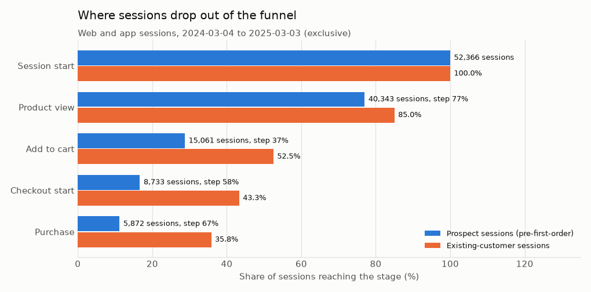
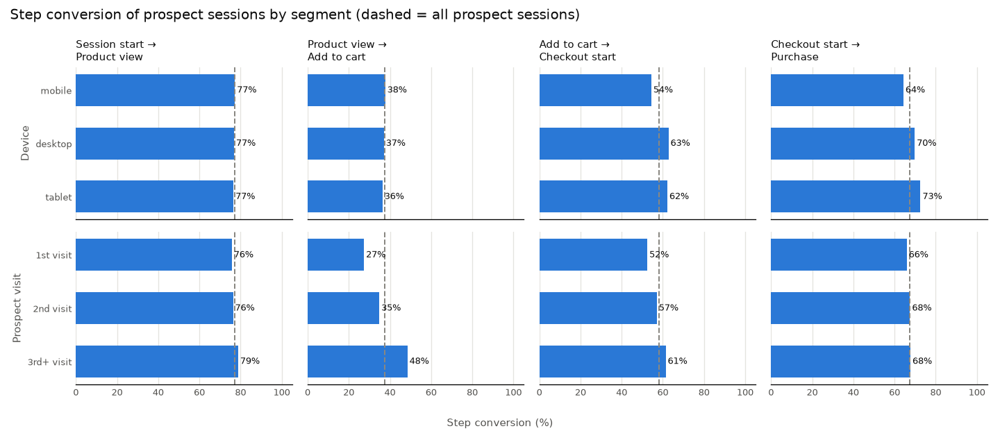
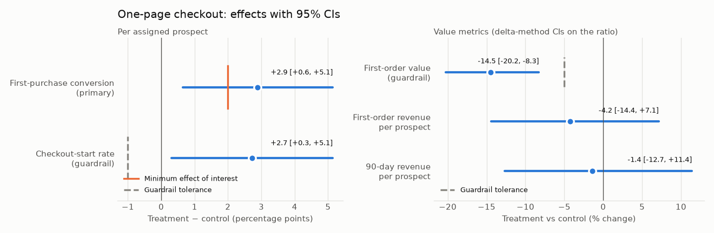
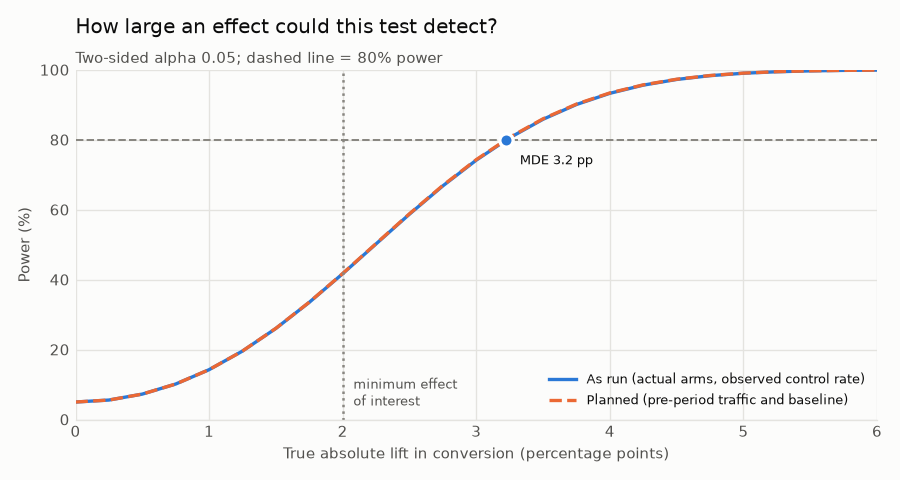
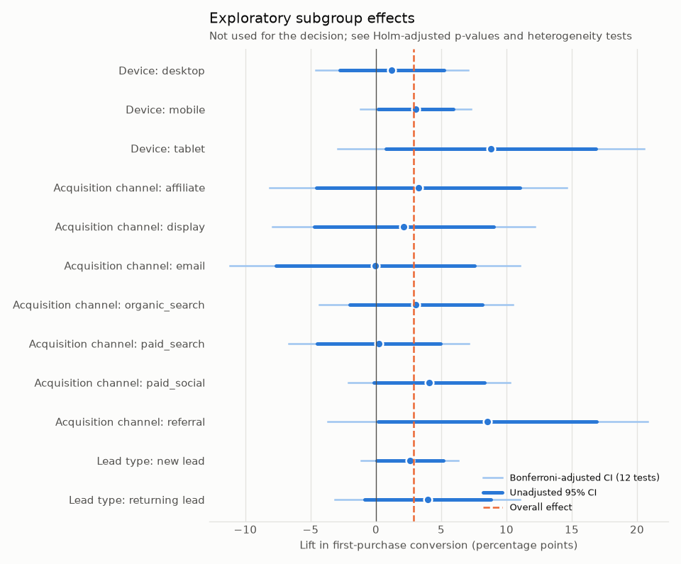
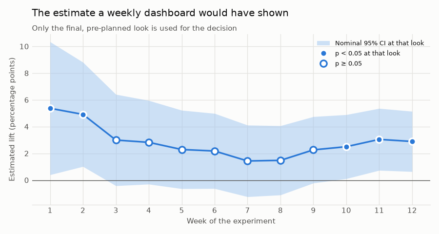

# 03 · Conversion Funnel and Experimentation

## Business problem

Only about one prospect web or app session in nine ends in a purchase, and roughly three in four
new leads have not bought within a month of signing up. Product and growth teams disagree on
where to invest: merchandising (getting visitors to add to cart) or checkout (getting carts
paid). Last spring the checkout team ran a 12-week A/B test that replaced the three-step
checkout with a **one-page checkout**, and now wants to ship it.

**Business question:** where do prospects drop out of the conversion funnel, and does the
one-page checkout improve conversion?

## Decision supported

1. **Where to invest next:** which funnel step loses the most prospects, and which segments
   (device, platform, traffic source, visit number) lag at which step.
2. **Ship / hold / iterate the one-page checkout**, using a decision rule fixed before the
   analysis (below). The rule separates *"is there an effect?"* (statistical significance)
   from *"is it worth shipping?"* (minimum effect of interest, guardrails, revenue).
3. **Whether to target the change by segment:** only if subgroup differences survive
   multiple-comparison correction and a heterogeneity test.

## Data used

Shared synthetic tables from [section 00](../00_foundation/README.md):

| Table | Used for |
|---|---|
| `funnel_events` | Ordered stage events per session (session start → product view → add to cart → checkout start → purchase) |
| `sessions` | Session attributes (device, platform, traffic source), prospect vs existing-customer sessions, visit number |
| `prospects`, `customers` | Lead creation time and attributes; first-order time (`customer_since`) |
| `orders` | First-order value and item count; 90-day revenue after assignment |
| `experiments` | Registry of `EXP001`: hypothesis, window, randomization unit, pre-registered primary and guardrail metrics |
| `experiment_assignments` | Hash-based arm assignment, logged at each prospect's first eligible session |

- **Funnel period:** the 52 weeks before the experiment, so the baseline is not affected by
  the treatment. The dates come from the registry, not from constants.
- **Experiment window:** 2025-03-03 to 2025-05-25 (12 weeks). Eligible = unconverted prospects
  with a web/app session in the window. The randomization unit is the prospect, so every
  experiment metric is computed **per assigned prospect**, never per session.

## Method

Code: [`src/northstar/conversion/`](../../src/northstar/conversion)
([`funnel.py`](../../src/northstar/conversion/funnel.py),
[`experiment.py`](../../src/northstar/conversion/experiment.py),
[`stats.py`](../../src/northstar/conversion/stats.py),
[`report.py`](../../src/northstar/conversion/report.py)).

### Funnel construction

- **Ordered stages, monotone by definition.** A session's depth is the longest *contiguous*
  prefix of stages it logged. A session counts at stage k only if it also logged stages
  1..k-1, so a purchase event without a checkout event cannot inflate the purchase count.
  `funnel_integrity` counts skipped stages, missing session starts, duplicates,
  out-of-order timestamps and orphan events. `assert_monotone` raises
  `FunnelIntegrityError` if any written table has more units downstream than upstream.
- **Two grains.**
  - *Session funnel:* where individual visits stop.
  - *Person-level funnel:* the deepest stage a lead reaches in any session within 30 days of
    creation. The fixed window avoids right-censoring, and only leads whose window closes
    before the experiment starts are included. "Ever reached stage k" implies "ever reached
    k-1", so this funnel is monotone too.
- **Prospects vs existing customers.** Prospect sessions (before the first order) are the
  conversion funnel. Existing-customer sessions are shown only for contrast.
- **Segments and drop-off.** Step conversion by device, platform, traffic source and prospect
  visit number (1st, 2nd, 3rd+; computed from prior sessions only). For each step: the
  weakest segment and the share of all losses. A *gap-to-benchmark* sizing estimates the extra
  completions and purchase equivalents if mobile and tablet converted at desktop's rate. This
  sizing is descriptive and not causal.

### Experiment analysis

The analysis plan is a frozen dataclass (`ExperimentPlan`). The pipeline writes it to
`metrics.json` before any result, and the decision function never reads subgroup results.

| Element | Choice | Why |
|---|---|---|
| Primary metric | First-purchase conversion per assigned prospect, within the window | The registry's pre-registered metric; matches the randomization unit |
| Test | Two-sided two-proportion z-test with unpooled SE; Wald 95% CI from the same SE | p < 0.05 if and only if the CI excludes 0, so conclusions cannot contradict the interval |
| Relative lift | Delta method on the log risk ratio | Asymmetric interval that respects the ratio scale |
| Minimum effect of interest (MEI) | +2.0 pp absolute (**assumed**) | Smallest lift the product team would act on; used for power and practical significance |
| Guardrails | First-order value (tolerance −5% relative); checkout-start rate (tolerance −1 pp) | The registry's guardrails; the tolerances are **assumed**. A guardrail *passes* only if its whole 95% CI is above the tolerance |
| Secondary | First-order revenue and 90-day revenue per assigned prospect (Welch t-tests, Holm within the family) | Unconditional value metrics that combine conversion and basket size |
| Subgroups | Device, acquisition channel, lead type (new vs returning) | Exploratory. Holm (FWER) and Benjamini-Hochberg (FDR) across all subgroup tests, Bonferroni-width intervals in the plot, and Cochran's Q for heterogeneity per dimension |

**Decision rule** (`experiment.decide`): not significant → *hold, no evidence*; significant
and negative → *reject*; significant and positive but a guardrail does not pass → *hold,
fix and re-test*; significant, positive, guardrails pass → *ship* if the whole CI clears the
MEI, otherwise *ship and keep measuring*.

**Power and design sensitivity.** Planning uses the 12 weeks before launch with the same
eligibility rule: baseline conversion, expected arm sizes, the MDE at 80% power, power at the
MEI, and the sample and duration needed for the MEI. After the test, the same quantities are
recomputed with the realized arms. A *retrodesign* (Gelman & Carlin) gives the expected
exaggeration of a significant estimate if the true effect equals the MEI.

## Validation design

- **Assignment audit (the pipeline stops on failure).** The audit checks that:
  - every recorded arm re-derives from the hash rule `sha256(experiment_id:prospect_id)`;
  - each prospect is assigned once, inside the window and before their first order;
  - the assigned set equals the eligible population, each assigned at their first eligible
    session;
  - there is no sample-ratio mismatch (chi-square alarm at p < 0.001).

  A pre-treatment covariate balance table (standardized mean differences) is written
  alongside.
- **Stable, testable assignment.** Tests confirm the hash rule is deterministic and
  independent of row order, uniform across buckets, and salted per experiment (arms are
  uncorrelated across experiment ids). Ramping the treatment share up never moves a treated
  unit back to control.
- **Leak-free covariates and fixed outcome windows.** Covariates use only sessions before
  assignment; a test deletes all later sessions and requires identical covariates. Outcomes
  use only events from assignment to the window end (conversion, reach) or a fixed 90 days
  (revenue). A first order moved past the window stops counting. The power analysis is
  reproduced from data truncated at launch.
- **Checking the method, not just the result.**
  - *A/A:* thousands of random splits of the control arm, where no effect exists, must reject
    at about 5% and cover 0 about 95% of the time.
  - *Randomization inference:* a permutation p-value that relies only on the design.
  - *Cross-checks:* the pooled-variance (chi-square) test, and a Lin regression-adjusted
    estimate with HC2 errors.
  - *Unit tests of the statistics:* intervals must cover the truth at the nominal rate in
    simulation. Power must match Monte Carlo, and the MDE must invert the power function.
    Welch must match scipy. Holm and BH must match a worked example. The retrodesign formulas
    must match simulation.
- **Pre-registration is enforced in code.** The plan's primary metric and guardrails must match
  the registry. Changing the subgroup family must leave the primary result unchanged. The
  decision function raises if the p-value and CI ever disagree.
- **Traceability.** The results block below is rendered from `outputs/metrics.json`, and
  a test requires them to match. The narrative claims in this README are asserted
  against the committed metrics, and a slow test regenerates the default data and reproduces
  every committed number.

## Results generated from the current run

Figures: [`funnel_stages.png`](outputs/figures/funnel_stages.png),
[`step_conversion_by_segment.png`](outputs/figures/step_conversion_by_segment.png),
[`experiment_effects.png`](outputs/figures/experiment_effects.png),
[`power_curve.png`](outputs/figures/power_curve.png),
[`subgroup_forest.png`](outputs/figures/subgroup_forest.png),
[`cumulative_effect.png`](outputs/figures/cumulative_effect.png).
Tables: [`funnel_overall.csv`](outputs/funnel_overall.csv),
[`funnel_prospect_cohort.csv`](outputs/funnel_prospect_cohort.csv),
[`funnel_segments.csv`](outputs/funnel_segments.csv),
[`dropoff_opportunity.csv`](outputs/dropoff_opportunity.csv),
[`experiment_results.csv`](outputs/experiment_results.csv),
[`experiment_units_summary.csv`](outputs/experiment_units_summary.csv),
[`covariate_balance.csv`](outputs/covariate_balance.csv),
[`experiment_funnel_by_arm.csv`](outputs/experiment_funnel_by_arm.csv),
[`subgroup_effects.csv`](outputs/subgroup_effects.csv),
[`power_curve.csv`](outputs/power_curve.csv),
[`cumulative_effect.csv`](outputs/cumulative_effect.csv) and
[`metrics.json`](outputs/metrics.json).

<!-- BEGIN GENERATED: conversion-results -->
_Data seed `20240101`, 40,000 prospects. Rendered from `outputs/metrics.json`._

### Part 1 - Funnel diagnostics

**Funnel data quality.** 606,786 funnel events across 220,091 sessions; orphan events: 0, sessions without events: 0, sessions missing session start: 0, sessions with skipped stages: 0, duplicate stage events: 0, out of order events: 0. Every table below is checked to be non-increasing downstream.

**Session funnel** (2024-03-04 to 2025-03-03, exclusive: the 52 weeks before the experiment)

| Stage | Prospect sessions | Share of sessions | Step conversion | Lost at this step | Share of all losses | Existing-customer step conversion |
|---|---:|---:|---:|---:|---:|---:|
| Session start | 52,366 | 100.0% | - | 0 | 0.0% | - |
| Product view | 40,343 | 77.0% | 77.0% | 12,023 | 25.9% | 85.0% |
| Add to cart | 15,061 | 28.8% | 37.3% | 25,282 | 54.4% | 61.8% |
| Checkout start | 8,733 | 16.7% | 58.0% | 6,328 | 13.6% | 82.5% |
| Purchase | 5,872 | 11.2% | 67.2% | 2,861 | 6.2% | 82.7% |

Largest absolute loss: **Product view → add to cart**. Lowest step conversion: **Product view → add to cart**.

**Person-level funnel** (17,004 leads created 2024-03-04 to 2025-02-01 (exclusive), deepest stage in any session within 30 days of lead creation)

| Stage | Leads reaching | Share of leads | Step conversion |
|---|---:|---:|---:|
| Session start | 17,004 | 100.0% | - |
| Product view | 15,344 | 90.2% | 90.2% |
| Add to cart | 7,945 | 46.7% | 51.8% |
| Checkout start | 5,541 | 32.6% | 69.7% |
| Purchase | 4,230 | 24.9% | 76.3% |

**Step conversion by segment** (prospect sessions; descriptive, not causal)

| Segment | Level | Sessions | Session start → product view | Product view → add to cart | Add to cart → checkout start | Checkout start → purchase | Session → purchase |
|---|---|---:|---:|---:|---:|---:|---:|
| Device | mobile | 29,034 | 77.3% | 37.7% | 54.4% | 64.3% | 10.2% |
| Device | desktop | 17,346 | 76.8% | 37.0% | 62.7% | 69.8% | 12.5% |
| Device | tablet | 5,986 | 76.6% | 36.4% | 62.2% | 72.6% | 12.6% |
| Platform | web | 36,888 | 77.0% | 37.3% | 59.2% | 67.9% | 11.6% |
| Platform | app | 15,478 | 77.1% | 37.4% | 55.1% | 65.4% | 10.4% |
| Traffic source | paid_search | 4,368 | 77.6% | 29.3% | 53.9% | 64.9% | 8.0% |
| Traffic source | paid_social | 4,943 | 73.7% | 31.5% | 55.2% | 66.8% | 8.6% |
| Traffic source | display | 2,713 | 72.5% | 35.4% | 62.7% | 65.4% | 10.5% |
| Traffic source | affiliate | 1,427 | 74.6% | 25.4% | 54.2% | 61.2% | 6.3% |
| Traffic source | email | 8,117 | 79.9% | 47.0% | 58.6% | 69.3% | 15.3% |
| Traffic source | referral | 1,591 | 80.5% | 33.6% | 55.1% | 72.2% | 10.7% |
| Traffic source | organic_search | 15,103 | 76.7% | 36.6% | 57.4% | 67.1% | 10.8% |
| Traffic source | direct | 14,104 | 77.5% | 38.8% | 59.6% | 66.7% | 11.9% |
| Prospect visit | 1st visit | 18,570 | 75.8% | 27.4% | 52.5% | 65.9% | 7.2% |
| Prospect visit | 2nd visit | 14,667 | 76.3% | 34.8% | 57.1% | 67.5% | 10.2% |
| Prospect visit | 3rd+ visit | 19,129 | 78.8% | 48.5% | 61.4% | 67.7% | 15.9% |

Weakest segment at each step (levels with at least 1,000 sessions entering the step):

| Step | Weakest segment | Its rate | All prospect sessions |
|---|---|---:|---:|
| Session start → product view | Traffic source: display | 72.5% | 77.0% |
| Product view → add to cart | Traffic source: affiliate | 25.4% | 37.3% |
| Add to cart → checkout start | Prospect visit: 1st visit | 52.5% | 58.0% |
| Checkout start → purchase | Device: mobile | 64.3% | 67.2% |

**Drop-off sizing: device gap to desktop.** Extra step completions in the period if each level converted at the desktop rate, and the purchases they would carry through at that level's own downstream rates. A benchmark gap, not a causal estimate.

| Level | Step | Entering | Level rate | Reference rate | Extra completions | Purchase equivalents |
|---|---|---:|---:|---:|---:|---:|
| mobile | Session start → product view | 29,034 | 77.3% | 76.8% | -126 | -17 |
| mobile | Product view → add to cart | 22,433 | 37.7% | 37.0% | -148 | -52 |
| mobile | Add to cart → checkout start | 8,458 | 54.4% | 62.7% | +706 | +454 |
| mobile | Checkout start → purchase | 4,600 | 64.3% | 69.8% | +253 | +253 |
| tablet | Session start → product view | 5,986 | 76.6% | 76.8% | +16 | +3 |
| tablet | Product view → add to cart | 4,583 | 36.4% | 37.0% | +32 | +14 |
| tablet | Add to cart → checkout start | 1,666 | 62.2% | 62.7% | +9 | +7 |
| tablet | Checkout start → purchase | 1,036 | 72.6% | 69.8% | -29 | -29 |

### Part 2 - One-page checkout experiment

**Experiment registry.** `EXP001` (one_page_checkout), 2025-03-03 to 2025-05-25 inclusive, randomized by prospect (person), target treatment share 50%. Hypothesis: _Replacing the three-step checkout with a one-page checkout increases the share of new visitors who complete a first purchase._

**Analysis plan (fixed before outcomes are computed; `ExperimentPlan`)**

| Item | Plan |
|---|---|
| Primary metric | First-purchase conversion: share of assigned prospects whose first order is placed between assignment and the end of the experiment window |
| Registry wording | First-purchase conversion: share of assigned prospects whose first order is placed during the experiment window |
| Test | two-sided two-proportion z-test (unpooled SE) with the matching Wald 95% CI, alpha 0.05 |
| Minimum effect of interest (assumed) | +2.0 pp absolute |
| Target power | 80% |
| Guardrail (assumed tolerance) | Average first-order net value: passes if the 95% CI rules out a decline worse than 5% relative |
| Guardrail (assumed tolerance) | Checkout-start rate: passes if the 95% CI rules out a decline worse than 1 pp absolute |
| Secondary (decision support) | First-order net revenue per assigned prospect; Net revenue per assigned prospect, 90 days from assignment |
| Exploratory subgroups | device_type, acquisition_channel, lead_type; Holm (FWER) and Benjamini-Hochberg (FDR) across all subgroup tests; not used for the decision |

**Assignment audit** (the pipeline refuses to write results if any check fails)

| Check | Result |
|---|---|
| variant matches hash rule | pass |
| one assignment per prospect | pass |
| assigned inside window | pass |
| assigned before first order | pass |
| every eligible prospect assigned at first exposure | pass |
| no sample ratio mismatch | pass |

Arms: 2,888 control / 2,886 treatment (observed treatment share 49.98%; SRM chi-square p = 0.9790, alarm below 0.001). Covariate balance: largest |standardized mean difference| 0.043 across 30 pre-treatment covariates (0 above 0.1).

**Power analysis.** Planning used the 12 weeks before launch (2024-12-09 to 2025-03-03, exclusive) with the same eligibility rule: 6,033 eligible prospects, baseline conversion 25.9%.

| Design quantity | Planned | As run |
|---|---:|---:|
| Units per arm | 3,016 | 2,888 / 2,886 |
| Control conversion | 25.9% | 24.2% |
| MDE at 80% power | +3.22 pp (12.4% relative) | +3.23 pp |
| Power at the minimum effect of interest (+2.0 pp) | 41.8% | 41.7% |

Reaching 80% power at the minimum effect of interest would need 7,718 prospects per arm, about 31 weeks at pre-period traffic. If the true lift were exactly +2.0 pp, a significant result from this design would overstate it by 54% on average (exaggeration ratio 1.54; sign-error rate 0.0002).

**Primary result (pre-registered)**

| Metric | Control | Treatment | Absolute lift [95% CI] | Relative lift [95% CI] | p-value |
|---|---:|---:|---:|---:|---:|
| First-purchase conversion | 24.24% (n = 2,888) | 27.13% (n = 2,886) | +2.89 pp [+0.64, +5.15] | +11.9% [+2.5, +22.2] | 0.0118 |

**Guardrails**

| Guardrail | Control | Treatment | Difference [95% CI] | Relative [95% CI] | p-value | Tolerance | Status |
|---|---:|---:|---:|---:|---:|---:|---|
| Average first-order net value | $86.02 | $73.59 | -$12.43 [-$18.02, -$6.84] | -14.5% [-20.2, -8.3] | < 0.0001 | -5% relative | **fail** |
| Checkout-start rate | 31.23% | 33.96% | +2.72 pp [+0.31, +5.14] | +8.7% [+0.9, +17.1] | 0.0272 | -1 pp | **pass** |

First-order value is measured on converters only (700 control, 783 treatment), a post-treatment subset. The secondary revenue metrics below include every assigned prospect (zeros for non-buyers), so they compare randomized groups. Basket diagnostic (same converters, descriptive): 1.73 vs 1.57 items per first order (-9.0% [-13.5, -4.4], p = 0.0002).

**Secondary metrics** (decision support; Welch t-tests, Holm-adjusted within the family)

| Metric | Control | Treatment | Difference [95% CI] | Relative [95% CI] | p-value | Holm p |
|---|---:|---:|---:|---:|---:|---:|
| First-order net revenue per assigned prospect | $20.85 | $19.96 | -$0.88 [-$3.18, $1.41] | -4.2% [-14.4, +7.1] | 0.4497 | 0.8994 |
| Net revenue per assigned prospect, 90 days from assignment | $55.39 | $54.62 | -$0.76 [-$7.47, $5.94] | -1.4% [-12.7, +11.4] | 0.8240 | 0.8994 |

**Decision (pre-specified rule in `experiment.decide`)**

| Question | Answer |
|---|---|
| Statistically significant at alpha 0.05? | yes (p = 0.0118; 95% CI excludes 0) |
| Practically significant? | the point estimate is above the minimum effect of interest, but the CI extends below it (+2.0 pp) |
| Guardrails pass? | no |
| Recommendation | **Do not ship as tested: conversion improved, but at least one guardrail did not pass. Fix the cause and re-test.** |

**Business translation** (observed effects restated; eligible traffic annualized from the experiment window)

| Quantity | Estimate [95% CI] |
|---|---:|
| Extra first purchases per 1,000 eligible prospects | +28.9 [+6.4, +51.5] |
| Extra first purchases per year (~25,089 eligible prospects) | +726 [+161, +1,291] |
| First-order net revenue per 1,000 eligible prospects | -$885 [-$3,179, $1,409] |
| 90-day net revenue per 1,000 eligible prospects | -$761 [-$7,467, $5,945] |
| Conversion lift needed to hold first-order revenue flat at the treatment's first-order value | +4.09 pp |

**Robustness and validation of the method**

| Check | Result |
|---|---|
| Pooled-variance z-test (= chi-square) | p = 0.0119 |
| Randomization inference (10,000 re-randomizations) | p = 0.0112 |
| Regression-adjusted lift (Lin estimator, 23 pre-treatment covariates, HC2 SE) | +2.52 pp [+0.32, +4.73], p = 0.0251; SE 0.980x unadjusted |
| A/A: 2,000 random splits of the control arm (2,888 units) | false-positive rate 4.50% [3.59%, 5.41%] vs nominal 5%; CI covers 0 in 95.50% |

**Mechanism: funnel reach by arm** (share of assigned prospects reaching each stage in the window; the last row conditions on a post-treatment event and is descriptive)

| Stage | Control | Treatment | Difference [95% CI] | p-value |
|---|---:|---:|---:|---:|
| Product view | 88.5% | 89.0% | +0.44 pp [-1.19, +2.07] | 0.5945 |
| Add to cart | 45.0% | 47.6% | +2.56 pp [-0.01, +5.13] | 0.0510 |
| Checkout start | 31.2% | 34.0% | +2.72 pp [+0.31, +5.14] | 0.0272 |
| Purchase | 24.2% | 27.1% | +2.89 pp [+0.64, +5.15] | 0.0118 |
| Purchase given checkout start | 77.6% | 79.9% | +2.29 pp [-1.41, +5.99] | 0.2247 |

**Exploratory subgroups** (12 tests; 4 nominally significant, 0 after Holm correction)

| Segment | Level | n (C / T) | Control | Treatment | Lift [95% CI] | p | Holm p | BH q |
|---|---|---:|---:|---:|---:|---:|---:|---:|
| Device | desktop | 960 / 961 | 27.2% | 28.4% | +1.2 pp [-2.8, +5.2] | 0.5505 | 1.0000 | 0.6606 |
| Device | mobile | 1,700 / 1,704 | 23.0% | 26.1% | +3.1 pp [+0.2, +5.9] | 0.0381 | 0.4193 | 0.1377 |
| Device | tablet | 228 / 221 | 21.1% | 29.9% | +8.8 pp [+0.8, +16.8] | 0.0314 | 0.3769 | 0.1377 |
| Acquisition channel | affiliate | 214 / 242 | 22.0% | 25.2% | +3.2 pp [-4.5, +11.0] | 0.4144 | 1.0000 | 0.6216 |
| Acquisition channel | display | 202 / 179 | 12.4% | 14.5% | +2.1 pp [-4.7, +9.0] | 0.5401 | 1.0000 | 0.6606 |
| Acquisition channel | email | 306 / 312 | 36.6% | 36.5% | -0.1 pp [-7.7, +7.5] | 0.9871 | 1.0000 | 0.9871 |
| Acquisition channel | organic_search | 572 / 588 | 24.7% | 27.7% | +3.1 pp [-2.0, +8.1] | 0.2339 | 1.0000 | 0.4010 |
| Acquisition channel | paid_search | 697 / 677 | 27.5% | 27.8% | +0.2 pp [-4.5, +5.0] | 0.9264 | 1.0000 | 0.9871 |
| Acquisition channel | paid_social | 657 / 634 | 16.6% | 20.7% | +4.1 pp [-0.2, +8.3] | 0.0601 | 0.4810 | 0.1443 |
| Acquisition channel | referral | 240 / 254 | 30.8% | 39.4% | +8.5 pp [+0.2, +16.9] | 0.0459 | 0.4567 | 0.1377 |
| Lead type | new lead | 2,273 / 2,295 | 24.8% | 27.4% | +2.6 pp [+0.1, +5.1] | 0.0457 | 0.4567 | 0.1377 |
| Lead type | returning lead | 615 / 591 | 22.3% | 26.2% | +4.0 pp [-0.9, +8.8] | 0.1094 | 0.7659 | 0.2188 |

Heterogeneity (Cochran's Q: do the levels share one effect?):

| Segment | Levels | Q | df | p | Holm p |
|---|---:|---:|---:|---:|---:|
| Device | 3 | 2.77 | 2 | 0.2503 | 0.7510 |
| Acquisition channel | 7 | 3.89 | 6 | 0.6919 | 1.0000 |
| Lead type | 2 | 0.24 | 1 | 0.6269 | 1.0000 |

**Weekly looks** (what a dashboard would have shown; 5 of 12 looks had p < 0.05; only the final look is the planned analysis)

| Week | Data through | Units | Lift [95% CI] | p-value |
|---:|---|---:|---:|---:|
| 1 | 2025-03-09 | 797 | +5.37 pp [+0.40, +10.34] | 0.0342 |
| 2 | 2025-03-16 | 1,408 | +4.92 pp [+1.02, +8.81] | 0.0134 |
| 3 | 2025-03-23 | 2,002 | +3.00 pp [-0.42, +6.41] | 0.0856 |
| 4 | 2025-03-30 | 2,483 | +2.83 pp [-0.30, +5.95] | 0.0764 |
| 5 | 2025-04-06 | 2,940 | +2.29 pp [-0.64, +5.22] | 0.1257 |
| 6 | 2025-04-13 | 3,350 | +2.18 pp [-0.63, +4.99] | 0.1283 |
| 7 | 2025-04-20 | 3,772 | +1.43 pp [-1.24, +4.11] | 0.2935 |
| 8 | 2025-04-27 | 4,172 | +1.48 pp [-1.11, +4.06] | 0.2626 |
| 9 | 2025-05-04 | 4,560 | +2.26 pp [-0.22, +4.75] | 0.0739 |
| 10 | 2025-05-11 | 4,983 | +2.50 pp [+0.11, +4.89] | 0.0405 |
| 11 | 2025-05-18 | 5,382 | +3.05 pp [+0.73, +5.36] | 0.0099 |
| 12 | 2025-05-25 | 5,774 | +2.89 pp [+0.64, +5.15] | 0.0118 |
<!-- END GENERATED: conversion-results -->













## Business interpretation

### Where prospects drop out

- **The biggest leak is before checkout.** Product view → add to cart is both the largest
  absolute loss (more than half of all prospect-session drop-off) and the lowest step
  conversion. The checkout steps lose far fewer sessions. A checkout change can, at best,
  address a minority of the funnel's losses. Merchandising, product discovery and
  consideration (the steps that get a visitor to add to cart) hold the larger opportunity.
- **Intent builds over visits.** A prospect's third and later visits add to cart far more
  often than first visits, and first-visit sessions are also the weakest at entering
  checkout. Nurture that brings leads back (email is the strongest traffic source) matters
  as much as any single page.
- **Mobile's gap is at checkout, not browsing.** Mobile matches desktop up to the cart, then
  trails at both checkout steps and is the weakest segment at checkout start → purchase. The
  benchmark sizing puts more purchase equivalents at mobile's *entry* into checkout than at
  checkout completion. A mobile-specific cart-to-checkout fix is the most concrete funnel
  opportunity found here. That sizing is a gap to desktop, not a causal estimate.

### Statistical significance: is there an effect?

**Yes.** The one-page checkout raised first-purchase conversion, and the pre-registered test is
significant at alpha 0.05, with the 95% CI excluding zero. The conclusion survives every
cross-check: the pooled chi-square test, randomization inference and the covariate-adjusted
(Lin) estimate all agree. The A/A check shows the test's false-positive rate is at its nominal
level on this data. The assignment audit passed, with no sample-ratio mismatch and good
covariate balance.

Three caveats temper the size of the effect, not its existence:

- **The design was underpowered for the effect that matters.** At pre-period traffic, 12
  weeks gave an MDE of about 3 pp and roughly 40% power at the +2 pp minimum effect of
  interest; 80% power would have needed a test more than twice as long. When a low-powered
  test is significant, the estimate tends to be inflated: at the MEI, significant results
  overstate the effect by about half on average. The true lift is more likely below the
  point estimate than above it, and the covariate-adjusted estimate is indeed smaller.
- **Peeking would have misled.** A weekly dashboard showed a nominally significant, much larger
  lift after week one and two, then lost significance for most of the test, then regained it.
  The plan's single fixed-horizon look is the only valid test. Anyone monitoring weekly needs a
  sequential method (alpha spending or always-valid intervals).
- **Mechanism is only partly visible.** Treated prospects see the new page only after starting
  checkout, yet the arms also differ by a similar amount in reaching checkout. That upstream
  gap cannot come from the new page, so part of the headline difference is likely chance. The
  conditional step (purchase given checkout start) moves in the expected direction but is not
  significant on its own, and it conditions on a post-treatment event.

### Business significance: is it worth shipping?

**Not as tested.** Statistical significance says the effect is probably not zero. It does not
say the effect is large enough, or that it makes money:

- **Practical significance is not established.** The point estimate is above the +2 pp minimum
  effect of interest, but the CI extends well below it.
- **The first-order value guardrail fails.** Buyers in the treatment arm spent substantially
  less on their first order. The whole CI lies beyond the 5% tolerance, and the basket
  diagnostic shows fewer items per order. The one-page layout appears to cut the add-on items
  that the multi-step checkout picked up. Because first-order value is measured on converters
  only, part of the drop could reflect *who* converts. That is why the unconditional
  revenue metrics decide the business case.
- **Revenue per prospect did not improve.** First-order revenue per assigned prospect and 90-day
  revenue per assigned prospect are both statistically indistinguishable from zero, with point
  estimates slightly *negative*. Holding first-order revenue flat at the treatment's smaller
  baskets would need a conversion lift well above the observed one. The extra first purchases
  (hundreds per year at current traffic) are real customers, but on this evidence they do not
  add revenue.

The subgroup analysis gives no reason to ship to a slice. A few segments (tablet, referral,
mobile, new leads) look significant before correction, but none survive Holm, and Cochran's Q
finds no heterogeneity across device, channel or lead type. The large lifts on small segments
are what noise looks like with twelve tests.

**Recommendation.** Follow the pre-specified rule: **do not ship the one-page checkout as
tested.** Keep the one-page flow's conversion gain, but restore basket building (add-on and
recommendation modules, free-shipping threshold prompts) and re-test with **revenue per
assigned prospect** as the primary metric and conversion as a guardrail. Size the test with this
section's power tooling: at current traffic, detecting a 2 pp conversion lift needs about 31
weeks, and covariate adjustment only trims the standard error by a few percent, so duration is
the lever. The funnel diagnostics also point to a parallel, likely larger investment in mobile
cart-to-checkout and in product-page-to-cart conversion.

## Limitations and next steps

- **Assumed thresholds.** The +2 pp minimum effect of interest and the guardrail tolerances are
  business assumptions set in `ExperimentPlan`, not estimated. The decision changes if they
  change, which is why they are written down before the analysis.
- **Window-bound primary metric.** Prospects assigned late in the window had less time to
  convert. This is balanced across arms, so it is unbiased for the in-window effect, but it
  understates the eventual conversion effect. A fixed per-prospect window (e.g. 14 days from
  assignment) would be cleaner in a re-test.
- **Conditional guardrail.** Average first-order value compares converters, a post-randomization
  subset. Revenue per assigned prospect is the unbiased value comparison and is reported
  alongside.
- **Short horizon.** 90-day revenue captures early repeat purchases, but not lifetime value.
  Section 04's customer value model is the natural extension, as are a long-term holdout and
  novelty-effect checks.
- **Funnel sizing is descriptive.** Segment gaps reflect who uses each device and channel as
  well as the experience itself. They rank hypotheses for experiments; they are not effects.
- **Synthetic data.** Effects come from the generator's documented assumptions in
  `src/northstar/synthetic/params.py`, which include a positive checkout effect and a smaller
  basket for treated buyers. The analysis recovers the direction of both. The value of this
  section is the method, not evidence about real shoppers.

## Reproduction commands

From the repository root, with the virtual environment activated (see the root README):

```bash
northstar generate-data                 # shared data (section 00), if not already present
northstar conversion                    # rebuild outputs/ and the results block above (~10 s)
python -m pytest tests/test_conversion_stats.py tests/test_conversion_funnel.py \
  tests/test_conversion_experiment.py tests/test_conversion_pipeline.py
```

`northstar conversion` generates the default data first if `data/raw` is empty (pass
`--no-generate` to fail instead). Use `--data-dir`, `--out-dir` and `--readme` to run against
other data or write elsewhere. The analysis plan's defaults live in
`northstar.conversion.experiment.ExperimentPlan`. To explore other thresholds (as a
sensitivity analysis, not a re-decision):

```python
from northstar.conversion.experiment import ExperimentPlan
from northstar.conversion.report import ConversionConfig, run_analysis
from northstar.io import load_tables

config = ConversionConfig(plan=ExperimentPlan(minimum_effect_of_interest=0.03))
metrics, tables = run_analysis(load_tables(), config)
print(metrics["experiment"]["decision"])
```

The slow reproduction test
(`test_committed_metrics_are_reproduced_from_default_generation`) regenerates the default data
from scratch and reruns the analysis. It runs as part of the default `python -m pytest` and is
skipped by `-m "not slow"`.
