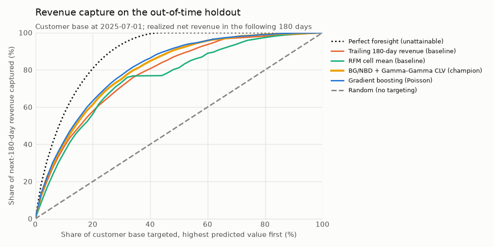
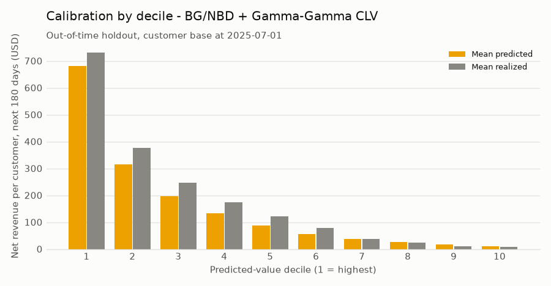
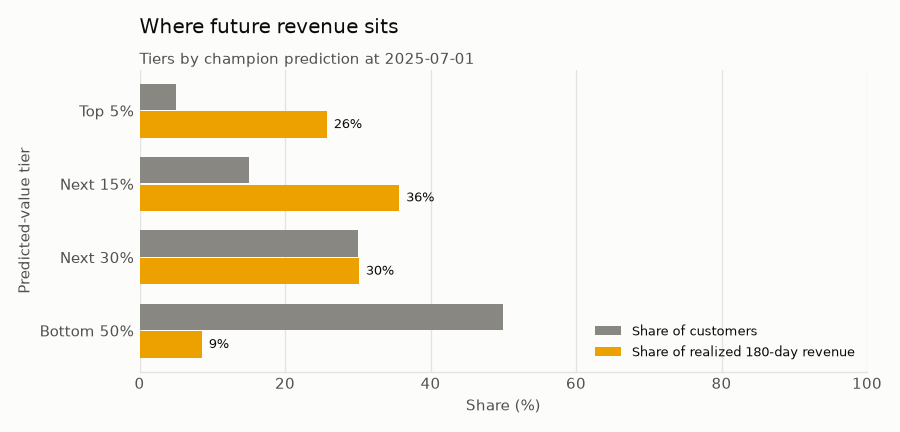
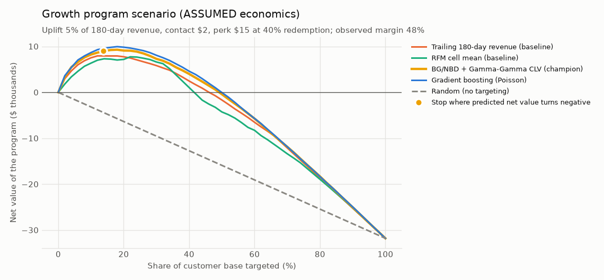
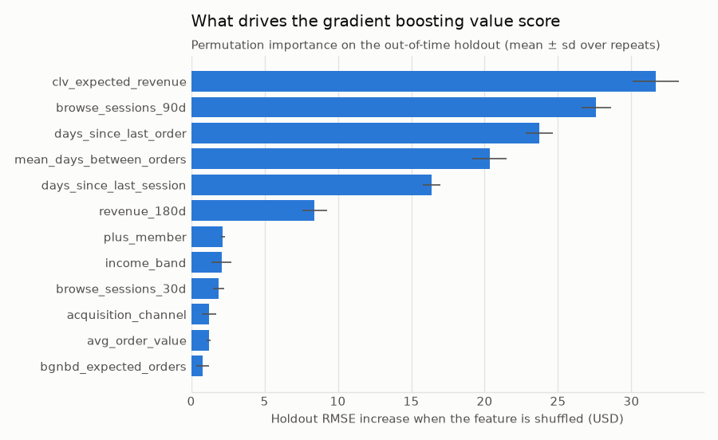

# 04 · Revenue Growth and Customer Value

## Business problem

Northstar's revenue is concentrated. In the six months after the portfolio's default cutoff, the
top tenth of the customer base spent more than half of the money, and most customers spent nothing
at all. Growth
marketing has a fixed budget for high-touch programs (VIP service, Northstar Plus invitations,
personalized cross-sell), and the list is built today by ranking customers on what they spent
in the last six months.

**Business question:** which customers represent the highest future value, and where should
growth efforts be focused?

## Decision supported

At each scoring run, growth marketing ranks the **whole customer base** by expected future value
and decides who gets which treatment. The analysis answers five questions:

1. Does a forward-looking value model rank and size future revenue better than the "last six
   months" rule and an RFM segmentation?
2. How much of next half-year's revenue sits with the top 1/5/10/20% of the ranked list?
3. How should the base be segmented by predicted value, and which customers does a
   past-spend list miss or over-rate?
4. What is each customer's next best action, under transparent rules a marketer can audit?
5. Under explicit, adjustable assumptions about program economics, how deep should a growth
   program go, and what does ranking by predicted value add?

## Target definition and time windows

Relative to a scoring cutoff `c` (the first day of a month):

| Window | Interval | Used for |
|---|---|---|
| Feature window | all history `< c`; activity windows of 30/90/180/365 days end at `c` | features, BG/NBD and Gamma-Gamma fits |
| Population | customers whose first order is `< c` (active and lapsed) | who is scored |
| Outcome window | `[c, c + 180 days)` | **target: net revenue (`orders.net_amount`) in this window, 0 if no order** |

- Future revenue is net of discounts and before cost of goods. It counts only orders placed
  after the cutoff, and new customers acquired during the window are out of scope (see
  [section 01](../01_acquisition/README.md)).
- **Historical spend never includes the target period.** `revenue_total`, `revenue_90d`,
  `revenue_180d` and `revenue_365d` sum orders strictly before `c`. The leakage audit reconciles
  `revenue_total + future_revenue` to the order log up to `c + 180 days` for every scored
  customer, so any overlap (or gap) between the two windows fails the run.
- Windows are half-open. An order exactly at `c` is part of the target and invisible to the
  features.
- Constants live in [`dataset.py`](../../src/northstar/revenue/dataset.py) (`HORIZON_DAYS`,
  `MIN_HISTORY_DAYS`) and are pinned by boundary tests in
  [`tests/test_revenue_dataset.py`](../../tests/test_revenue_dataset.py).

## Data used

Shared synthetic tables from [section 00](../00_foundation/README.md), read through
`northstar.timeline.snapshot`, so every feature uses only rows timestamped before the cutoff:

| Table | Used for |
|---|---|
| `customers` | tenure; acquisition channel, region, age/income band, device, email consent |
| `orders`, `order_lines`, `products` | recency, frequency and revenue over 90/180/365 days and lifetime, mean days between orders, order value, basket size, discount share, category breadth, store/app mix; BG/NBD and Gamma-Gamma inputs; the category rules; observed gross margin rate |
| `sessions` | browsing sessions without an order (30/90 days), days since the last visit |
| `marketing_touches` | lifecycle emails received, open rate and clicks in the last 90 days |
| `subscription_events` | Northstar Plus membership at the cutoff, cancellation requests in the last 180 days |
| `support_contacts` | contacts and low-CSAT contacts in 180 days (resolutions after the cutoff masked) |
| `orders` in `[c, c + 180d)` | **target only** (plus categories bought, used only to *score* the category rules) |

## Method

Code: [`src/northstar/revenue/`](../../src/northstar/revenue)
([`dataset.py`](../../src/northstar/revenue/dataset.py),
[`clv.py`](../../src/northstar/revenue/clv.py),
[`models.py`](../../src/northstar/revenue/models.py),
[`evaluation.py`](../../src/northstar/revenue/evaluation.py),
[`actions.py`](../../src/northstar/revenue/actions.py),
[`scenarios.py`](../../src/northstar/revenue/scenarios.py),
[`report.py`](../../src/northstar/revenue/report.py)). The engagement, membership and support
features reuse section 02's definitions, and the split logic reuses section 01's `SplitPlan`.

1. **Scoring runs.** Population = every customer acquired before the cutoff; target = net revenue
   in the next 180 days. The target is zero for about half of the base and heavily right-skewed.
2. **Point-in-time features (38).** Five customer attributes, 29 behavioral features and 4
   probabilistic-CLV outputs, all built from `snapshot(tables, cutoff)`.
3. **Four value models behind one `fit` / `predict` interface:**
   - *Trailing 180-day revenue (baseline):* "the next six months look like the last six". This
     is the rule behind today's top-spender list.
   - *RFM cell mean (baseline):* the smoothed training mean of future revenue in each recency
     (0-29, 30-89, 90-179, 180-364, 365+ days) × frequency (1, 2-3, 4-7, 8+ orders) × monetary
     (average-order-value tercile) cell.
   - *BG/NBD + Gamma-Gamma CLV:* the standard probabilistic model for non-contractual retail,
     implemented from the published likelihoods in [`clv.py`](../../src/northstar/revenue/clv.py).
     The BG/NBD model predicts repeat purchase occasions and the probability that a customer is
     still "alive"; the Gamma-Gamma model predicts spend per occasion, shrunk towards the
     population mean. Both are fit by maximum likelihood **on each run's pre-cutoff history,
     with no labels**. Expected revenue = expected purchase days in 180 days × expected spend
     per purchase day.
   - *Gradient boosting (Poisson):* `HistGradientBoostingRegressor` with a Poisson loss. It
     models the conditional mean of a non-negative, zero-inflated target, cannot predict
     negative revenue, and takes the CLV outputs as inputs. Hyperparameters and the seed are
     fixed.
4. **Champion selection by validation RMSE.** RMSE is minimized by the conditional mean, and
   the mean is what sums into a revenue plan. MAE is reported, but on this target it is
   minimized by the median (zero for most customers), so it rewards under-prediction.
5. **Evaluation.** Dollar error (RMSE, MAE, R²), calibration-in-the-large (total predicted /
   total realized - 1), calibration by decile, and ranking: Spearman correlation, **normalized
   Gini** (the Lorenz curve of revenue when customers are ordered by the prediction, relative to
   perfect foresight) and **revenue capture** of the top 1/5/10/20%. Ties are resolved by their
   expectation. The same metrics are repeated within the active base, so a model cannot look
   good only because lapsed customers are easy to rank last.
6. **Value segmentation.** Tiers by predicted value (top 5%, next 15%, next 30%, bottom 50%),
   and a *value migration* matrix crossing the top 20% by trailing revenue with the top 20% by
   predicted value: **core**, **rising** (missed by a past-spend list), **fading** (over-rated
   by it) and **base**.
7. **Next best action** ([`actions.py`](../../src/northstar/revenue/actions.py)). One action per
   customer from ordered rules; the first match wins and every threshold lives in
   `ActionRules`:
   1. *Retention outreach:* a top-20% spender over the last 365 days with BG/NBD P(alive) < 0.5.
      Protecting value comes first, and these customers go to the
      [section 02](../02_retention/README.md) program.
   2. *VIP care:* top 5% by predicted value (service and early access, no discount).
   3. *Northstar Plus invitation:* top 20% by predicted value, not a member, no recent
      cancellation.
   4. *Cross-sell:* top 50% by predicted value with purchases in at most two categories.
   5. *Personalized content:* the rest of the top 50%.
   6. *Low touch:* everyone else (newsletter only).

   Every message carries a **featured category** (the customer's most-bought category), and
   cross-sell names a **suggested new category** (the most widely bought category the customer
   does not own yet). Both rules use pre-cutoff data only and are scored against what customers
   actually bought next. Ranking inside each action by predicted value gives the call-list
   order ([`nba_priority_list.csv`](outputs/nba_priority_list.csv)).
8. **Growth program scenarios** ([`scenarios.py`](../../src/northstar/revenue/scenarios.py)).
   *Observed* inputs are each customer's realized 180-day revenue on the holdout and the gross
   margin rate before the cutoff. *Assumed* inputs live in one dataclass
   (`GrowthAssumptions`), are printed with the results and are stress-tested: the relative
   revenue uplift the program causes, the contact cost, the perk cost and the redemption rate.
   The analysis covers five ranking policies at fixed depths, an ex-ante "target while predicted
   incremental margin covers cost" rule, the break-even uplift of every policy, plan (predicted)
   vs. outcome (realized) for the champion's list, and a sensitivity grid over uplift × perk
   cost.

## Validation design

- **Out-of-time, purged split.** A 180-day target and 24 months of data leave room for exactly
  one out-of-time holdout run, **2025-07-01**, the portfolio's default cutoff (its label
  window runs to 2025-12-28, exclusive). Training labels must end before it, so model selection uses the
  **2025-01-01** validation run, and the learned models are first fit on four monthly runs
  (Apr - Jul 2024, whose label windows end by 2024-12-28). All models are then refit on the
  five training runs and scored **once** on the holdout. `SplitPlan` rejects any design whose
  label windows cross a split.
- **Leakage audit, run on every execution.** The audit rebuilds the holdout run from data
  truncated at its cutoff and requires identical features (including the refit BG/NBD and
  Gamma-Gamma outputs). It recomputes every label from the order log and reconciles historical
  spend plus target to the ledger. It also checks that every scored customer was acquired before
  the cutoff, that the latest event feeding any feature is strictly before the cutoff, that no
  outcome column is a feature, and that training labels end before the holdout starts. As a
  proxy-leak alarm, it flags any single feature with |Spearman| ≥ 0.9 against the target. If
  any check fails, `northstar revenue` stops without writing results.
- **Uncertainty.** 95% intervals come from a customer-level bootstrap (200 resamples, clustered
  by customer, although each customer appears once in the holdout). Champion-minus-model
  differences are paired on the same resamples.
- **Tests** ([`tests/test_revenue_*.py`](../../tests)). Hand-built customers pin every window
  boundary: orders exactly at the cutoff and at cutoff + 180 days, customers acquired at or
  after the cutoff, and lapsed customers. Deleting the entire future must change labels but no
  feature. The audit must catch an injected revenue proxy, corrupted labels and a
  target-contaminated spend aggregate. BG/NBD and Gamma-Gamma recover known parameters from
  data simulated by their own generative processes, and conditional expectations match Monte
  Carlo. Other tests check the Lorenz, Gini and capture metrics against hand calculations
  (including ties), the RFM baseline, the NBA rule order, the category rules and the scenario
  accounting and break-even formula, and run an end-to-end CLI. The README block must equal a
  rendering of `metrics.json`, the prose claims below are asserted against it, and a slow test
  regenerates the default data and reproduces the committed metrics.

## Results generated from the current run

Figures: [`revenue_gains.png`](outputs/figures/revenue_gains.png),
[`decile_calibration.png`](outputs/figures/decile_calibration.png),
[`value_tiers.png`](outputs/figures/value_tiers.png),
[`growth_scenario.png`](outputs/figures/growth_scenario.png),
[`feature_importance.png`](outputs/figures/feature_importance.png).
Tables: [`model_comparison.csv`](outputs/model_comparison.csv),
[`decile_table.csv`](outputs/decile_table.csv), [`gains_curve.csv`](outputs/gains_curve.csv),
[`revenue_capture.csv`](outputs/revenue_capture.csv),
[`feature_importance.csv`](outputs/feature_importance.csv),
[`value_tiers.csv`](outputs/value_tiers.csv),
[`value_migration.csv`](outputs/value_migration.csv),
[`next_best_action.csv`](outputs/next_best_action.csv),
[`nba_priority_list.csv`](outputs/nba_priority_list.csv),
[`growth_scenarios.csv`](outputs/growth_scenarios.csv),
[`growth_value_curve.csv`](outputs/growth_value_curve.csv),
[`planned_vs_realized.csv`](outputs/planned_vs_realized.csv),
[`scenario_sensitivity.csv`](outputs/scenario_sensitivity.csv), and everything in
[`metrics.json`](outputs/metrics.json).

<!-- BEGIN GENERATED: revenue-results -->
_Data seed `20240101`, 40,000 prospects. Rendered from `outputs/metrics.json`. Customer base = every customer whose first order was before the run; target = net revenue in the 180 days from the run; 200 customer-level bootstrap resamples for 95% intervals._

**Time-aware split**

| Split | Runs | First run | Last run | Customers scored | Unique customers | Median tenure (days) | Buyer rate | Mean future revenue |
|---|---:|---|---|---:|---:|---:|---:|---:|
| fit | 4 | 2024-04-01 | 2024-07-01 | 6,522 | 2,294 | 60 | 53.6% | $204.10 |
| validation | 1 | 2025-01-01 | 2025-01-01 | 5,434 | 5,434 | 159 | 45.7% | $164.12 |
| holdout | 1 | 2025-07-01 | 2025-07-01 | 8,643 | 8,643 | 236 | 43.2% | $180.35 |

**Leakage audit** (the pipeline refuses to write results if any check fails)

| Check | Result |
|---|---|
| features only from pre cutoff rows | pass |
| features unchanged when future rows removed | pass |
| labels only from prediction window | pass |
| historical spend excludes target period | pass |
| every scored customer acquired before cutoff | pass |
| no outcome columns used as features | pass |
| train labels end before holdout starts | pass |
| no single feature suspiciously predictive | pass |

Most predictive single feature on the holdout: `clv_expected_revenue` (|Spearman| 0.668, limit 0.9). Last training label window ends 2025-06-30; holdout run 2025-07-01. Spend reconciliation mismatches: 0.

Probabilistic CLV parameters, refit on pre-cutoff history at each run (time unit: weeks):

| Run | Customers | Repeat customers | BG/NBD r | alpha | a | b | Gamma-Gamma p | q | v |
|---|---:|---:|---:|---:|---:|---:|---:|---:|---:|
| 2024-04-01 | 979 | 337 | 0.534 | 3.98 | 352.546 | 2980.958 | 2.19 | 72.29 | 2737.4 |
| 2024-05-01 | 1,413 | 536 | 0.503 | 3.82 | 2.141 | 12.458 | 2.27 | 35.36 | 1319.4 |
| 2024-06-01 | 1,836 | 753 | 0.500 | 3.97 | 1.015 | 5.803 | 2.26 | 23.70 | 879.6 |
| 2024-07-01 | 2,294 | 1,025 | 0.509 | 3.94 | 0.617 | 3.705 | 2.29 | 27.58 | 999.0 |
| 2025-01-01 | 5,434 | 3,088 | 0.517 | 3.66 | 0.167 | 1.307 | 2.16 | 27.93 | 1049.1 |
| 2025-07-01 | 8,643 | 5,162 | 0.467 | 3.49 | 0.306 | 2.124 | 2.24 | 25.39 | 921.1 |

BG/NBD + Gamma-Gamma total predicted vs. realized revenue at every run (the model never sees labels, so each run is an out-of-sample check of the *level*):

| Run | Split | Label window ends | Customers | Predicted total | Realized total | Bias |
|---|---|---|---:|---:|---:|---:|
| 2024-04-01 | fit | 2024-09-28 | 979 | $161,674 | $196,381 | -17.7% |
| 2024-05-01 | fit | 2024-10-28 | 1,413 | $208,346 | $279,165 | -25.4% |
| 2024-06-01 | fit | 2024-11-28 | 1,836 | $271,176 | $369,149 | -26.5% |
| 2024-07-01 | fit | 2024-12-28 | 2,294 | $361,497 | $486,475 | -25.7% |
| 2025-01-01 | validation | 2025-06-30 | 5,434 | $1,112,896 | $891,825 | +24.8% |
| 2025-07-01 | holdout | 2025-12-28 | 8,643 | $1,347,094 | $1,558,807 | -13.6% |

**Model comparison** (champion selected on validation RMSE: **BG/NBD + Gamma-Gamma CLV**; learned models refit on all training runs and every model scored once on the same holdout)

| Model | Validation RMSE | Holdout RMSE [95% CI] | MAE | R² | Bias (total) | Spearman | Normalized Gini [95% CI] | Top-10% revenue capture [95% CI] |
|---|---:|---:|---:|---:|---:|---:|---:|---:|
| Trailing 180-day revenue (baseline) | 271.5 | 269.4 [260.0, 279.8] | 148.6 | 0.360 | -4.4% | 0.612 | 0.719 [0.704, 0.735] | 38.7% [37.2%, 40.5%] |
| RFM cell mean (baseline) | 284.1 | 279.7 [269.8, 292.3] | 180.6 | 0.310 | +9.1% | 0.535 | 0.661 [0.644, 0.679] | 35.5% [34.1%, 37.2%] |
| BG/NBD + Gamma-Gamma CLV **(champion)** | 246.3 | 245.8 [235.7, 255.4] | 138.0 | 0.467 | -13.6% | 0.668 | 0.776 [0.762, 0.788] | 40.6% [39.1%, 42.2%] |
| Gradient boosting (Poisson) | 254.6 | 242.6 [232.7, 252.8] | 132.6 | 0.481 | -15.9% | 0.683 | 0.797 [0.786, 0.808] | 41.7% [40.3%, 43.5%] |

- BG/NBD + Gamma-Gamma CLV minus Trailing 180-day revenue (baseline): RMSE -23.6 [-29.7, -16.9], normalized Gini +0.057 [+0.046, +0.065], top-10% capture +1.9 pp [+0.8, +3.0].
- BG/NBD + Gamma-Gamma CLV minus RFM cell mean (baseline): RMSE -33.8 [-40.0, -28.2], normalized Gini +0.115 [+0.104, +0.125], top-10% capture +5.0 pp [+3.9, +6.5].
- BG/NBD + Gamma-Gamma CLV minus Gradient boosting (Poisson): RMSE +3.2 [-1.1, +7.9], normalized Gini -0.021 [-0.028, -0.016], top-10% capture -1.2 pp [-2.4, +0.3].

Within the active base only (5,676 customers with an order in the last 180 days, 65.7% of the base holding 96.8% of future revenue):

| Model | RMSE | Normalized Gini | Top-10% capture | Bias (total) |
|---|---:|---:|---:|---:|
| Trailing 180-day revenue (baseline) | 327.5 | 0.574 | 30.1% | -1.2% |
| RFM cell mean (baseline) | 331.0 | 0.592 | 26.2% | -5.8% |
| BG/NBD + Gamma-Gamma CLV | 298.3 | 0.667 | 31.6% | -14.9% |
| Gradient boosting (Poisson) | 294.3 | 0.703 | 32.8% | -15.7% |

**Revenue capture of top-ranked customers** (share of the holdout's realized 180-day revenue held by the top of each ranked list; lift = capture / share targeted)

| Share targeted | Random (no targeting) | Trailing 180-day revenue (baseline) | RFM cell mean (baseline) | BG/NBD + Gamma-Gamma CLV | Gradient boosting (Poisson) | Perfect foresight (unattainable) |
|---:|---:|---:|---:|---:|---:|---:|
| 1% | 1.0% (1.0x) | 6.8% (6.8x) | 4.3% (4.3x) | 7.2% (7.2x) | 7.4% (7.4x) | 10.5% (10.5x) |
| 5% | 5.0% (1.0x) | 23.5% (4.7x) | 19.9% (4.0x) | 25.7% (5.1x) | 26.0% (5.2x) | 35.9% (7.2x) |
| 10% | 10.0% (1.0x) | 38.7% (3.9x) | 35.5% (3.6x) | 40.6% (4.1x) | 41.7% (4.2x) | 56.3% (5.6x) |
| 20% | 20.0% (1.0x) | 57.8% (2.9x) | 56.2% (2.8x) | 61.4% (3.1x) | 63.3% (3.2x) | 80.8% (4.0x) |

**Calibration by decile - BG/NBD + Gamma-Gamma CLV** (holdout)

| Decile | Customers | Mean predicted | Mean realized | Predicted / realized | Buyer rate | Share of revenue | Cumulative |
|---:|---:|---:|---:|---:|---:|---:|---:|
| 1 | 865 | $680 | $731 | 0.93 | 92.4% | 40.6% | 40.6% |
| 2 | 864 | $316 | $376 | 0.84 | 83.0% | 20.8% | 61.4% |
| 3 | 864 | $196 | $247 | 0.79 | 71.8% | 13.7% | 75.1% |
| 4 | 864 | $133 | $175 | 0.76 | 60.0% | 9.7% | 84.8% |
| 5 | 865 | $87 | $121 | 0.72 | 49.4% | 6.7% | 91.5% |
| 6 | 864 | $56 | $77 | 0.73 | 33.6% | 4.3% | 95.8% |
| 7 | 864 | $37 | $37 | 1.01 | 20.2% | 2.0% | 97.8% |
| 8 | 864 | $25 | $23 | 1.11 | 12.5% | 1.3% | 99.1% |
| 9 | 864 | $17 | $10 | 1.84 | 5.3% | 0.5% | 99.6% |
| 10 | 865 | $9 | $7 | 1.27 | 3.5% | 0.4% | 100.0% |

**What drives the learned value score** (permutation importance: increase in holdout RMSE, USD, when the feature is shuffled)

| Feature | RMSE increase | SD over repeats |
|---|---:|---:|
| `clv_expected_revenue` | 31.7 | 1.6 |
| `browse_sessions_90d` | 27.6 | 1.0 |
| `days_since_last_order` | 23.7 | 0.9 |
| `mean_days_between_orders` | 20.3 | 1.2 |
| `days_since_last_session` | 16.4 | 0.6 |
| `revenue_180d` | 8.4 | 0.8 |
| `plus_member` | 2.2 | 0.2 |
| `income_band` | 2.1 | 0.7 |
| `browse_sessions_30d` | 1.9 | 0.4 |
| `acquisition_channel` | 1.2 | 0.5 |
| `avg_order_value` | 1.2 | 0.1 |
| `bgnbd_expected_orders` | 0.8 | 0.4 |

**Value segmentation** (customer base at 2025-07-01, tiers by the champion's prediction; realized columns are the check, not an input)

| Tier | Customers | Share of base | Predicted revenue share | Realized revenue share | Mean predicted | Mean realized | Buyer rate | Active share | Plus members | Mean categories |
|---|---:|---:|---:|---:|---:|---:|---:|---:|---:|---:|
| Top 5% | 432 | 5.0% | 27.9% | 25.7% | $871 | $928 | 95.1% | 100.0% | 59.0% | 4.3 |
| Next 15% | 1,296 | 15.0% | 36.0% | 35.6% | $374 | $429 | 85.2% | 100.0% | 30.3% | 3.5 |
| Next 30% | 2,593 | 30.0% | 26.7% | 30.1% | $139 | $181 | 60.4% | 98.5% | 10.1% | 2.5 |
| Bottom 50% | 4,322 | 50.0% | 9.4% | 8.5% | $29 | $31 | 15.0% | 32.2% | 2.4% | 1.8 |

Value migration (top 20% by trailing 180-day revenue vs. top 20% by predicted value):

| Group | Customers | Share of base | Predicted revenue share | Realized revenue share | Mean predicted | Mean realized | Buyer rate | Active share | Plus members | Mean categories |
|---|---:|---:|---:|---:|---:|---:|---:|---:|---:|---:|
| Core: high past and high predicted value | 1,325 | 15.3% | 54.0% | 51.7% | $549 | $609 | 89.7% | 100.0% | 41.6% | 3.9 |
| Rising: high predicted, not a top past spender | 403 | 4.7% | 10.0% | 9.6% | $333 | $372 | 81.1% | 100.0% | 24.1% | 3.1 |
| Fading: top past spender, not high predicted | 403 | 4.7% | 4.8% | 6.0% | $160 | $233 | 59.8% | 100.0% | 16.1% | 3.2 |
| Base: neither | 6,512 | 75.3% | 31.3% | 32.6% | $65 | $78 | 30.3% | 54.4% | 4.6% | 2.0 |

**Next best action** (ordered rules, first match wins: top-20% past spender with BG/NBD P(alive) < 0.50 → retention; top 5% predicted → VIP; top 20% non-member → Plus invite; top 50% with ≤ 2 categories → cross-sell; rest of top 50% → personalized; others → low touch)

| Action | Customers | Share of base | Predicted revenue share | Realized revenue share | Mean predicted | Mean realized | Buyer rate | Active share | Plus members | Mean categories |
|---|---:|---:|---:|---:|---:|---:|---:|---:|---:|---:|
| Retention outreach (hand to the section 02 program) | 212 | 2.5% | 1.2% | 1.5% | $75 | $109 | 22.6% | 65.1% | 17.4% | 3.9 |
| VIP care: early access and service, no discount | 432 | 5.0% | 27.9% | 25.7% | $871 | $928 | 95.1% | 100.0% | 59.0% | 4.3 |
| Invite to Northstar Plus | 838 | 9.7% | 22.5% | 20.7% | $361 | $386 | 83.2% | 100.0% | 0.0% | 3.4 |
| Cross-sell a new category | 1,452 | 16.8% | 14.9% | 16.4% | $138 | $176 | 58.5% | 99.7% | 9.8% | 1.6 |
| Personalized content in the featured category | 1,509 | 17.5% | 24.3% | 27.4% | $217 | $283 | 71.9% | 98.1% | 32.6% | 3.6 |
| Low-cost newsletter only | 4,200 | 48.6% | 9.2% | 8.3% | $29 | $31 | 15.2% | 31.9% | 2.1% | 1.8 |

- Featured category (the customer's most-bought category) was among the categories bought by 82.3% of the 3,730 customers who bought in the window, vs. 68.3% for featuring the best seller (`apparel`) to everyone.
- Suggested new category (most widely bought category not yet owned) was among the new categories of 53.6% of the 631 cross-sell customers who bought a new category, vs. 38.9% expected from a random unowned category.

**Growth program scenarios.** Realized revenue and the margin rate are observed. The program economics are **assumptions, not observed facts**: no growth treatment has been randomized, so the uplift in particular is unknown.

| Input | Value | Meaning |
|---|---:|---|
| `uplift` (assumed) | 5% | Relative lift in a targeted customer's 180-day net revenue (causal effect) |
| `contact_cost` (assumed) | $2.00 | Outreach cost per targeted customer (USD) |
| `perk_cost` (assumed) | $15.00 | Perk cost per redemption (USD) |
| `redemption_rate` (assumed) | 40% | Share of targeted customers who redeem the perk |
| gross margin rate (observed) | 47.9% | Gross margin / net revenue on all order lines before the run |

Cost per targeted customer $8.00; base of 8,643 customers.

| Depth | Policy | Customers | Their realized revenue | Incremental margin | Program cost | Net value | ROI | Break-even uplift |
|---:|---|---:|---:|---:|---:|---:|---:|---:|
| 5% | Random (no targeting) | 432 | $77,940 | $1,867 | $3,457 | -$1,590 | -0.46 | 9.3% |
| 10% | Random (no targeting) | 864 | $155,881 | $3,735 | $6,914 | -$3,180 | -0.46 | 9.3% |
| 20% | Random (no targeting) | 1,729 | $311,761 | $7,470 | $13,829 | -$6,359 | -0.46 | 9.3% |
| 30% | Random (no targeting) | 2,593 | $467,642 | $11,204 | $20,743 | -$9,539 | -0.46 | 9.3% |
| 50% | Random (no targeting) | 4,322 | $779,404 | $18,674 | $34,572 | -$15,898 | -0.46 | 9.3% |
| 5% | Trailing 180-day revenue (baseline) | 432 | $366,080 | $8,771 | $3,457 | $5,314 | 1.54 | 2.0% |
| 10% | Trailing 180-day revenue (baseline) | 864 | $602,622 | $14,438 | $6,914 | $7,524 | 1.09 | 2.4% |
| 20% | Trailing 180-day revenue (baseline) | 1,729 | $900,468 | $21,574 | $13,829 | $7,746 | 0.56 | 3.2% |
| 30% | Trailing 180-day revenue (baseline) | 2,593 | $1,108,925 | $26,569 | $20,743 | $5,826 | 0.28 | 3.9% |
| 50% | Trailing 180-day revenue (baseline) | 4,322 | $1,373,529 | $32,909 | $34,572 | -$1,663 | -0.05 | 5.2% |
| 5% | RFM cell mean (baseline) | 432 | $310,570 | $7,441 | $3,457 | $3,984 | 1.15 | 2.3% |
| 10% | RFM cell mean (baseline) | 864 | $554,174 | $13,278 | $6,914 | $6,363 | 0.92 | 2.6% |
| 20% | RFM cell mean (baseline) | 1,729 | $876,514 | $21,001 | $13,829 | $7,172 | 0.52 | 3.3% |
| 30% | RFM cell mean (baseline) | 2,593 | $1,141,768 | $27,356 | $20,743 | $6,613 | 0.32 | 3.8% |
| 50% | RFM cell mean (baseline) | 4,322 | $1,264,775 | $30,303 | $34,572 | -$4,269 | -0.12 | 5.7% |
| 5% | BG/NBD + Gamma-Gamma CLV | 432 | $400,786 | $9,603 | $3,457 | $6,145 | 1.78 | 1.8% |
| 10% | BG/NBD + Gamma-Gamma CLV | 864 | $632,029 | $15,143 | $6,914 | $8,228 | 1.19 | 2.3% |
| 20% | BG/NBD + Gamma-Gamma CLV | 1,729 | $956,750 | $22,923 | $13,829 | $9,094 | 0.66 | 3.0% |
| 30% | BG/NBD + Gamma-Gamma CLV | 2,593 | $1,170,424 | $28,042 | $20,743 | $7,299 | 0.35 | 3.7% |
| 50% | BG/NBD + Gamma-Gamma CLV | 4,322 | $1,425,879 | $34,163 | $34,572 | -$409 | -0.01 | 5.1% |
| 5% | Gradient boosting (Poisson) | 432 | $405,778 | $9,722 | $3,457 | $6,265 | 1.81 | 1.8% |
| 10% | Gradient boosting (Poisson) | 864 | $650,064 | $15,575 | $6,914 | $8,661 | 1.25 | 2.2% |
| 20% | Gradient boosting (Poisson) | 1,729 | $987,548 | $23,661 | $13,829 | $9,832 | 0.71 | 2.9% |
| 30% | Gradient boosting (Poisson) | 2,593 | $1,202,642 | $28,814 | $20,743 | $8,071 | 0.39 | 3.6% |
| 50% | Gradient boosting (Poisson) | 4,322 | $1,441,480 | $34,537 | $34,572 | -$35 | -0.00 | 5.0% |

- Without a fixed budget, targeting every customer whose *predicted* incremental margin covers their cost (predicted 180-day revenue ≥ $334) would reach 13.8% of the base (1,190 customers) for a planned $7,457 and a realized-under-assumptions $8,976 (break-even uplift 2.6%).

Plan vs. outcome for the champion's list (planned = predicted revenue of the list; realized = what those customers actually spent):

| Depth | Planned revenue of list | Realized revenue of list | Planned net value | Realized net value |
|---:|---:|---:|---:|---:|
| 5% | $376,399 | $400,786 | $5,561 | $6,145 |
| 10% | $588,212 | $632,029 | $7,179 | $8,228 |
| 20% | $861,398 | $956,750 | $6,810 | $9,094 |
| 30% | $1,030,851 | $1,170,424 | $3,955 | $7,299 |
| 50% | $1,221,075 | $1,425,879 | -$5,316 | -$409 |

Sensitivity of net value at 10% depth to the two least certain assumptions:

| Uplift | Policy | Perk $5 | Perk $15 | Perk $30 |
|---:|---|---:|---:|---:|
| 2% | Random (no targeting) | -$1,963 | -$5,420 | -$10,606 |
| 2% | Trailing 180-day revenue (baseline) | $2,318 | -$1,139 | -$6,325 |
| 2% | BG/NBD + Gamma-Gamma CLV | $2,600 | -$857 | -$6,043 |
| 5% | Random (no targeting) | $278 | -$3,180 | -$8,365 |
| 5% | Trailing 180-day revenue (baseline) | $10,981 | $7,524 | $2,338 |
| 5% | BG/NBD + Gamma-Gamma CLV | $11,686 | $8,228 | $3,043 |
| 10% | Random (no targeting) | $4,012 | $555 | -$4,631 |
| 10% | Trailing 180-day revenue (baseline) | $25,419 | $21,962 | $16,776 |
| 10% | BG/NBD + Gamma-Gamma CLV | $26,829 | $23,371 | $18,186 |
<!-- END GENERATED: revenue-results -->











## Business interpretation

**What is predicted, what is prioritized, what is assumed.** The model comparison, capture,
decile and segmentation tables are *predictive*: they say who is likely to spend. The next best
actions are *prioritization rules* built on those predictions. The realized-revenue columns next
to them check that the groups are ordered as predicted; they do not show that a treatment would
change anyone's spend. The scenario dollars layer *assumed* program effects on top, so they are
planning scenarios, not measured returns. **Nothing in this section is causal proof of
incremental revenue.**

- **A forward-looking value model beats today's list.** The pre-registered champion, the
  BG/NBD + Gamma-Gamma model, beats both the trailing-revenue rule and the RFM segmentation on
  the out-of-time holdout. It has lower RMSE, higher normalized Gini and higher top-10% revenue
  capture, and the paired bootstrap intervals for all three differences exclude zero. The gain
  holds within the active base, so it does not come only from lapsed customers.
- **The learned model ranks better, but the pre-registered choice stands.** Refit on all five
  training runs, gradient boosting ranks the holdout better than the champion (the Gini
  difference excludes zero), but its RMSE advantage is not significant. It lost on validation
  because its first fit had only four young runs (median tenure about two months); the
  probabilistic model needs no labels and is robust to that. Switching champions after seeing
  the holdout would be selection on the test set. The fair next step is to re-run selection
  once more labelled runs exist. Its most important inputs are the CLV score itself, 90-day
  browsing, recency and purchase cadence.
- **Rank with the model; take the level from a forecast.** Every model's total moves with the
  calendar, and the probabilistic model shows it cleanly because it never sees labels. It
  under-predicts every window that runs through the second half of the year (summer sale, Black
  Friday, holidays), including the holdout, and over-predicts the one window covering the
  post-holiday first half by about a quarter. The learned models and the baselines show the same
  swing between validation and holdout. The ranking is stable across seasons; the level is not. Planned revenue from the scores is therefore
  conservative for the holdout half-year. Budget totals should come from the section 05
  forecast.
- **Future revenue is concentrated, and the list finds it.** The champion's top 10% holds about
  four times its share of next half-year's revenue, and its top 20% holds over half. The bottom
  half of the base holds under a tenth. Paid-for treatments belong in the top half.
- **A past-spend list misses rising customers.** *Rising* customers (high predicted value, not
  top past spenders) go on to spend more per head than *fading* ones (top past spenders the
  model rates lower), even though the fading group spent more last half-year. This is the
  practical difference between ranking by history and ranking by expected future value.
- **The rules are auditable, and their category logic works.** Each action group is ordered as
  predicted on realized revenue. The retention group (past-year top spenders the BG/NBD model
  thinks have lapsed) mostly does not buy again: its buyer rate is less than half the core
  group's. The customer's own top
  category is a much better featured category than the global best seller. The most widely
  bought unowned category beats a random unowned category as a cross-sell suggestion.
- **Under the stated assumptions, targeting by predicted value is what makes the program pay.**
  Random targeting loses money at every depth. Every model-ranked list is profitable at shallow
  depths. The champion beats both baselines at every depth and needs a much lower break-even
  uplift than random targeting. At a 2% uplift with a $15 perk, every list loses money, which is
  why the uplift has to be measured.

**Recommendation.** Replace the six-month top-spender list with the value model's ranking
(today's champion, reviewed against gradient boosting at the next selection run). Focus
high-touch growth budget on the top 20% by predicted value, starting with VIP care and Plus
invitations. Route past top spenders the model rates as lapsed to retention, not growth. Size
the program with the ex-ante rule, predicted incremental margin ≥ cost, and treat the
break-even uplift as the go/no-go criterion. Launch every treatment with a randomized holdout
inside each value tier (section 03's tooling) so the uplift is measured, not assumed. Once it
is measured, move from value ranking to uplift ranking.

## Limitations and next steps

- **Prioritization ≠ incremental revenue.** High predicted value means a customer is likely to
  spend, not that a treatment will make them spend more. The scenario assumes a *proportional*
  uplift (the program amplifies existing demand). Under a flat per-customer effect, ranking by
  value would not matter, and the highest-value customers may be those least in need of a
  nudge. Only a randomized test can tell these apart; an uplift model is the next step.
- **One holdout run.** A 180-day target leaves room for a single out-of-time run in 24 months of
  data. The intervals reflect customer sampling, not run-to-run variation. A longer history
  would allow a rolling backtest.
- **Young training base.** The fit runs come from the business's first months. Learned models
  see few long-tenure customers until the validation run, which is why selection favoured the
  label-free probabilistic model.
- **Seasonality.** The BG/NBD process is stationary, and the level of every model moves with the
  season of the outcome window. Use section 05's forecast for totals, or add seasonal
  covariates to the purchase process.
- **Revenue, not margin.** The target is net revenue. The scenarios convert to margin with one
  observed average margin rate; category-level margins would refine value-based targeting.
- **Assumed economics.** Uplift, contact and perk costs and redemption are not in the data. The
  sensitivity grid and break-even uplift show how conclusions move.
- **Synthetic data.** Relationships come from the documented generative assumptions in
  `src/northstar/synthetic/params.py`. The value is a leak-free, reproducible method, not
  evidence about real consumers.

## Reproduction commands

From the repository root, with the virtual environment activated (see the root README):

```bash
northstar generate-data                 # shared data (section 00), if not already present
northstar revenue                       # rebuild outputs/ and the results block above (~30 s)
python -m pytest tests/test_revenue_dataset.py tests/test_revenue_clv.py \
  tests/test_revenue_models.py tests/test_revenue_actions.py tests/test_revenue_pipeline.py
```

`northstar revenue` generates the default data first if `data/raw` is empty (pass
`--no-generate` to fail instead). Use `--data-dir`, `--out-dir` and `--readme` to run against
other data or write elsewhere. The NBA thresholds and program economics are the defaults of
`ActionRules` and `GrowthAssumptions`. To rerun with different ones:

```python
from northstar.io import load_tables
from northstar.revenue.actions import ActionRules
from northstar.revenue.report import RevenueConfig, run_analysis
from northstar.revenue.scenarios import GrowthAssumptions

config = RevenueConfig(rules=ActionRules(vip_share=0.02),
                       assumptions=GrowthAssumptions(uplift=0.03, perk_cost=10))
metrics, tables = run_analysis(load_tables(), config)
```

The slow reproduction test
(`test_committed_metrics_are_reproduced_from_default_generation`) regenerates the default data
from scratch and reruns the analysis. It is included in the default `python -m pytest` and
skipped by `-m "not slow"`.
