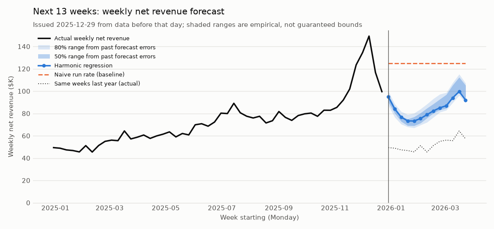
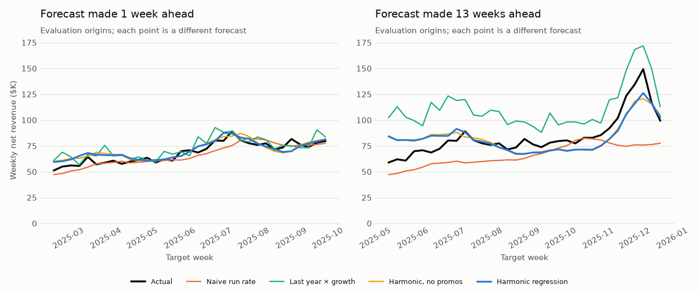
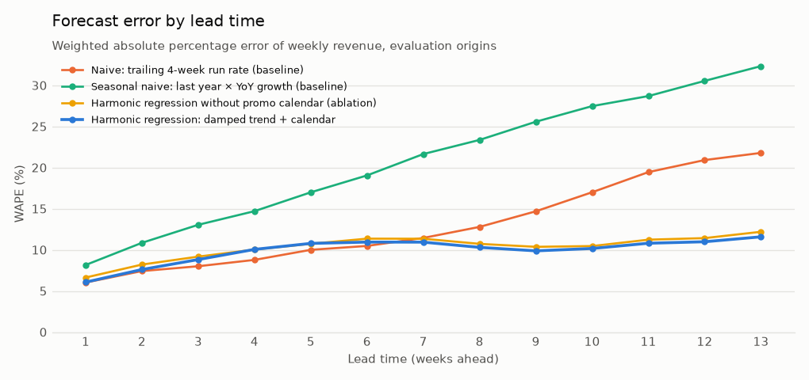
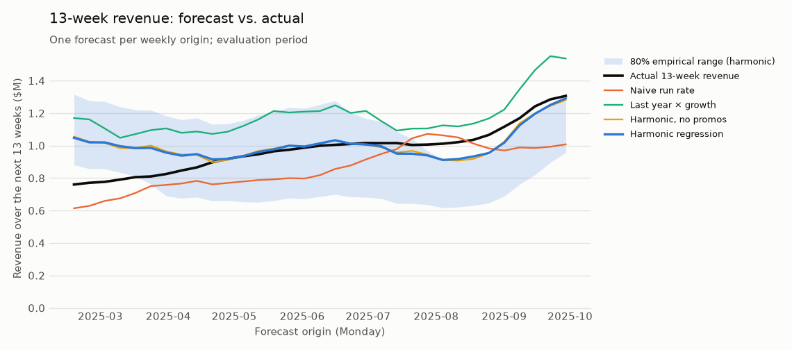
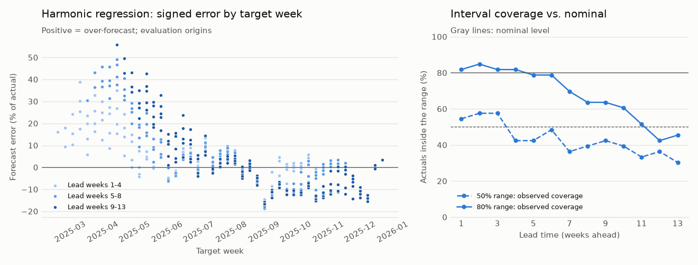

# 05 · Predictive Analytics and Revenue Forecasting

## Business problem

Northstar is still in its growth phase: weekly net revenue roughly doubled year over year, and
on top of that growth sit a holiday peak, a summer bump, a January lull, a weekly shopping
cycle and four planned promotions a year. Finance currently plans the next quarter either at
the *run rate* (the last four weeks carried forward) or as *last year plus growth* (the same
weeks a year ago scaled by recent year-over-year growth). Both rules are easy to explain.
Neither says how wrong it is likely to be.

**Business question:** what revenue should leadership expect in upcoming periods, and how
uncertain is that forecast?

## Decision supported

Every Monday, finance and operations refresh a **13-week revenue outlook**. It drives:

- **The quarter number:** revenue guidance, marketing budget pacing and cash planning use the
  13-week total.
- **Weekly operations:** inventory replenishment, fulfilment and store staffing use each
  week's value, especially 4-13 weeks out, where orders and rosters are committed.
- **Risk:** a range, not just a point, so planners can size buffers (safety stock, spend
  held in reserve) and know how much to trust the number.

## Forecast definition and horizon

| Item | Definition |
|---|---|
| Target | Net order revenue (`orders.net_amount`, after discounts, before cost of goods), summed per Monday-Sunday week. It includes all customers, new and existing, so it is the top line section 04's customer-level scores cannot give. |
| Origin | A Monday. A forecast issued at origin `o` uses only days `< o`. |
| Horizon | **13 weeks (91 days): one fiscal quarter**, reported weekly and as a 13-week total. Accuracy is reported separately for lead weeks 1-4, 5-8 and 9-13, because error grows with lead time. |
| Granularity | Models forecast daily revenue so weekday and promotion effects land on the right days. Days are summed into weeks. |
| Complete weeks only | The history ends on Wednesday 2025-12-31. The final partial week is excluded from weekly totals and from every backtest target. |

Constants live in [`evaluation.py`](../../src/northstar/forecasting/evaluation.py)
(`BacktestPlan`) and [`models.py`](../../src/northstar/forecasting/models.py) (`HarmonicConfig`).

## Data used

Shared synthetic tables from [section 00](../00_foundation/README.md):

| Table | Used for |
|---|---|
| `orders` | daily net revenue, the only observed quantity the models learn from |
| `campaigns` | **planned promotion calendar**: start and end dates of the `promotion` campaigns (spring sale, summer sale, Black Friday / Cyber Week, holiday gift event), never their results |

**Known-in-advance inputs.** The day of week, the day of year and the promotion *dates* are
treated as known at the origin, because retail promotion calendars are set months ahead.
Everything else a model uses is revenue observed before the origin. The ablation model
(no promotion calendar) shows how much the result depends on that assumption. The campaign
table has no 2026 plan yet, so the **forward forecast assumes 2025's promotions repeat 52 weeks
later** (same weekdays). That assumption is flagged wherever it is used.

## Method

Code: [`src/northstar/forecasting/`](../../src/northstar/forecasting)
([`series.py`](../../src/northstar/forecasting/series.py),
[`models.py`](../../src/northstar/forecasting/models.py),
[`evaluation.py`](../../src/northstar/forecasting/evaluation.py),
[`report.py`](../../src/northstar/forecasting/report.py)).

1. **Series.** Daily net revenue from the order log (731 days, zero-filled), and Monday-start
   weekly totals over complete weeks.
2. **Four forecasters behind one interface**, `forecast(name, history, origin, horizon, promo)`,
   which refuses any history that reaches the origin:
   - *Naive run rate (baseline):* every future day at the mean of the last 28 days.
   - *Last year × growth (baseline):* the same day 52 weeks earlier (weekday-aligned) times the
     year-over-year ratio of the last 28 days. It needs 392 days of history.
   - *Harmonic regression (the forecasting model):* least squares on log daily revenue with
     - a **piecewise-linear trend** (a knot every 4 weeks, ridge-penalized so the slope changes
       only when the data insist, and no knot in the last 8 weeks);
     - **annual Fourier terms** (6 harmonics), used only once a full year of history exists,
       because with less the model cannot separate seasonality from growth;
     - **day-of-week** effects and a **promotion-day** flag.
     To forecast, the model extrapolates the trend with **damping** (the slope decays 3% a day,
     a half-life of about 3 weeks), adds the calendar effects, anchors to the last four weeks'
     level (the mean recent residual), and back-transforms to dollars with a smearing
     correction.
   - *Harmonic regression without the promotion calendar (ablation).*
3. **Why these choices.** Growth dominates this series and is slowing as the customer base
   matures. A model that extrapolates recent growth at full strength over-forecasts, and one
   that ignores growth under-forecasts. Damping is the standard compromise. A single
   interpretable regression refit weekly is also something a finance partner can audit
   coefficient by coefficient.
4. **Uncertainty: empirical prediction intervals.** At each origin, the range for lead week
   `k` is the point forecast times the 25th/75th (50% range) and 10th/90th (80% range)
   percentiles of `actual / forecast`. The ratios come from the **26 most recent past forecasts
   at the same lead whose outcome was already known at the origin**. The 13-week total gets
   its own range the same way. This makes no distributional assumption. It carries forward any
   recent bias, so a range need not be centred on the point forecast. It is only as good as
   the assumption that the next quarter's errors resemble the last half-year's. Nothing about
   it is a guarantee, and its coverage is measured below.

## Validation design

- **Rolling-origin (expanding-window) backtest, never a random split.** One forecast every
  Monday from 2024-07-01 to 2025-09-29 (66 origins). Every model is refit at every origin on
  all data before it and forecasts the next 13 weeks. Origins play three roles:
  - **Design** (2024-07-01 to 2024-11-18): the harmonic model's settings (damping, level
    anchor, knot spacing, penalties, the one-year rule for annual terms) were chosen by
    comparing a handful of variants against the naive baseline here. Their targets end on
    2025-02-16.
  - **Calibration** (2024-11-25 to 2025-02-10): not scored. These forecasts only give the
    interval method a track record.
  - **Evaluation** (2025-02-17 to 2025-09-29, 33 origins, targets through 2025-12-28): scored
    once with frozen settings. It covers spring, the summer sale, Black Friday and the holiday
    peak. It starts when the last design target has been observed and every baseline is
    defined.
- **Metrics.** Weekly **MAE** in dollars. Scale-aware **WAPE** (total absolute error / total
  revenue, the headline, robust to small weeks) and **sMAPE**. RMSE. **Bias** (total forecast
  / total actual - 1). **Skill** = 1 - MAE / naive MAE. For planning, the absolute
  percentage error of the **13-week total**. For intervals, **observed coverage** vs. nominal
  and mean width.
- **Is a difference real?** A Diebold-Mariano test of equal mean absolute error at lead weeks
  1, 4, 8 and 13 and for the 13-week total. Errors from overlapping horizons are serially
  correlated, so the test uses a Newey-West variance (lag = lead - 1) and the
  Harvey-Leybourne-Newbold small-sample correction. It also reports the share of origins each
  model wins.
- **Leakage audit, run on every execution.** For every evaluation origin, the revenue series
  is **rebuilt from the order log truncated at the origin**, and every model must reproduce
  its backtest forecast exactly. The audit also checks that:
  - the model interface rejects any history reaching the origin;
  - the regression's last training day precedes the origin;
  - the seasonal naive only looks a full season back;
  - every interval uses only errors observed before its origin;
  - design targets end before evaluation starts;
  - every target is a complete, observed week.

  If any check fails, `northstar forecast` stops without writing results.
- **Tests** ([`tests/test_forecasting_*.py`](../../tests)):
  - *Aggregation:* daily/weekly totals reconcile with the order log, a partial week is
    dropped, and an order at 23:59 on a Sunday lands in its own week.
  - *Leakage:* poisoning every day on or after the origin leaves all forecasts unchanged, and
    the interface rejects leaky histories.
  - *Baselines:* checked against hand calculations.
  - *Harmonic regression:* recovers a known weekday pattern, promotion lift and growth from a
    simulated series.
  - *Metrics:* checked against hand calculations.
  - *Intervals:* reach nominal coverage on exchangeable errors and never use an unobserved
    error.
  - *Diebold-Mariano:* has the right size under the null and power under the alternative.
  - *End to end:* the CLI runs and the README block equals a rendering of `metrics.json`. The
    prose claims below are asserted against the committed metrics, and a slow test
    regenerates the default data and reproduces them.

## Results generated from the current run

Figures: [`forecast_fan.png`](outputs/figures/forecast_fan.png),
[`backtest_tracks.png`](outputs/figures/backtest_tracks.png),
[`error_by_horizon.png`](outputs/figures/error_by_horizon.png),
[`quarter_totals.png`](outputs/figures/quarter_totals.png),
[`residual_diagnostics.png`](outputs/figures/residual_diagnostics.png).
Tables: [`weekly_revenue.csv`](outputs/weekly_revenue.csv),
[`backtest_forecasts.csv`](outputs/backtest_forecasts.csv) (every forecast, with intervals for
the harmonic model), [`backtest_quarter_totals.csv`](outputs/backtest_quarter_totals.csv),
[`accuracy_by_horizon.csv`](outputs/accuracy_by_horizon.csv),
[`accuracy_by_lead_week.csv`](outputs/accuracy_by_lead_week.csv),
[`model_comparison_tests.csv`](outputs/model_comparison_tests.csv),
[`interval_coverage.csv`](outputs/interval_coverage.csv),
[`forecast.csv`](outputs/forecast.csv), and everything in
[`metrics.json`](outputs/metrics.json).

<!-- BEGIN GENERATED: forecast-results -->
_Data seed `20240101`, 40,000 prospects. Rendered from `outputs/metrics.json`. Target = weekly net order revenue (Monday-Sunday), forecast 13 weeks ahead from every Monday origin._

**Series.** 731 days (2024-01-01 to 2025-12-31), 104 complete weeks (2024-01-01 to 2025-12-22); 3 days of the final partial week are excluded from weekly totals. Total net revenue $5,402,376. Last 13 complete weeks: $1,306,506 vs. $681,466 in the same weeks a year earlier.

**Rolling-origin backtest** (every model refit on an expanding window at every origin)

| Role | Origins | First origin | Last origin | Last target day | Used for |
|---|---:|---|---|---|---|
| design | 21 | 2024-07-01 | 2024-11-18 | 2025-02-16 | choosing the harmonic model's settings |
| calibration | 12 | 2024-11-25 | 2025-02-10 | 2025-05-11 | interval track record only (not scored) |
| evaluation | 33 | 2025-02-17 | 2025-09-29 | 2025-12-28 | **scored once**: all accuracy and coverage below |

**Leakage audit** (the pipeline refuses to write results if any check fails)

| Check | Result |
|---|---|
| forecasts identical when rebuilt from orders before origin | pass |
| models refuse history on or after origin | pass |
| harmonic fit only on days before origin | pass |
| seasonal naive looks back a full season | pass |
| interval errors observed before origin | pass |
| design targets end before evaluation | pass |
| targets are complete observed weeks | pass |

33 evaluation origins were re-forecast from orders truncated at the origin; forecast mismatches: 0. Last design target day 2025-02-16; first evaluation origin 2025-02-17.

**Accuracy on the evaluation origins** (weekly revenue; skill = 1 - MAE / naive MAE)

| Model | Weekly MAE | RMSE | WAPE | sMAPE | Bias (total) | Skill vs. naive |
|---|---:|---:|---:|---:|---:|---:|
| Naive: trailing 4-week run rate (baseline) | $10,019 | $14,645 | 13.3% | 13.7% | -11.8% | +0.0% |
| Seasonal naive: last year × YoY growth (baseline) | $16,119 | $19,344 | 21.5% | 19.0% | +21.1% | -60.9% |
| Harmonic regression without promo calendar (ablation) | $7,791 | $10,210 | 10.4% | 10.5% | +2.8% | +22.2% |
| **Harmonic regression: damped trend + calendar** | $7,501 | $9,920 | 10.0% | 10.1% | +2.8% | +25.1% |

WAPE by lead time (MAE skill vs. naive in parentheses):

| Model | Lead weeks 1-4 | Lead weeks 5-8 | Lead weeks 9-13 |
|---|---:|---:|---:|
| Naive: trailing 4-week run rate (baseline) | 7.6% (+0%) | 11.2% (+0%) | 18.9% (+0%) |
| Seasonal naive: last year × YoY growth (baseline) | 11.7% (-55%) | 20.3% (-81%) | 29.0% (-54%) |
| Harmonic regression without promo calendar (ablation) | 8.5% (-13%) | 11.1% (+1%) | 11.2% (+41%) |
| Harmonic regression: damped trend + calendar | 8.2% (-8%) | 10.7% (+4%) | 10.7% (+43%) |

13-week (quarter) total, one forecast per origin:

| Model | Origins | Mean abs. % error | Median | Worst | Bias |
|---|---:|---:|---:|---:|---:|
| Naive: trailing 4-week run rate (baseline) | 33 | 12.8% | 14.6% | 22.8% | -11.8% |
| Seasonal naive: last year × YoY growth (baseline) | 33 | 22.2% | 19.9% | 53.8% | +21.1% |
| Harmonic regression without promo calendar (ablation) | 33 | 9.2% | 3.6% | 38.8% | +2.8% |
| Harmonic regression: damped trend + calendar | 33 | 9.1% | 5.4% | 37.9% | +2.8% |

Development-period accuracy (21 design origins, used to fix the harmonic settings; the seasonal naive is not yet defined):

| Model | Weekly MAE | WAPE | Bias (total) |
|---|---:|---:|---:|
| Naive: trailing 4-week run rate (baseline) | $10,600 | 23.4% | -22.5% |
| Harmonic regression without promo calendar (ablation) | $8,591 | 19.0% | -5.4% |
| Harmonic regression: damped trend + calendar | $7,462 | 16.5% | -4.5% |

**Is the difference real?** Diebold-Mariano tests of equal mean absolute error, Harmonic regression: damped trend + calendar vs. each alternative (Newey-West variance for overlapping horizons, Harvey-Leybourne-Newbold correction; negative difference = harmonic more accurate):

| Alternative | Target | Origins | MAE harmonic | MAE alternative | Mean difference | Harmonic wins | DM statistic | p-value |
|---|---|---:|---:|---:|---:|---:|---:|---:|
| Naive run rate | week 1 | 33 | $4,164 | $4,131 | $33 | 48% | +0.04 | 0.968 |
| Naive run rate | week 4 | 33 | $7,131 | $6,225 | $906 | 48% | +0.35 | 0.730 |
| Naive run rate | week 8 | 33 | $7,699 | $9,560 | -$1,861 | 48% | -0.39 | 0.702 |
| Naive run rate | week 13 | 33 | $9,782 | $18,398 | -$8,616 | 70% | -1.32 | 0.198 |
| Naive run rate | 13-week total | 33 | $79,863 | $126,696 | -$46,833 | 55% | -0.81 | 0.423 |
| Last year × growth | week 1 | 33 | $4,164 | $5,595 | -$1,431 | 55% | -1.68 | 0.103 |
| Last year × growth | week 4 | 33 | $7,131 | $10,426 | -$3,295 | 67% | -1.93 | 0.062 |
| Last year × growth | week 8 | 33 | $7,699 | $17,463 | -$9,764 | 85% | -2.80 | 0.009 |
| Last year × growth | week 13 | 33 | $9,782 | $27,307 | -$17,525 | 97% | -2.74 | 0.010 |
| Last year × growth | 13-week total | 33 | $79,863 | $205,670 | -$125,807 | 91% | -3.30 | 0.002 |
| Harmonic, no promos | week 1 | 33 | $4,164 | $4,548 | -$384 | 70% | -1.48 | 0.148 |
| Harmonic, no promos | week 4 | 33 | $7,131 | $7,114 | $16 | 48% | +0.08 | 0.940 |
| Harmonic, no promos | week 8 | 33 | $7,699 | $8,018 | -$319 | 64% | -1.50 | 0.143 |
| Harmonic, no promos | week 13 | 33 | $9,782 | $10,299 | -$517 | 61% | -1.46 | 0.153 |
| Harmonic, no promos | 13-week total | 33 | $79,863 | $80,441 | -$578 | 61% | -0.56 | 0.579 |

**Uncertainty.** Ranges are empirical quantiles of actual/forecast over the most recent 26 past origins at the same lead whose outcome was observed before the origin. They describe how wrong past forecasts were; they are **not guaranteed bounds**. Observed coverage on the evaluation origins:

| Group | Nominal | Forecasts | Observed coverage | Actual below range | Actual above range | Mean width (% of forecast) |
|---|---:|---:|---:|---:|---:|---:|
| all lead weeks | 50% | 429 | 43.1% | 11.2% | 45.7% | 22.9% |
| all lead weeks | 80% | 429 | 68.1% | 4.2% | 27.7% | 46.4% |
| lead weeks 1-4 | 50% | 132 | 53.0% | 5.3% | 41.7% | 17.5% |
| lead weeks 1-4 | 80% | 132 | 82.6% | 0.0% | 17.4% | 34.0% |
| lead weeks 5-8 | 50% | 132 | 41.7% | 12.1% | 46.2% | 25.2% |
| lead weeks 5-8 | 80% | 132 | 72.7% | 1.5% | 25.8% | 50.0% |
| lead weeks 9-13 | 50% | 165 | 36.4% | 15.2% | 48.5% | 25.4% |
| lead weeks 9-13 | 80% | 165 | 52.7% | 9.7% | 37.6% | 53.4% |
| Nov-Dec peak weeks | 50% | 36 | 27.8% | 0.0% | 72.2% | 20.2% |
| Nov-Dec peak weeks | 80% | 36 | 52.8% | 0.0% | 47.2% | 36.8% |
| other weeks | 50% | 393 | 44.5% | 12.2% | 43.3% | 23.2% |
| other weeks | 80% | 393 | 69.5% | 4.6% | 25.9% | 47.2% |
| 13-week total | 50% | 33 | 42.4% | 18.2% | 39.4% | 29.0% |
| 13-week total | 80% | 33 | 54.5% | 15.2% | 30.3% | 43.7% |

**Forward forecast**, issued Monday 2025-12-29 from data through 2025-12-28, for 2025-12-29 to 2026-03-29:

| Week starting | Harmonic forecast | 50% range | 80% range | Naive run rate | Last year × growth | Same week last year (actual) |
|---|---:|---:|---:|---:|---:|---:|
| 2025-12-29 | $94,846 | $90,092 - $96,846 | $87,271 - $99,889 | $125,048 | $93,663 | $49,405 |
| 2026-01-05 | $83,969 | $80,187 - $85,949 | $76,557 - $88,548 | $125,048 | $92,696 | $48,895 |
| 2026-01-12 | $76,760 | $72,839 - $77,679 | $70,407 - $81,674 | $125,048 | $89,771 | $47,352 |
| 2026-01-19 | $73,354 | $69,164 - $74,959 | $67,962 - $79,087 | $125,048 | $88,717 | $46,796 |
| 2026-01-26 | $73,252 | $69,037 - $76,957 | $67,086 - $80,214 | $125,048 | $86,382 | $45,564 |
| 2026-02-02 | $75,503 | $71,407 - $80,461 | $69,697 - $84,007 | $125,048 | $97,046 | $51,189 |
| 2026-02-09 | $78,917 | $75,885 - $84,746 | $72,099 - $88,429 | $125,048 | $86,154 | $45,444 |
| 2026-02-16 | $82,350 | $80,293 - $88,627 | $76,633 - $93,261 | $125,048 | $97,249 | $51,296 |
| 2026-02-23 | $85,072 | $83,193 - $92,802 | $81,131 - $97,255 | $125,048 | $104,311 | $55,021 |
| 2026-03-02 | $86,977 | $84,617 - $96,908 | $82,901 - $98,692 | $125,048 | $106,381 | $56,113 |
| 2026-03-09 | $94,029 | $94,060 - $105,396 | $89,700 - $107,521 | $125,048 | $105,487 | $55,641 |
| 2026-03-16 | $99,660 | $99,822 - $112,451 | $96,127 - $115,212 | $125,048 | $122,007 | $64,355 |
| 2026-03-23 | $91,980 | $92,521 - $105,209 | $89,554 - $107,081 | $125,048 | $108,406 | $57,181 |
| **13-week total** | **$1,096,670** | $1,081,515 - $1,168,633 | $1,068,156 - $1,216,983 | $1,625,619 | $1,278,269 | $674,254 |

- Harmonic total vs. the same 13 weeks last year: +62.6%. The 50% range for the total is $1,081,515 to $1,168,633 and the 80% range $1,068,156 to $1,216,983 (from 26 past quarter forecasts).
- Promotions in the horizon: Spring Refresh Sale (assumed repeat) 2026-03-12 to 2026-03-22 (**assumed**: repeats last year 52 weeks later).
- Fitted model at the origin: trained on 2024-01-29 to 2025-12-28; annual terms on; underlying trend growth +69.8% a year before damping; estimated promotion-day effect +10.7%; level correction +0.007 (log scale).
<!-- END GENERATED: forecast-results -->











## Business interpretation

- **For the quarter, the harmonic model beats both planning rules.** On the evaluation origins
  it has the lowest weekly WAPE and the smallest 13-week-total error of any model. Its total
  bias is small, while the run rate under-forecasts a growing business by about a tenth and
  "last year × growth" over-forecasts by about a fifth. The second rule compounds last year's
  steep ramp-up into this year.
- **Its advantage is at 5-13 weeks, not next week.** For the next four weeks, the run rate is
  as good (slightly better on WAPE, statistically indistinguishable in the Diebold-Mariano
  test). At 9-13 weeks, the harmonic model's MAE is over 40% lower. The difference against
  "last year × growth" is significant at lead weeks 8 and 13 and for the total. Against the
  run rate, even the large long-lead gain is **not statistically significant**. The 33
  overlapping origins hold about 2.5 independent quarters, so the evidence is directional,
  not conclusive.
- **The planned promotion calendar adds a little.** The model without it is only slightly
  worse overall, and none of the differences is significant. Most of the gain comes from the
  damped trend and the seasonal shape. The known-in-advance assumption therefore carries
  little of the result.
- **The biggest misses have a clear cause.** Quarter forecasts issued in February and March
  2025 are the model's worst, over-forecasting by more than a fifth. With a single prior year,
  the model partly read the 2024 launch ramp (revenue doubled from February to May) as
  "spring seasonality". The error fades once 2025's own spring is observed. Origins in August
  under-forecast the run-up to the holidays by about a tenth.
- **The ranges are too narrow, so treat them as a minimum.** The 80% ranges held about
  two-thirds of weekly outcomes, and only about half of 13-week totals. They are close to
  nominal for the next four weeks and progressively too narrow further out. Misses are mostly
  on the upside and concentrate in the Nov-Dec peak weeks, where the ranges held about half
  of outcomes. Past errors, especially from a young business, understate future ones.
- **The forward outlook (Q1 2026).** The harmonic model expects the post-holiday dip in
  January, then a recovery through March and the (assumed) spring sale. Its 13-week total is
  well above the same weeks of 2025, but growth is slower than in the last quarter. The run
  rate, anchored on the holiday peak, would overstate the quarter badly. "Last year × growth"
  lands above the harmonic forecast, as it did in the backtest.

**Recommendation.** Use the harmonic model's 13-week total as the planning number instead of
the run rate or "last year × growth", and refresh it every Monday. For the next four weeks,
either the model or the run rate is fine. Budget against the 80% range, and treat it as the
narrowest plausible band. For the holiday quarter and for Q1 2026 (the same season in which
the model over-forecast last year), hold a wider buffer on the upside risk of the range, and
sanity-check the spring ramp against the actual promotion plan once it is published. Track
coverage every week. If the 80% range keeps holding fewer than 70% of outcomes, widen it with
a longer error window or a seasonal error pool.

## Limitations and next steps

- **Two years of history, one of them a launch.** Annual seasonality is estimated from at
  most two cycles, and the first is confounded with the launch ramp. This is the root cause
  of the spring over-forecast. Next step: exclude the launch half-year from the seasonal fit
  once a second full year is in the training window, and pre-register that change before
  scoring it on 2026 data.
- **The evaluation is not perfectly pristine.** During development, one earlier design (an
  undamped growth model that over-forecast by about a fifth) was scored once on the
  evaluation origins before the design was moved to the development period. The final
  settings were chosen on design origins only, but the evaluation period had been looked at
  once.
- **Few independent quarters.** 33 weekly origins with 13-week horizons overlap heavily. The
  Diebold-Mariano tests account for that, and they show how little a single year of backtests
  can prove.
- **Intervals under-cover.** Empirical ranges assume the next quarter's errors look like the
  recent past's. Candidates to test on future data: a seasonal error pool, a longer
  calibration window, conformal methods for dependent data, or bootstrapped residual paths
  from the regression.
- **Top line only.** The forecast is total net revenue. Splitting by channel, category or
  new vs. existing customers (tying in section 01's acquisition pipeline and section 04's
  customer value) would make it actionable for more teams. So would adding marketing spend
  as a planned input.
- **Assumed 2026 promotion plan.** The forward forecast assumes 2025's promotions repeat. Once
  the real plan is known, rerun `northstar forecast` with it in the campaign table.
- **Synthetic data.** The seasonal shape, promotion lift and growth come from the documented
  generator in `src/northstar/synthetic/`. The value here is a leak-free, reproducible
  forecasting and validation method, not evidence about real consumers.

## Reproduction commands

From the repository root, with the virtual environment activated (see the root README):

```bash
northstar generate-data                 # shared data (section 00), if not already present
northstar forecast                      # rebuild outputs/ and the results block above (~5 s)
python -m pytest tests/test_forecasting_series.py tests/test_forecasting_models.py \
  tests/test_forecasting_evaluation.py tests/test_forecasting_pipeline.py
```

`northstar forecast` generates the default data first if `data/raw` is empty (pass
`--no-generate` to fail instead). Use `--data-dir`, `--out-dir` and `--readme` to run against
other data or write elsewhere. The backtest design and model settings are the defaults of
`BacktestPlan` and `HarmonicConfig`. To rerun with different ones:

```python
from northstar.forecasting.evaluation import BacktestPlan
from northstar.forecasting.models import HarmonicConfig
from northstar.forecasting.report import ForecastConfig, run_analysis
from northstar.io import load_tables

config = ForecastConfig(plan=BacktestPlan(calibration_origins=52),
                        harmonic=HarmonicConfig(damping=0.95))
metrics, tables = run_analysis(load_tables(), config)
```

The slow reproduction test
(`test_committed_metrics_are_reproduced_from_default_generation`) regenerates the default data
from scratch and reruns the analysis. It is included in the default `python -m pytest` and
skipped by `-m "not slow"`.
