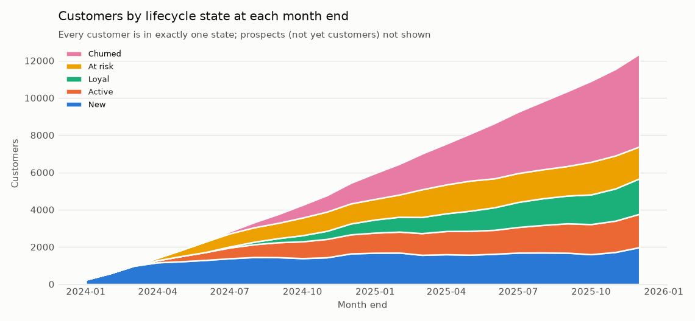
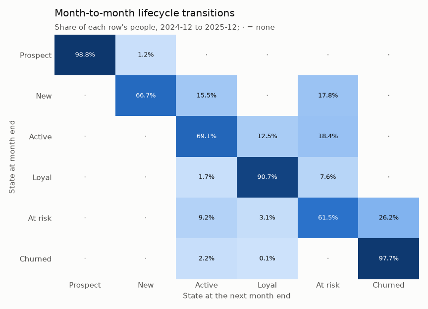
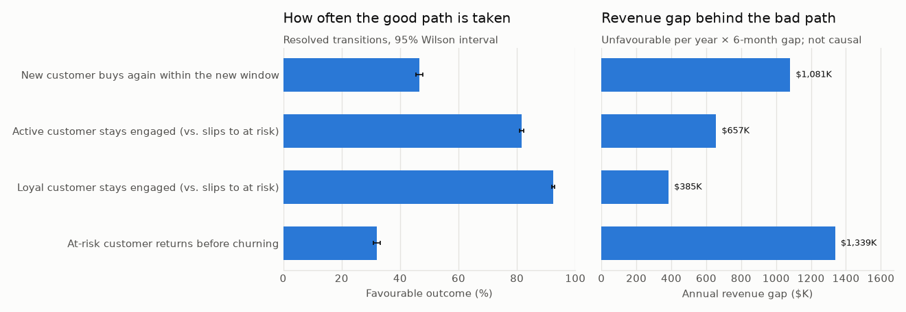
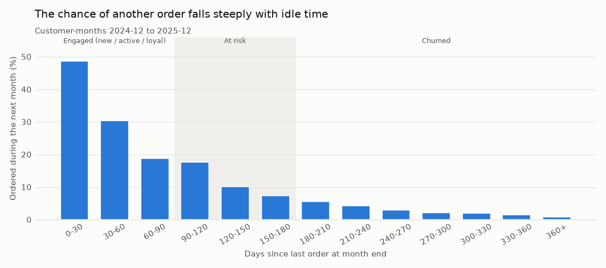
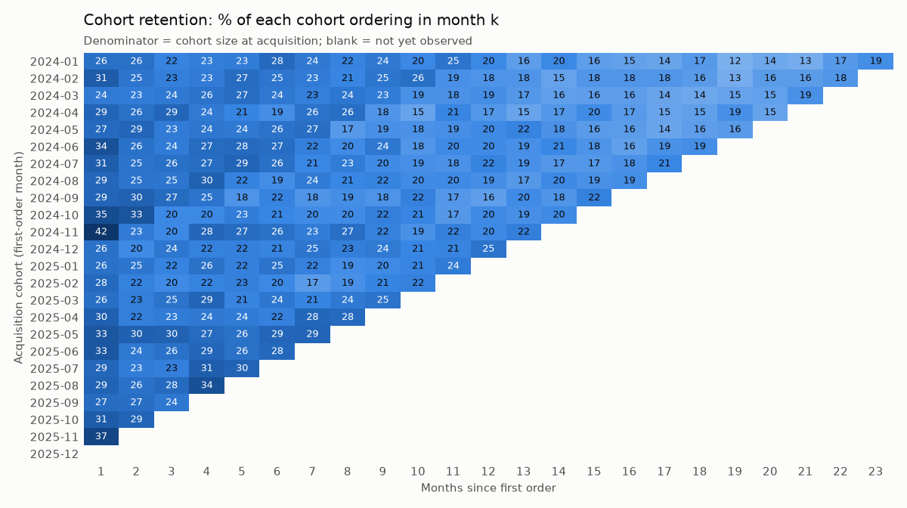
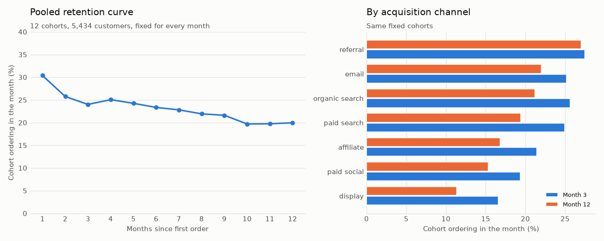
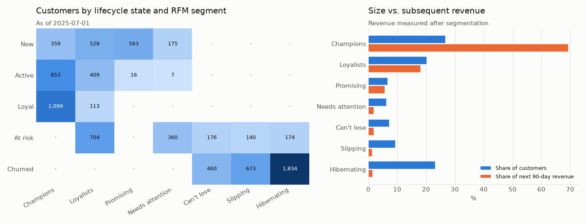

# 06 · Customer Lifecycle Analytics

## Business problem

Sections 01-05 each look at one moment: winning a lead, predicting churn, fixing the checkout,
valuing customers, forecasting revenue. Marketing and CRM leaders also need the connected view:
where customers are in their relationship with Northstar, how they move between stages from
month to month, and at which moments the business loses the most value. Without it, every
program (welcome series, loyalty perks, retention offers, win-back) argues for budget with a
different definition of "active" or "lapsed".

**Business question:** how do customers move from prospect to new, active, loyal, at-risk and
churned states, and where are the largest lifecycle opportunities?

## Decision supported

The CRM and lifecycle-marketing team sets its **annual program portfolio**: which lifecycle
moments get dedicated programs and budget, which customers each program targets, and which
programs are tested first. This section gives them:

- **One shared vocabulary.** Six lifecycle states with exact, mutually exclusive definitions,
  refreshed at every month end, that every team and report can use.
- **The size of each leak.** How many customers pass each decision point per month, how often
  they take the good path, and how much more the good-path customers went on to spend.
- **Who to prioritize inside a state.** RFM segments separate high- and low-value customers
  who sit in the same lifecycle state.

It sizes and ranks opportunities. It does **not** say what a program would cause; that needs
the experiments recommended below.

## Lifecycle state definitions

States are assigned to every person (`prospect_id`) at each month end `d`, using only orders
placed **before** `d`. Rules are checked in this order and the **first match wins**, so a
person has exactly one state per month end:

| Precedence | State | Rule at month end `d` | Why this boundary |
|---:|---|---|---|
| 1 | **Prospect** | Identified lead, no order yet | Everyone enters the lifecycle as a lead (section 01's population). |
| 2 | **Churned** | Last order more than 180 days ago | Same boundary as section 02's active base: churned customers are exactly those section 02 no longer scores. |
| 3 | **At risk** | Last order more than 90 and at most 180 days ago | Northstar's win-back emails start after 90 idle days, and section 02's churn horizon is 90 days. |
| 4 | **New** | First order within the last 90 days | The onboarding window, in which a second purchase is the goal. |
| 5 | **Loyal** | Ordered within 90 days, 6+ orders in the last 365 days, first order more than 180 days ago | Sustained repeat buying (about every other month) over at least half a year, not a burst. |
| 6 | **Active** | Ordered within 90 days, neither new nor loyal | The engaged middle. |

Precedence matters only where rules could overlap. Recency is checked before tenure, so a
long-standing heavy buyer who stops ordering becomes at-risk, not loyal. `LifecycleRules`
refuses threshold combinations that would let New overlap Loyal or At risk. Thresholds are
**business policy choices, not estimates**. The recency curve in the results supports them
(the chance of another order roughly halves between 60-90 and 120-150 idle days and falls
below 3% after 240 days), but it did not choose them. They live in
[`states.py`](../../src/northstar/lifecycle/states.py) (`LifecycleRules`); any other set can be
run from Python (see reproduction).

Section 02 scores New, Active, Loyal and At-risk customers (its "active base"). Section 04's
value tiers and next best action rank customers by predicted value. This section adds the
lifecycle position and movement that both of those take as given.

## Data used

Shared synthetic tables from [section 00](../00_foundation/README.md):

| Table | Used for |
|---|---|
| `prospects` | when each person enters the lifecycle; acquisition channel |
| `customers` | first-order date (cohort month) and the prospect-customer link |
| `orders` | every state (via recency, tenure and frequency), monthly revenue and cohort activity |
| `sessions`, `marketing_touches`, `subscription_events` | engagement summaries for segments (browse sessions, email opens, Plus membership), using section 02's definitions |

The panel covers every person at each of the 24 month ends (January 2024 to December 2025),
from the month their lead is created onwards.

## Method

Code: [`src/northstar/lifecycle/`](../../src/northstar/lifecycle)
([`states.py`](../../src/northstar/lifecycle/states.py),
[`transitions.py`](../../src/northstar/lifecycle/transitions.py),
[`cohorts.py`](../../src/northstar/lifecycle/cohorts.py),
[`segments.py`](../../src/northstar/lifecycle/segments.py),
[`report.py`](../../src/northstar/lifecycle/report.py)).

1. **Person-month panel.** `build_panel` assigns every person a state at each month end
   (as of the first day of the next month) with the rule above. It also records that month's
   orders and net revenue. The panel is deterministic: no sampling and no randomness.
2. **Transitions.** For each pair of consecutive month ends, each person contributes one
   (from, to) pair. Counts are pooled over the most recent 12 monthly steps (Dec 2024 to
   Dec 2025) and normalised by row, so each row is the distribution of next-month states for
   everyone in that state. People never leave the panel, so each row's denominator is exactly
   that state's population. New leads enter separately and are reported as entries.
3. **Structural zeros.** `impossible_transitions` derives from the thresholds which moves
   cannot happen in one month. For example, Active -> Churned would need more than 90 extra
   idle days in one month, and a churned customer who returns is never New again. The
   pipeline requires those cells to be zero.
4. **Decision points.** Four moments with a favourable and an unfavourable next state:
   New -> Active/Loyal vs. At risk (the **second purchase**), Active and Loyal staying engaged
   vs. slipping to At risk, and At risk -> back to engaged vs. Churned (**recovery**). For
   each: the favourable rate with a 95% Wilson interval, the unfavourable transitions per
   month, and the average net revenue in the six months starting with the transition month
   for each path. The **annual revenue gap** = unfavourable transitions per year × revenue
   gap per customer. It measures how much revenue separates the two paths today. It does not
   measure what a program would win back.
5. **Descriptive curves.** Next-month repurchase rate by days since last order. Next-month
   first-order rate for prospects by lead age. Next-month purchase rate and revenue by state.
6. **Cohort retention.** Customers are grouped by first-order month. Retention in month *k*
   is the share of the cohort **at acquisition** that ordered in calendar month *k*. The
   denominator is fixed: lapsed customers stay in it. Months after the data ends are
   **missing, not zero**. Pooled curves (overall and by acquisition channel) use one fixed
   set of cohorts: the 12 with at least 12 months observed. The pooled denominator is
   therefore identical in every column, and young cohorts do not drop out and shift the mix.
7. **RFM segmentation.** At 2025-07-01 (the portfolio's default cutoff), each customer gets
   recency, frequency and monetary scores of 1-5 by quintile of the customer base.
   Frequency and monetary use the last 365 days, and tied values share a score. Frequency
   and spend are combined as FM = ceil((F + M) / 2). An explicit R x FM grid maps every
   score pair to one of seven named segments. Outcomes in the next 90 days are attached
   **after** segmentation, to describe what each segment went on to do.

## Validation design

This section is descriptive, so validation means **calculations that are correct,
reproducible and internally consistent**, not predictive accuracy.

- **Integrity audit on every run.** `northstar lifecycle` refuses to write results unless all
  of the following hold:
  - every person has exactly one valid state in every month after their lead is created;
  - people never leave the panel, and transitions out of each state sum to that state's
    population, month by month;
  - no rule-forbidden transition occurs;
  - states and segment scores at 2025-07-01 are unchanged when every later order (or row) is
    removed;
  - each cohort's denominator equals the customers acquired that month and is the same in
    every column;
  - unobserved cohort months are missing, never zero;
  - the pooled curve uses one fixed cohort set.
- **Tests** ([`tests/test_lifecycle_*.py`](../../tests)).
  - **States.** A hand-worked history of four people pins every monthly state, including the
    exact 90- and 180-day boundaries, a lead with no order, a customer becoming loyal and a
    churned customer returning (Active, never New). A grid test recomputes each definition
    without precedence and checks that exactly one holds.
  - **Transitions.** Transition counts, the Wilson interval and the decision-point revenue
    arithmetic are checked against hand counts. On generated data, populations are conserved
    (state at *t* + 1 = inflows + new leads), and no forbidden transition appears under three
    different rule sets.
  - **Cohorts.** Cohort retention is checked by hand, including a customer who never orders
    again and months that are not yet observed.
  - **Segments.** The RFM grid is checked for all 25 score pairs. Profiles are identical when
    the future is deleted.
  - **Pipeline and prose.** The CLI runs end to end, and the audit gate blocks output on
    failure. The README block must equal a rendering of `metrics.json`, the prose claims below
    are asserted against it, and a slow test regenerates the default data and reproduces the
    committed metrics.

## Results generated from the current run

Figures: [`state_mix.png`](outputs/figures/state_mix.png),
[`transition_matrix.png`](outputs/figures/transition_matrix.png),
[`decision_points.png`](outputs/figures/decision_points.png),
[`repurchase_by_recency.png`](outputs/figures/repurchase_by_recency.png),
[`cohort_retention.png`](outputs/figures/cohort_retention.png),
[`retention_curves.png`](outputs/figures/retention_curves.png),
[`rfm_lifecycle.png`](outputs/figures/rfm_lifecycle.png).
Tables: [`state_counts_by_month.csv`](outputs/state_counts_by_month.csv),
[`transition_counts.csv`](outputs/transition_counts.csv),
[`transition_matrix.csv`](outputs/transition_matrix.csv),
[`transitions_by_month.csv`](outputs/transitions_by_month.csv),
[`entries_by_month.csv`](outputs/entries_by_month.csv),
[`state_value.csv`](outputs/state_value.csv),
[`decision_points.csv`](outputs/decision_points.csv),
[`decision_points_by_channel.csv`](outputs/decision_points_by_channel.csv),
[`repurchase_by_recency.csv`](outputs/repurchase_by_recency.csv),
[`conversion_by_lead_age.csv`](outputs/conversion_by_lead_age.csv),
[`cohort_retention.csv`](outputs/cohort_retention.csv),
[`cohort_retention_pooled.csv`](outputs/cohort_retention_pooled.csv),
[`cohort_retention_by_channel.csv`](outputs/cohort_retention_by_channel.csv),
[`rfm_segments.csv`](outputs/rfm_segments.csv),
[`lifecycle_state_summary.csv`](outputs/lifecycle_state_summary.csv),
[`rfm_by_lifecycle.csv`](outputs/rfm_by_lifecycle.csv), and everything in
[`metrics.json`](outputs/metrics.json).

<!-- BEGIN GENERATED: lifecycle-results -->
_Data seed `20240101`, 40,000 prospects. Rendered from `outputs/metrics.json`. 40,000 people (12,359 became customers) assigned a state at each of 24 month ends, 2024-01 to 2025-12._

**State definitions** (first matching rule in this order wins, so every person has exactly one state per month end):

| Precedence | State | Definition at month end `d` (orders before `d` only) |
|---:|---|---|
| 1 | Prospect | Identified lead with no order yet. |
| 2 | Churned | Last order more than 180 days ago. |
| 3 | At risk | Last order more than 90 and at most 180 days ago. |
| 4 | New | First order within the last 90 days. |
| 5 | Loyal | Ordered within the last 90 days, at least 6 orders in the last 365 days and first order more than 180 days ago. |
| 6 | Active | Ordered within the last 90 days; neither new nor loyal. |

**State mix.** Customers by state at the end of 2025-12 and a year earlier:

| State | 2025-12 | Share of customers | 2024-12 | Share of customers |
|---|---:|---:|---:|---:|
| New | 1,981 | 16.0% | 1,643 | 30.2% |
| Active | 1,789 | 14.5% | 1,023 | 18.8% |
| Loyal | 1,900 | 15.4% | 585 | 10.8% |
| At risk | 1,713 | 13.9% | 1,075 | 19.8% |
| Churned | 4,976 | 40.3% | 1,108 | 20.4% |
| **All customers** | **12,359** | | **5,434** | |
| Prospects (not yet customers) | 27,641 | | 12,691 | |

**Transition matrix**, pooled over the 12 month-to-month steps from 2024-12 to 2025-12 (row = state at month end, column = state one month later; each row sums to 100% of the people in that state):

| From \ to | Prospect | New | Active | Loyal | At risk | Churned | People-months |
|---|---:|---:|---:|---:|---:|---:|---:|
| Prospect | 98.8% | 1.2% | · | · | · | · | 225,605 |
| New | · | 66.7% | 15.5% | · | 17.8% | · | 19,778 |
| Active | · | · | 69.1% | 12.5% | 18.4% | · | 15,926 |
| Loyal | · | · | 1.7% | 90.7% | 7.6% | · | 13,788 |
| At risk | · | · | 9.2% | 3.1% | 61.5% | 26.2% | 17,794 |
| Churned | · | · | 2.2% | 0.1% | · | 97.7% | 33,710 |

`·` = no transitions. 18 cells are impossible under the rules (for example Active -> Churned needs more than one month of extra idle time) and are required to be zero; they are. Of 21,875 leads created in the window, 4,174 (19.1%) ordered in their first month and entered the panel directly as New.

**What each state is worth next month** (same window):

| State at month end | Customer-months | Share | Ordered next month | Revenue next month per customer | Share of next-month revenue |
|---|---:|---:|---:|---:|---:|
| New | 19,778 | 19.6% | 26.0% | $37 | 23.3% |
| Active | 15,926 | 15.8% | 36.5% | $49 | 25.1% |
| Loyal | 13,788 | 13.7% | 57.9% | $93 | 41.3% |
| At risk | 17,794 | 17.6% | 12.3% | $13 | 7.7% |
| Churned | 33,710 | 33.4% | 2.4% | $2 | 2.6% |

**Decision points** (rates over the window above; revenue = net revenue in the 6 months starting with the transition month, over every origin month with complete follow-up; descriptive, not causal):

| Decision point | Favourable / unfavourable next state | Resolved | Favourable rate (95% CI) | Unfavourable per month | Revenue after: favourable | Revenue after: unfavourable | Annual revenue gap |
|---|---|---:|---:|---:|---:|---:|---:|
| New customer buys again within the new window | active/loyal / at_risk | 6,587 | 46.6% (45.4%-47.8%) | 293 | $361 | $54 | $1,081,404 |
| Active customer stays engaged (vs. slips to at risk) | active/loyal / at_risk | 15,926 | 81.6% (81.0%-82.2%) | 244 | $330 | $106 | $657,162 |
| Loyal customer stays engaged (vs. slips to at risk) | loyal/active / at_risk | 13,788 | 92.4% (92.0%-92.8%) | 87 | $525 | $157 | $384,661 |
| At-risk customer returns before churning | active/loyal / churned | 6,854 | 32.0% (30.9%-33.1%) | 388 | $313 | $26 | $1,338,523 |

Favourable rate by acquisition channel (resolved transitions in parentheses):

| Channel | New customer buys again within the new window | Active customer stays engaged (vs. slips to at risk) | Loyal customer stays engaged (vs. slips to at risk) | At-risk customer returns before churning |
|---|---:|---:|---:|---:|
| affiliate | 44.2% (462) | 82.4% (1,062) | 92.5% (915) | 30.0% (470) |
| display | 40.5% (237) | 79.8% (521) | 90.6% (406) | 25.4% (276) |
| email | 45.7% (996) | 81.9% (2,453) | 92.9% (2,423) | 33.6% (1,065) |
| organic search | 50.9% (1,337) | 80.9% (3,466) | 92.2% (2,964) | 36.0% (1,403) |
| paid search | 46.4% (1,699) | 81.8% (4,045) | 92.3% (3,668) | 30.9% (1,765) |
| paid social | 41.7% (1,016) | 80.2% (2,228) | 89.8% (1,297) | 27.2% (1,088) |
| referral | 49.8% (840) | 83.7% (2,151) | 94.2% (2,115) | 35.4% (787) |

**Repurchase by idle time**: share of customers ordering during the next month, by days since their last order at month end:

| Days since last order | 0-30 | 30-60 | 60-90 | 90-120 | 120-150 | 150-180 | 180-210 | 210-240 | 240-270 | 270-300 | 300-330 | 330-360 | 360+ |
|---|---:|---:|---:|---:|---:|---:|---:|---:|---:|---:|---:|---:|---:|
| Ordered next month | 48.7% | 30.3% | 18.8% | 17.6% | 10.1% | 7.4% | 5.6% | 4.2% | 2.9% | 2.1% | 2.0% | 1.6% | 0.8% |
| Customer-months | 26,999 | 13,383 | 9,110 | 7,120 | 5,728 | 4,946 | 4,429 | 4,004 | 3,668 | 3,395 | 3,116 | 2,835 | 12,263 |

**Lead conversion by lead age**: share of not-yet-converted leads placing a first order during the next month:

| Lead age (days) | 0-30 | 30-60 | 60-90 | 90-180 | 180-365 | 365+ |
|---|---:|---:|---:|---:|---:|---:|
| Converted next month | 11.43% | 3.38% | 1.12% | 0.30% | 0.02% | 0.00% |
| Prospect-months | 17,028 | 14,891 | 14,217 | 40,661 | 77,581 | 61,227 |

**Cohort retention.** 24 monthly acquisition cohorts (2024-01 to 2025-12); the full triangle is in `outputs/cohort_retention.csv` and the figure below. Pooled over the 12 cohorts with at least 12 months observed (2024-01 to 2024-12); the denominator is the same 5,434 customers in every column:

| Months since first order | 1 | 2 | 3 | 6 | 9 | 12 |
|---|---:|---:|---:|---:|---:|---:|
| Customers (denominator) | 5,434 | 5,434 | 5,434 | 5,434 | 5,434 | 5,434 |
| Ordered in the month | 30.4% | 25.8% | 24.0% | 23.4% | 21.6% | 20.0% |
| Cumulative revenue per acquired customer | $148 | $184 | $217 | $317 | $410 | $495 |

Same fixed cohorts by acquisition channel:

| Channel | Customers | Month 3 | Month 6 | Month 12 | Revenue per customer, months 0-12 |
|---|---:|---:|---:|---:|---:|
| referral | 655 | 27.5% | 27.9% | 27.0% | $603 |
| email | 863 | 25.1% | 26.3% | 22.0% | $511 |
| organic search | 1,100 | 25.6% | 24.2% | 21.2% | $512 |
| paid search | 1,418 | 25.0% | 24.5% | 19.4% | $510 |
| affiliate | 387 | 21.4% | 23.5% | 16.8% | $486 |
| paid social | 764 | 19.4% | 16.4% | 15.3% | $383 |
| display | 247 | 16.6% | 12.2% | 11.3% | $352 |

**RFM segments** as of 2025-07-01 (8,643 customers with an order before that date; outcomes are orders from 2025-07-01 to 2025-09-28, measured after segmentation):

| Segment | Rule | Customers | Share | Revenue, last 365 days (share) | Orders, last 365 days | Plus members | Email open rate | Ordered in next 90 days | Share of next-period revenue |
|---|---|---:|---:|---:|---:|---:|---:|---:|---:|
| Champions | R 4-5 and FM 4-5 | 2,311 | 26.7% | $1,659,082 (62.9%) | 8.4 | 31.6% | 27.1% | 75.4% | 69.5% |
| Loyalists | R 4-5 and FM 3, or R 3 and FM 3-5 | 1,754 | 20.3% | $511,041 (19.4%) | 3.4 | 9.5% | 21.9% | 41.3% | 18.2% |
| Promising | R 4-5 and FM 1-2 | 579 | 6.7% | $31,187 (1.2%) | 1.0 | 4.2% | 22.2% | 40.9% | 5.7% |
| Needs attention | R 3 and FM 1-2 | 542 | 6.3% | $27,784 (1.1%) | 1.0 | 3.1% | 15.1% | 20.5% | 1.9% |
| Can't lose | R 1-2 and FM 4-5 | 636 | 7.4% | $240,161 (9.1%) | 4.3 | 6.3% | 10.9% | 13.7% | 1.9% |
| Slipping | R 1-2 and FM 3 | 813 | 9.4% | $112,477 (4.3%) | 1.5 | 1.8% | 11.6% | 10.2% | 1.3% |
| Hibernating | R 1-2 and FM 1-2 | 2,008 | 23.2% | $54,971 (2.1%) | 0.5 | 1.1% | 9.7% | 4.4% | 1.5% |

Lifecycle states at the same date:

| State | Customers | Share | Revenue, last 365 days (share) | Orders, last 365 days | Browse sessions, last 90 days | Plus members | Ordered in next 90 days | Revenue per customer, next period | Share of next-period revenue |
|---|---:|---:|---:|---:|---:|---:|---:|---:|---:|
| New | 1,625 | 18.8% | $235,667 (8.9%) | 1.7 | 1.1 | 7.6% | 45.9% | $113 | 24.0% |
| Active | 1,285 | 14.9% | $442,704 (16.8%) | 4.1 | 2.1 | 16.7% | 63.5% | $143 | 24.0% |
| Loyal | 1,212 | 14.0% | $1,289,658 (48.9%) | 12.6 | 3.9 | 42.8% | 80.5% | $258 | 41.1% |
| At risk | 1,554 | 18.0% | $366,287 (13.9%) | 2.9 | 0.8 | 6.3% | 23.4% | $39 | 8.0% |
| Churned | 2,967 | 34.3% | $302,388 (11.5%) | 1.2 | 0.4 | 2.0% | 5.8% | $7 | 2.9% |

Customers by lifecycle state (rows) and RFM segment (columns):

| State | Champions | Loyalists | Promising | Needs attention | Can't lose | Slipping | Hibernating |
|---|---:|---:|---:|---:|---:|---:|---:|
| New | 359 | 528 | 563 | 175 | · | · | · |
| Active | 853 | 409 | 16 | 7 | · | · | · |
| Loyal | 1,099 | 113 | · | · | · | · | · |
| At risk | · | 704 | · | 360 | 176 | 140 | 174 |
| Churned | · | · | · | · | 460 | 673 | 1,834 |

**Integrity audit** (the pipeline refuses to write results if any check fails):

| Check | Result |
|---|---|
| every person has one valid state once created | pass |
| people never leave the panel | pass |
| transitions out of each state sum to its population | pass |
| no transition the state rules forbid | pass |
| states unchanged when later orders removed | pass |
| segment profile uses panel states | pass |
| segment scores unchanged when later rows removed | pass |
| cohort denominator fixed at acquisition size | pass |
| unobserved cohort months missing not zero | pass |
| pooled curve uses one fixed cohort set | pass |

457,121 person-months audited; 18 rule-forbidden transitions checked; point-in-time probe at 2025-07-01.
<!-- END GENERATED: lifecycle-results -->















## Business interpretation

**Descriptive patterns, not causal explanations.** Everything below describes how customers
behaved in this data. "Customers who made a second purchase spent more later" does **not**
mean a second-purchase campaign would create that spend. Those customers may simply have
wanted the product more, and the synthetic generator does give some people a higher
underlying purchase rate and a lower churn hazard. Revenue gaps are therefore **upper bounds**
for sizing, and the gaps of different decision points overlap (one customer can pass several
of them), so they must not be added up. Causal claims need the controlled tests recommended
below.

- **The customer base is ageing.** The share of customers in the churned state doubled in a
  year, to about two in five at the end of 2025, and the engaged share (new, active, loyal)
  fell. Part of this is mechanical: the business launched in January 2024, and churned
  customers accumulate while new ones keep arriving. Even so, a growing fraction of the file
  is dormant, and a headline customer count overstates the addressable base.
- **Loyal customers carry the business.** Loyal customers are about a seventh of
  customer-months but produce over 40% of next-month revenue: a majority of them order in any
  given month, versus about 2% of churned customers. Over nine in ten stay engaged each
  month. Loyalty is sticky once reached, so the leverage is in getting customers there.
- **The second purchase is the biggest early leak.** Fewer than half of new customers buy
  again before their 90-day new window ends. The rest move straight to at risk. The new
  customers who did buy again spent several times more over the next six months than those
  who did not. Organic-search and referral customers make the second purchase more often
  than display and paid-social customers.
- **At-risk customers are usually lost, and early action matters.** Only about a third of
  at-risk customers who resolve come back; two-thirds churn. The recency curve shows why
  timing matters: a customer idle 90-120 days is almost as likely to order next month as one
  idle 60-90 days, but by 150-180 days the chance has fallen below half of that. The first
  month at risk is the window. At-risk recovery and the second purchase carry the two
  largest annual revenue gaps, each more than twice the gap behind loyal customers slipping.
- **Win-back from deep churn is rare.** Around 2% of churned customers return in a given
  month, and after a year of inactivity fewer than 1% do.
- **Retention is decided in the first months.** In the pooled cohort curve, only about 30% of
  customers order in the month after acquisition. The rate falls further over the next two
  months, then declines slowly to about 20% by month 12. Cumulative revenue per acquired
  customer keeps rising roughly linearly because the retained core keeps buying.
- **Acquisition channel still shows a year later.** On the same fixed cohorts, referral
  customers retain best at month 12 and display customers worst, at less than half the
  referral rate. Revenue per acquired customer is also highest for referral and lowest for
  display. This matches the channel pattern at the second-purchase and recovery decision
  points and argues for judging section 01's channel budget on retained value, not first
  orders.
- **Leads convert early or not at all.** Among leads that have not yet ordered, the monthly
  conversion rate is highest in the first 30 days, several times the 30-60 day rate, and
  almost nil after six months. About a fifth of new leads order in the month they are
  created. Nurture spend on leads older than about three months buys very little.
- **RFM separates value inside each state.** At 2025-07-01, Champions were about a quarter of
  customers but over 60% of trailing-year revenue and almost 70% of revenue in the next 90
  days. RFM also splits states that lifecycle rules treat alike. The largest group of at-risk
  customers are Loyalists (high past frequency and spend, recency slipping), clearly worth a
  recovery effort, while about a quarter are low-value *Needs attention* customers. Among
  churned customers, the *Can't lose* group bought often and spent a lot before going quiet;
  it is the only churned group worth a paid win-back.

**Recommendations** (each is a hypothesis to test, not a proven effect):

1. **Build a second-purchase program first.** Trigger a personalised follow-up (the section 04
   featured category) 30-60 days after a first order when no repeat has happened. Run it as a
   randomised holdout, using the section 03 experiment machinery, with the
   New -> Active/Loyal rate as the primary metric.
2. **Treat the first month at risk as the recovery window.** Route customers entering at-risk
   to retention outreach within 30 days, ordered by RFM (Loyalists and *Can't lose* first) and
   by section 02's churn score, and keep a holdout to measure incremental recovery.
3. **Protect loyal customers without discounts.** Few slip, but each slip costs the most per
   customer. Section 04's VIP care (service, early access) fits better than blanket offers.
4. **Narrow win-back.** Limit paid win-back to recently churned *Can't lose* customers. Stop
   paid win-back beyond a year of inactivity, where response is below 1%.
5. **Feed retention back into acquisition.** Report cohort retention and revenue per acquired
   customer by channel next to section 01's lead scores, and re-weight channel budgets
   toward those whose customers stay.

## Limitations and next steps

- **Descriptive, not causal.** The analysis measures transitions and associated revenue. It
  cannot separate the effect of a transition from who the customers taking it are. Revenue
  gaps are upper bounds on program value. Next step: randomised holdouts for the programs
  above, then compare their incremental effect with these gaps.
- **Thresholds are policy.** The 90/180-day, six-order and 180-day tenure thresholds are
  business definitions. Different thresholds move customers between states, although the
  tests show the calculation stays consistent under other rule sets. Next step: agree the
  definitions with CRM and finance, and version them like a metric definition.
- **Purchase-only states.** States use orders only. Browsing, email engagement and
  membership describe segments but do not define states, so a Plus member who browses weekly
  but has not bought in 100 days is at risk. An engagement-aware state (for example
  "dormant but engaged") is a possible extension.
- **Monthly grain.** Month-end snapshots hide within-month moves and make each transition
  depend on the calendar. Customer-months are not independent (the same customer appears in
  many), so the Wilson intervals for the monthly-rate decision points are somewhat too
  narrow. The second-purchase and recovery intervals count each customer episode once.
- **A young business.** With two years of history, the oldest cohorts have 23 months of
  follow-up, and the 2024 state mix reflects the launch. Churned share will keep rising
  mechanically until acquisition and churn balance.
- **Synthetic data.** Behaviour comes from the documented generator in
  `src/northstar/synthetic/`. The value here is the method (definitions, conservation checks,
  fixed denominators, descriptive-vs-causal discipline), not evidence about real consumers.

## Reproduction commands

From the repository root, with the virtual environment activated (see the root README):

```bash
northstar generate-data                 # shared data (section 00), if not already present
northstar lifecycle                     # rebuild outputs/ and the results block above (~10 s)
python -m pytest tests/test_lifecycle_states.py tests/test_lifecycle_transitions.py \
  tests/test_lifecycle_cohorts.py tests/test_lifecycle_segments.py \
  tests/test_lifecycle_pipeline.py
```

`northstar lifecycle` generates the default data first if `data/raw` is empty (pass
`--no-generate` to fail instead). Use `--data-dir`, `--out-dir` and `--readme` to run against
other data or write elsewhere. Thresholds and windows are the defaults of `LifecycleRules` and
`LifecycleConfig`. To rerun with different ones:

```python
from northstar.io import load_tables
from northstar.lifecycle.report import LifecycleConfig, run_analysis
from northstar.lifecycle.states import LifecycleRules

config = LifecycleConfig(rules=LifecycleRules(at_risk_days=60, churn_days=150),
                         report_months=6)
metrics, tables = run_analysis(load_tables(), config)
```

The slow reproduction test
(`test_committed_metrics_are_reproduced_from_default_generation`) regenerates the default data
from scratch and reruns the analysis. It is included in the default `python -m pytest` and
skipped by `-m "not slow"`.
